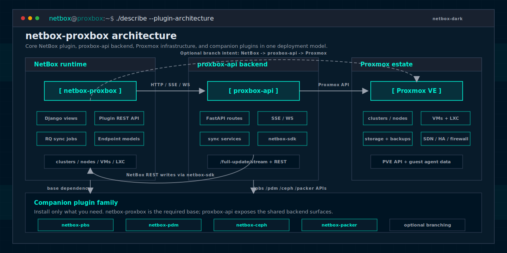

# Proxbox

Proxbox is a NetBox plugin that synchronizes Proxmox infrastructure data into NetBox. It keeps your DCIM up-to-date with real Proxmox clusters, nodes, virtual machines, containers, backups, and Firecracker micro-VM inventory used by the NMS Cloud runtime.



## What It Does

Proxbox discovers and syncs the following from Proxmox into NetBox:

- **Clusters and Nodes** — Proxmox cluster name, mode (cluster/standalone), quorum status, node count, and Proxmox VE version. Each node includes online status, IP address, CPU usage, memory usage, and uptime at sync time. Optionally link to NetBox Cluster and Device objects.
- **Virtual Machines** — VM status, resources, and configuration
- **Containers (LXC)** — Container details and settings
- **Firecracker Cloud inventory** — Host pools, host-agent VMs, image templates, and provisioned micro-VMs exposed separately from QEMU/LXC for NMS Cloud provisioning
- **VM Snapshots** — Point-in-time snapshots for recovery
- **VM Backups** — Backup jobs and restore points
- **Storage** — Datastores and storage content
- **Network Interfaces and IPs** — Proxmox NICs (`net0`, `net1`) as core NetBox VM interfaces, optional guest-OS interfaces (`ens18`, `eth0`) as plugin `GuestVMInterface` rows, and IP addresses assigned to VMs and containers
- **Backup Routines** — Backup job definitions from Proxmox
- **Replications** — Replication job status and configuration

> **Note:** All metrics (CPU, memory, uptime, etc.) are captured as point-in-time snapshots at sync time, not continuous monitoring.

Sync runs on-demand from the NetBox UI or scheduled automatically via NetBox's job system.

## Additional Optional Plugins

Proxbox can be extended with standalone companion plugins. Install only the
plugins you need; `netbox-proxbox` remains the base plugin and must be enabled
before any companion plugin. The infrastructure inventory plugins declare
`netbox-proxbox>=0.0.18` as a dependency, while `netbox-packer` and
`netbox-rpc` follow the same operational conventions for the Proxbox plugin
family. `netbox-rpc` is an *operational* companion: when it is installed,
netbox-proxbox can run audited SSH procedures against Proxmox hosts (for
example installing the proxbox-api cloud-image-build SSH key on a node) through
the netbox-rpc engine instead of handling SSH itself. The integration is a soft
dependency — see `netbox_proxbox/integrations/rpc.py`.

| Package | NetBox plugin | What it adds |
|---------|---------------|--------------|
| [`netbox-pdm`](https://github.com/emersonfelipesp/netbox-pdm) | `netbox_pdm` | Inventories Proxmox Datacenter Manager endpoints and the PVE/PBS remotes managed by PDM. It links PDM remotes back to Proxbox Proxmox endpoints and, when installed, `netbox-pbs` backup servers. |
| [`netbox-pbs`](https://github.com/emersonfelipesp/netbox-pbs) | `netbox_pbs` | Inventories Proxmox Backup Server infrastructure, including PBS servers, datastores, backup snapshots, and scheduled job history. |
| [`netbox-ceph`](https://github.com/emersonfelipesp/netbox-ceph) | `netbox_ceph` | Adds read-only Ceph cluster inventory for Proxmox-managed Ceph: clusters, daemons, OSDs, pools, filesystems, CRUSH rules, flags, and health checks. |
| [`netbox-packer`](https://github.com/emersonfelipesp/netbox-packer) | `netbox_packer` | Tracks HashiCorp Packer image definitions and build execution records for Proxmox VM templates and image-factory workflows. |
| [`netbox-rpc`](https://github.com/emersonfelipesp/netbox-rpc) | `netbox_rpc` | Audited SSH/RPC procedure engine. netbox-proxbox optionally uses it to install SSH keys on Proxmox hosts (e.g. for the cloud-image build pipeline) via `netbox_proxbox.integrations.rpc`. |

For a standard NetBox virtualenv install, activate the NetBox environment and
install the packages you want:

```bash
source /opt/netbox/venv/bin/activate
pip install netbox-pbs netbox-pdm netbox-ceph netbox-packer
```

Enable the selected plugins in `netbox/netbox/configuration.py`. Keep
`netbox_proxbox` first. If you enable `netbox_pdm`, enable `netbox_pbs` before
it because PDM can link to PBS server records.

```python
PLUGINS = [
    "netbox_proxbox",
    "netbox_pbs",
    "netbox_pdm",
    "netbox_ceph",
    "netbox_packer",
]
```

Run migrations for the selected plugins, preserving the same order:

```bash
cd /opt/netbox/netbox
python3 manage.py migrate netbox_proxbox
python3 manage.py migrate netbox_pbs
python3 manage.py migrate netbox_pdm
python3 manage.py migrate netbox_ceph
python3 manage.py migrate netbox_packer
python3 manage.py collectstatic --no-input
sudo systemctl restart netbox netbox-rq
```

For `netbox-docker`, add the selected packages to `plugin_requirements.txt`,
enable the matching plugin module names in `configuration/plugins.py`, rebuild,
and run migrations:

```txt
netbox-pbs
netbox-pdm
netbox-ceph
netbox-packer
```

```bash
docker compose build
docker compose up -d
docker compose exec netbox /opt/netbox/netbox/manage.py migrate
```

Full companion-plugin details live under
[docs/companion-plugins/](./docs/companion-plugins/).

### Endpoint Enablement

Endpoint records are inventory/configuration objects even when disabled. For
`ProxmoxEndpoint`, `NetBoxEndpoint`, `FastAPIEndpoint`, `PBSEndpoint`,
`PDMEndpoint`, and companion endpoint objects that expose an `enabled` field,
`enabled=False` is a hard operational gate: netbox-proxbox keeps the row visible
in UI/API output, but status checks, backend registration, OpenAPI fetches,
sync scopes, keepalive probes, and startup/signal pushes must return before any
proxbox-api or remote-service connection attempt.

The Proxmox Endpoints list shows the `Enabled` column by default. Operators can
select multiple rows and use **Enable Selected** or **Disable Selected** to
toggle the local `ProxmoxEndpoint.enabled` flag in bulk; those list actions do
not call proxbox-api or Proxmox.

Disabled Proxmox endpoints render as a gray **Disabled** status badge on the
list, detail page, and dashboard card. These UI surfaces do not attach live
status polling metadata for disabled rows, so the browser does not repaint an
administratively disabled endpoint as a red error.

### Cloud Portal Endpoint Allowlists

`ProxmoxEndpoint.allowed_tenants` controls which Proxmox endpoint rows are
eligible for tenant-scoped NMS Cloud callers. An empty allow-list means the
endpoint stays in the default/global pool. A non-empty allow-list pins that
endpoint to the listed tenants.

The paired `nms-backend` contract is intentionally asymmetric: if a tenant has
no explicit endpoint grants, it may still see global/default endpoints; once
that tenant matches any explicitly granted endpoint, the backend hides the
global pool and returns only the explicit matches. Use this to pin a tenant
such as Confitec to a single cluster without changing the default pool for
other tenants.

## Maintenance hardening notes

- **Primary endpoint secrets are encrypted at rest.** `ProxmoxEndpoint.password`,
  `ProxmoxEndpoint.token_value`, `FastAPIEndpoint.token`,
  `PBSEndpoint.token_secret`, and `PDMEndpoint.token_secret` now write through
  Fernet-encrypted `*_enc` database columns. The upgrade migration encrypts
  existing values and creates `ProxboxPluginSettings.encryption_key` if it was
  blank, so new endpoint saves do not persist those primary secrets in
  plaintext columns.
- **Dual VM interface sync.** The plugin model surface supports the new
  `guest_os_model` strategy: keep Proxmox-side NICs as core
  `virtualization.VMInterface` rows named `net0`/`net1`, and store guest-agent
  OS names such as `ens18` in `GuestVMInterface`. `GuestVMInterfaceAddress`
  links those guest interfaces to the same core `ipam.IPAddress` rows already
  assigned to the core VM interface. The older `use_guest_agent_interface_name`
  flag is deprecated and only applies when `vm_interface_sync_strategy` is set
  to `legacy_rename`.

## What's New in v0.0.23.post1

Current pairing: netbox-proxbox 0.0.23.post1 <-> proxbox-api (guest-VM-interface writer build / next release) <-> proxmox-sdk 0.0.12 <-> netbox-sdk 0.0.10.

Paired with backend: guest-VM-interface writer build / next release.

- **Universal guest OS interface model default.** `vm_interface_sync_strategy=guest_os_model` is now the default for existing installs as well as new installs; migration `0060` supersedes the `0.0.23` upgrade backfill that kept configured installs on `legacy_rename`.
- **Upgrade behavior change.** Proxmox NICs stay as `net0`/`net1` core `VMInterface` rows, guest-agent names such as `ens18` are stored in `GuestVMInterface`, and operators who want the old renaming behavior can re-select `legacy_rename` in plugin settings.

Full notes: [Release Notes - v0.0.23.post1](docs/release-notes/version-0.0.23.post1.md).

## What's New in v0.0.23

Current pairing: netbox-proxbox 0.0.23 <-> proxbox-api (guest-VM-interface writer build / next release) <-> proxmox-sdk 0.0.12 <-> netbox-sdk 0.0.10.

Paired with backend: guest-VM-interface writer build / next release.

- **Dual VM interface sync.** Proxmox NICs stay as core `VMInterface` rows named `net0`/`net1`, while guest-agent OS interfaces such as `ens18` are stored in `GuestVMInterface` rows.
- **Shared IP ownership.** `GuestVMInterfaceAddress` links guest interfaces to the same core `ipam.IPAddress` objects already assigned to the mapped core VM interface.
- **Strategy control.** `vm_interface_sync_strategy=guest_os_model` is the new default for fresh installs; existing configured installs are backfilled to `legacy_rename` during migration `0059` so upgrades do not silently rename interfaces differently. This 0.0.23 upgrade backfill is superseded by v0.0.23.post1.

Full notes: [Release Notes - v0.0.23](docs/release-notes/version-0.0.23.md).

## What's New in v0.0.22

Current pairing: netbox-proxbox 0.0.22 <-> proxbox-api 0.0.19.post5 <-> proxmox-sdk 0.0.12 <-> netbox-sdk 0.0.10.

Paired with backend [`proxbox-api 0.0.19.post5`](https://github.com/emersonfelipesp/proxbox-api).

- **Per-endpoint access methods.** Proxmox endpoints now expose API-only vs API+SSH transport selection, with the selected `access_methods` value sent to the backend registration payload so backend SSH paths can enforce the same gate.
- **Endpoint operator controls.** The form includes the Proxmox-side write-permission toggle, SSH credential-source selection, and a **Fetch host key** flow for pinned SSH fingerprints.
- **Inventory and API coverage.** This release includes tenant allowlists, bulk endpoint enablement, PDM endpoint sync, SDN inventory, Firecracker serializer hardening, and REST coverage for PBS/PDM endpoints plus read-only DeletionRequest and ProxmoxApplyJob audit endpoints.
- **Certification refresh.** NetBox compatibility remains `4.5.8` through `4.6.99`, now validated through NetBox `v4.6.4`.

Full notes: [Release Notes - v0.0.22](docs/release-notes/version-0.0.22.md).

## What's New in v0.0.21

Paired with backend [`proxbox-api 0.0.18.post5`](https://github.com/emersonfelipesp/proxbox-api).

- **Sync-mode filtering at source.** Per-record VM and VM-template filtering is enforced by the paired backend through `sync_mode_vm` and `sync_mode_vm_template` query params, so disabled modes no longer create dependent NetBox objects for skipped VMs.
- **Batch and stream hardening.** VM sync uses two-phase batch processing, isolates per-VM dispatch failures, matches interface-dense guest aliases by name, and emits partial-failure stream frames for operator visibility.
- **Current SDK pairing.** This release pairs with `proxmox-sdk 0.0.12` and `netbox-sdk 0.0.10` through the separate backend runtime.

Full notes: [Release Notes - v0.0.21](docs/release-notes/version-0.0.21.md).

## What's New in v0.0.20.post3

Paired with backend [`proxbox-api 0.0.17.post1`](https://github.com/emersonfelipesp/proxbox-api).

- **Disabled endpoints never connect.** Endpoint-like rows with `enabled=False` remain visible as inventory/configuration records, but Proxbox status, keepalive, backend registration, OpenAPI, sync, startup, signal, PBS, PDM, and companion endpoint paths now return before any proxbox-api or remote-service connection attempt.
- **Maintenance guardrails.** LLM and developer docs now describe the all-endpoint enabled-field invariant, and the regression suite covers PBSEndpoint/PDMEndpoint shared `EndpointBase.enabled` behavior plus shared guard wiring.

Full notes: [Release Notes - v0.0.20.post3](docs/release-notes/version-0.0.20.post3.md).

## What's New in v0.0.20.post2

Paired with backend [`proxbox-api 0.0.17.post1`](https://github.com/emersonfelipesp/proxbox-api).

- **Latest Sync Jobs on the homepage.** The plugin homepage now includes a read-only table with the five latest Proxbox sync jobs and a **View all sync jobs** button after the additional plugin endpoint cards.

Full notes: [Release Notes - v0.0.20.post2](docs/release-notes/version-0.0.20.post2.md).

## What's New in v0.0.20.post1

Paired with backend [`proxbox-api 0.0.17.post1`](https://github.com/emersonfelipesp/proxbox-api).

- **VM-template sync job wiring.** `ProxboxSyncJob` now calls the existing `sync_vm_templates()` stage, so `ProxmoxVMTemplate` inventory is populated during full/scheduled syncs instead of staying empty.

Full notes: [Release Notes - v0.0.20.post1](docs/release-notes/version-0.0.20.post1.md).

## What's New in v0.0.20

Paired with backend [`proxbox-api 0.0.17`](https://github.com/emersonfelipesp/proxbox-api).

- **IP-address ownership safety.** The paired backend prevents VM-interface IP sync from taking over an address that already belongs to another interface.
- **Interface-batch settings persistence.** `interface_batch_size` and `interface_batch_delay_ms` entered on the plugin Settings page now persist to the database.

Full notes: [Release Notes - v0.0.20](docs/release-notes/version-0.0.20.md).

## What's New in v0.0.19

Paired with backend [`proxbox-api 0.0.16`](https://github.com/emersonfelipesp/proxbox-api).

- **FastAPI endpoint token drift fix.** `FastAPIEndpoint.save()` now detects explicit token changes on existing rows and calls `_register_key_with_backend(skip_bootstrap_check=True)` so operators can recover from a proxbox-api key rotation without direct database surgery.
- **PBS/PDM `host` compatibility property.** `PBSEndpoint` and `PDMEndpoint` now expose a `host` property bridging the field-name difference with proxbox-api's SQLite column.
- **PBS/PDM `timeout_seconds` compatibility property.** Both models now expose a `timeout_seconds` property to match the proxbox-api SQLite column name.

Full notes: [Release Notes — v0.0.19](docs/release-notes/version-0.0.19.md).

## What's New in v0.0.18

Paired with backend [`proxbox-api 0.0.14`](https://github.com/emersonfelipesp/proxbox-api).

- **Full PVE 9.2 support.** New models for SDN fabrics, route maps, prefix lists, and custom datacenter CPU models, plus automated sync services. Completed per-node firewall sync. HA arm/disarm action views. `ProxmoxNode.location` field.

Full notes: [Release Notes — v0.0.18](https://emersonfelipesp.github.io/netbox-proxbox/release-notes/version-0.0.18/).

## Compatibility Matrix

| NetBox | netbox-proxbox | proxbox-api | netbox-sdk | proxmox-sdk |
|--------|----------------|-------------|------------|-------------|
| >=4.5.8 | v0.0.23.post1 | guest-VM-interface writer build / next release | v0.0.10 | v0.0.12 |
| >=4.5.8 | v0.0.23 | guest-VM-interface writer build / next release | v0.0.10 | v0.0.12 |
| >=4.5.8 | v0.0.22 | v0.0.19.post5 | v0.0.10 | v0.0.12 |
| >=4.5.8 | v0.0.21 | v0.0.18.post5 | v0.0.10 | v0.0.12 |
| >=4.5.8 | v0.0.20.post3 | v0.0.17.post1 | v0.0.9.post1 | v0.0.11.post1 |
| >=4.5.8 | v0.0.20.post2 | v0.0.17.post1 | v0.0.9.post1 | v0.0.11.post1 |
| >=4.5.8 | v0.0.20.post1 | v0.0.17.post1 | v0.0.9.post1 | v0.0.11.post1 |
| >=4.5.8 | v0.0.20 | v0.0.17 | v0.0.8.post1 | v0.0.11 |
| >=4.5.8 | v0.0.19 | v0.0.16 | v0.0.8.post1 | v0.0.9 |
| >=4.5.8 | v0.0.18.post1 | v0.0.14 | v0.0.8.post1 | v0.0.3.post1 |
| >=4.5.8 | v0.0.18 | v0.0.14 | v0.0.8.post1 | v0.0.3.post1 |
| >=4.5.8 | v0.0.17 | v0.0.13 | v0.0.8.post1 | v0.0.3.post1 |

See [COMPATIBILITY.md](COMPATIBILITY.md) for the full version compatibility table.

## Requirements

- NetBox 4.5.8, 4.5.9, or 4.6.x
- Verified with NetBox v4.5.8, v4.5.9, and v4.6.0 through v4.6.4
- Python 3.12+
- Proxmox VE 7.x, 8.x, or 9.x (PVE 9 requires `VM.GuestAgent.Audit` on the API role; see "Troubleshooting" below for the PVE 9 auth checklist)
- Proxbox API backend as a separately deployed service (see below)

## Quick Start

Choose the installation path that matches your NetBox deployment:

- **Standard NetBox install (venv on host):** follow steps below.
- **NetBox Docker install (`netbox-docker`):** use the Docker-specific workflow in [Installing the Plugin in Docker-Based NetBox Deployments](./docs/installation/3-installing-plugin-docker.md).

1. **Install the plugin** into your NetBox virtual environment (host/venv deployment):

   ```bash
   cd /opt/netbox/netbox
   git clone https://github.com/emersonfelipesp/netbox-proxbox.git
   source /opt/netbox/venv/bin/activate
   pip install -e ./netbox-proxbox
   ```

2. **Enable the plugin** in `netbox/netbox/configuration.py`:

   ```python
   PLUGINS = ["netbox_proxbox"]
   ```

3. **Run migrations and collect static files:**

   ```bash
   python3 manage.py migrate netbox_proxbox
   python3 manage.py collectstatic --no-input
   sudo systemctl restart netbox
   ```

4. **Install the Proxbox API backend:**

   ```bash
   mkdir -p /opt/proxbox-api
   cd /opt/proxbox-api
   python3 -m venv venv
   source venv/bin/activate
   pip install proxbox-api
   uvicorn proxbox_api.main:app --host 0.0.0.0 --port 8800
   ```

   Or use Docker (the published image runs **nginx** on port **8000** inside the container, in front of **uvicorn**):

   ```bash
   docker run -d --name proxbox-api -p 8800:8000 emersonfelipesp/proxbox-api:latest
   ```

   **HTTPS with mkcert (optional):** the backend also publishes **`emersonfelipesp/proxbox-api:latest-mkcert`** (and `:<version>-mkcert`). **nginx** terminates **TLS** there (mkcert certs) on **`PORT`** (default **8000**); add more certificate names or IPs with **`MKCERT_EXTRA_NAMES`** (comma- or space-separated). Example:

   ```bash
   docker run -d --name proxbox-api-tls \
     -p 8800:8000 \
     -e MKCERT_EXTRA_NAMES='proxbox.backend.local' \
     emersonfelipesp/proxbox-api:latest-mkcert
   ```

   Point your NetBox **ProxBox API** endpoint at `https://<host>:8800` (or your mapped port). Trust the mkcert root on clients if needed; see the [proxbox-api README](https://github.com/emersonfelipesp/proxbox-api/blob/main/README.md) for build flags, `CAROOT`, and details.

5. **Configure endpoints in NetBox:**

   - Go to **Plugins > Proxbox**
   - Create a **Proxmox API** endpoint (your Proxmox host URL and token).
     The Proxmox user/token must hold a role with `Datastore.Audit`,
     `Sys.Audit`, `VM.Audit`, `VM.Monitor`, **and `VM.GuestAgent.Audit`**.
     `VM.GuestAgent.Audit` is required on Proxmox VE >= 9 for the backend to
     pull VM IPs through the QEMU guest agent — without it, VMs sync but
     their IP addresses are missing from NetBox. See the proxbox-api docs
     [Required Proxmox role privileges](https://github.com/emersonfelipesp/proxbox-api/blob/main/docs/getting-started/configuration.md#required-proxmox-role-privileges)
     for the `pveum role add` command.
   - Create a **NetBox API** endpoint (your NetBox URL and token)
   - Create a **ProxBox API** endpoint (the backend from step 4)

6. **Run your first sync:**

    Click **Full Update** on the Proxbox home page. Progress appears in real-time.

## NetBox Docker Install Option

If your NetBox runs with `netbox-community/netbox-docker`, install the plugin through the Docker plugin files in your NetBox Docker project:

1. Add plugin requirements to `plugin_requirements.txt` (PyPI or Git):

   ```txt
   netbox-proxbox
   # or
   # netbox-proxbox @ git+https://github.com/emersonfelipesp/netbox-proxbox.git
   ```

2. Enable the plugin in `configuration/plugins.py`:

   ```python
   PLUGINS = ["netbox_proxbox"]
   ```

3. Rebuild and restart NetBox:

   ```bash
   docker compose build
   docker compose up -d
   ```

4. Run migrations in the NetBox container:

   ```bash
   docker compose exec netbox /opt/netbox/netbox/manage.py migrate
   ```

For complete Docker installation instructions, validation checks, and Git/source install examples, see [docs/installation/3-installing-plugin-docker.md](./docs/installation/3-installing-plugin-docker.md).

## Scheduled Sync

Proxbox sync jobs run on NetBox's **`default`** RQ queue. A standard NetBox installation already ships a `netbox-rq` systemd service that runs:

```
manage.py rqworker high default low
```

Check whether it is running before doing anything else:

```bash
sudo systemctl status netbox-rq
```

If it is **active (running)**, you have nothing extra to configure — Proxbox jobs will be picked up automatically.

If the service is **inactive or missing**, enable it:

```bash
sudo systemctl enable --now netbox-rq
```

The unit file is provided by NetBox at `contrib/netbox-rq.service` in the NetBox repository. If you need to create it manually, copy it from there and run:

```bash
sudo systemctl daemon-reload
sudo systemctl enable --now netbox-rq
```

> **Upgrading from an older Proxbox release?** Jobs used to be enqueued on the `netbox_proxbox.sync` queue. The stock `netbox-rq` service does not listen to that queue, so old-style jobs will not run. New jobs always use `default` and are picked up without any changes.

Disabled `ProxmoxEndpoint` rows are hard-excluded from operational reads and
sync jobs. The scheduler, CLI sync command, dashboard cards, keepalive checks,
HA/storage/firewall/SDN/datacenter live reads, backend endpoint preflight, and
stale scheduled job parameters all filter to `enabled=True` before contacting
proxbox-api or Proxmox. To pause a production endpoint, set **Enabled** to
false; the row remains visible in the API and UI but no connection attempt is
made for that endpoint.

### Schedule a sync

1. In NetBox, go to **Proxbox > Schedule Sync**.
2. Choose one or more sync types (**All**, Devices, VMs, Storage, etc.).
3. Optionally set a **Schedule at** time and a **Recurs every** interval in minutes (e.g. `1440` for daily).
4. Click **Schedule**.

Track job status under **Proxbox > Sync Jobs** or **Operations > Background Jobs**.

### Job timeout

Proxbox sync jobs default to a **7200-second (2-hour) RQ wall-clock limit** (`PROXBOX_SYNC_JOB_TIMEOUT`). NetBox's default `RQ_DEFAULT_TIMEOUT` is only 300 s, which would kill long syncs. No configuration is needed unless your syncs routinely take longer than two hours; if they do, override the constant in `netbox_proxbox/jobs.py`.

### Troubleshooting

| Symptom | Likely cause | Fix |
|---------|-------------|-----|
| Job stays **`pending`** | No RQ worker running, or worker not listening to `default` queue | Start/restart `manage.py rqworker` |
| Job stays **`running`** for a long time | Proxbox API is still syncing or stream is slow | Check the job **Log** tab; wait or inspect the backend |
| Job **`errored: JobTimeoutException`** | RQ wall-clock limit exceeded | Increase `PROXBOX_SYNC_JOB_TIMEOUT` in `netbox_proxbox/jobs.py` |
| Disabled endpoint still appears in `/api/plugins/proxbox/endpoints/proxmox/` | Expected API behavior; disabled rows remain inventory records | Leave it disabled to prevent all connection attempts. Re-enable only when the endpoint should participate in cards, checks, and sync jobs again. |
| VM IP addresses stay empty after upgrade | The separate `proxbox-api` backend is too old, is on the v0.0.13/v0.0.14 agent-flag warning window, existing VMs still lack `proxmox_vm_id`, or the Proxmox role lacks guest-agent privileges | Check the FastAPI card warning on the Proxbox home page. Run `proxbox-api >= 0.0.13` at minimum; if the warning references PR #156, install a backend build containing that fix or the next fixed backend release. Then run **Full Update** so existing VMs get `proxmox_vm_id` before the IP-address stage runs. For PVE 9, also confirm `VM.GuestAgent.Audit`. |
| **HTTP 401 Authentication failed!** against Proxmox VE 9.x | A stale stored token is overriding fresh password credentials, or the role is missing PVE 9 permissions | On the Proxmox endpoint edit page, tick **"Clear stored API token on save"** (and/or **"Clear stored password on save"**) to wipe the unused secret. The form rejects rows that end up with neither a password nor a complete `(token name, token value)` pair. Confirm the role on Proxmox grants `Datastore.Audit`, `Sys.Audit`, `VM.Audit`, and on PVE 9 also `VM.GuestAgent.Audit`. The plugin now surfaces the upstream PVE 9 error message in the UI instead of `"Unknown error."`, which makes "no such realm" / "expired token" / "missing privilege" failures self-diagnosing. |

#### Switching credentials cleanly (PVE 9 friendly)

The Proxmox endpoint edit form preserves the stored password and token value
when you submit blank masked fields — that is intentional for partial edits.
When you genuinely want to **switch** auth modes (for example, password → token
or vice versa, or rotate a leaked secret), tick the matching **"Clear
stored …"** checkbox so the unused credential is wiped on save. Clearing the
token always clears **both** `token name` and `token value` together so the row
never persists in a half-token state.

## Documentation

Full documentation is available at [emersonfelipesp.github.io/netbox-proxbox](https://emersonfelipesp.github.io/netbox-proxbox/).

Key pages:

- [Installation Guide](https://emersonfelipesp.github.io/netbox-proxbox/installation/2-installing-plugin-git/)
- [Backend Setup](https://emersonfelipesp.github.io/netbox-proxbox/installation/backend-setup/)
- [Scheduled Sync](https://emersonfelipesp.github.io/netbox-proxbox/features/scheduled-sync/)
- [Certification Evidence](https://emersonfelipesp.github.io/netbox-proxbox/certification/)
- [Application Packet](https://emersonfelipesp.github.io/netbox-proxbox/application-packet/)

## Community

- GitHub Discussions: https://github.com/orgs/emersonfelipesp/discussions

## LLM Agent Safety

> **Before any destruction-adjacent operation, read `AGENTS.md` §"LLM Agent Safety Guardrails".**

Proxbox protects VM destruction behind a five-lock chain. LLM agents **MUST NOT**:
- Autonomously set `apply_destroy_confirmed=True`
- Submit the confirmation phrase `"allow-edit-and-add-actions"` on a user's behalf
- Approve a `DeletionRequest` as the same user who created it (`self_approve_allowed=False`)

The `DeletionRequest` REST endpoint (`/api/plugins/proxbox/deletion-requests/`) is read-only — enforced by `netbox_proxbox/api/views.py::DeletionRequestViewSet.http_method_names = ["get", "head", "options"]`. Pinned by `tests/test_static_guardrails.py`.

## Contributing

See [DEVELOP.md](./DEVELOP.md) for development setup and contribution guidelines.

## Support the Project

If Proxbox has been useful for you, consider supporting the project on GitHub Sponsors:

[Sponsor Me!](https://github.com/sponsors/emersonfelipesp)
