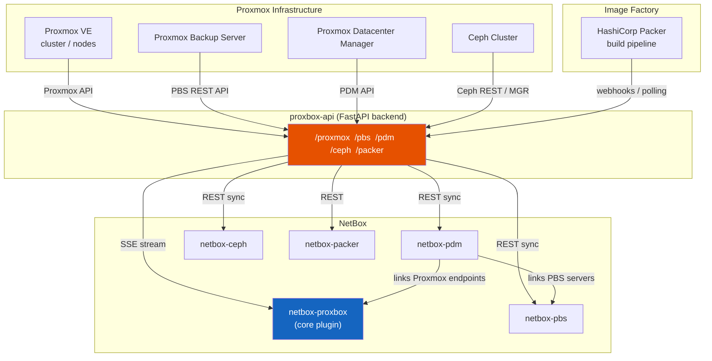
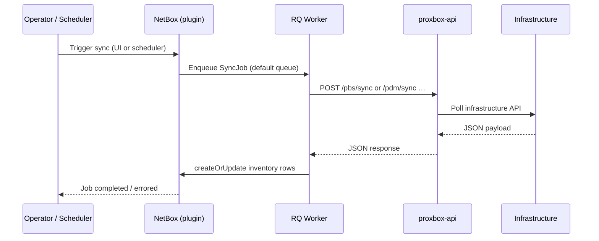
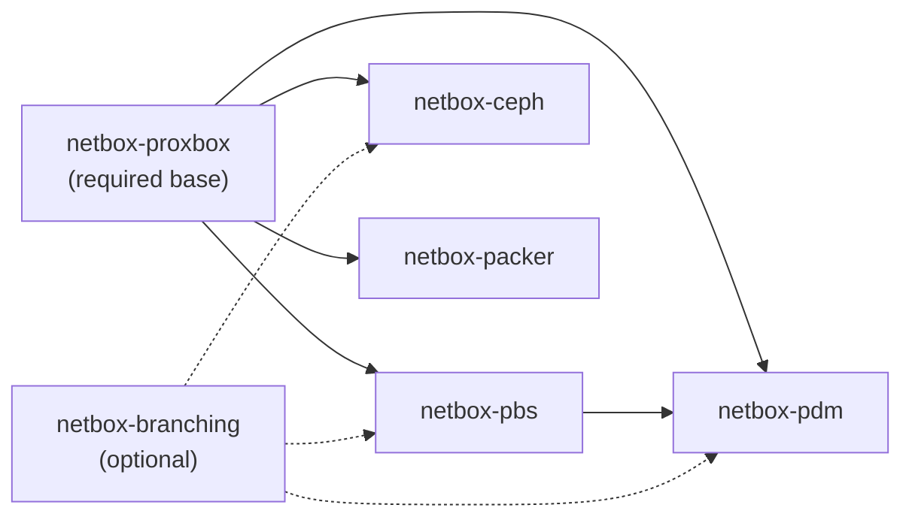

# Companion Plugins

The Proxbox ecosystem is built around a central FastAPI backend (`proxbox-api`) and the core NetBox plugin (`netbox-proxbox`). Four standalone companion plugins extend that foundation with inventory for adjacent Proxmox-family infrastructure: Proxmox Backup Server, Proxmox Datacenter Manager, Ceph storage clusters, and HashiCorp Packer image factories.

Each companion plugin is a fully independent NetBox plugin package. You install only the plugins that match your infrastructure.

## Plugin Overview

| Plugin | PyPI package | What it inventories |
|---|---|---|
| [netbox-pbs](./netbox-pbs.md) | `netbox-pbs` | Proxmox Backup Server — servers, datastores, snapshots, jobs |
| [netbox-pdm](./netbox-pdm.md) | `netbox-pdm` | Proxmox Datacenter Manager — PDM endpoints and their remotes (PVE + PBS) |
| [netbox-ceph](./netbox-ceph.md) | `netbox-ceph` | Ceph clusters — nodes, OSDs, pools, filesystems, CRUSH rules, flags, health checks |
| [netbox-packer](./netbox-packer.md) | `netbox-packer` | HashiCorp Packer — image definitions and build execution records |

## Ecosystem Architecture



## How Sync Works

All companion plugins follow the same pattern:



Key points shared by all companion plugins:

- Sync jobs run on NetBox's **`default`** RQ queue. A stock `manage.py rqworker` (no extra arguments) picks them up.
- Each plugin sets a **7200 s** job timeout so slow syncs are not killed by RQ's default 300 s wall-clock limit.
- **Branch-aware sync** (optional, requires `netbox-branching`) creates an isolated NetBox branch, runs the sync against it, and merges on success. The conflict policy (`abort` or `overwrite`) is configurable per plugin from the plugin's **Plugin Settings** singleton.

## Plugin Dependency Map



`netbox-proxbox` must be installed before any companion plugin. `netbox-pdm` further cross-references `netbox-pbs` models, so install and migrate `netbox-pbs` before `netbox-pdm`.

## Installing All Companion Plugins

Install the packages you need alongside `netbox-proxbox`:

```bash
source /opt/netbox/venv/bin/activate
pip install netbox-proxbox netbox-pbs netbox-pdm netbox-ceph netbox-packer
```

Enable them in `configuration.py`. The order matters: `netbox_proxbox` must appear first, and `netbox_pbs` before `netbox_pdm`:

```python
PLUGINS = [
    "netbox_proxbox",
    "netbox_pbs",
    "netbox_pdm",
    "netbox_ceph",
    "netbox_packer",
]
```

Run migrations for each plugin:

```bash
cd /opt/netbox/netbox
python3 manage.py migrate netbox_proxbox
python3 manage.py migrate netbox_pbs
python3 manage.py migrate netbox_pdm
python3 manage.py migrate netbox_ceph
python3 manage.py migrate netbox_packer
python3 manage.py collectstatic --no-input
sudo systemctl restart netbox netbox-rq
```

!!! note "Partial installs"
    You do not need to install all four companion plugins. Each is independent; for example, `netbox-ceph` works without `netbox-pbs`. The only required dependency for all four is `netbox-proxbox`.

!!! warning "Migration order"
    Always migrate `netbox_proxbox` before any companion plugin. Migrate `netbox_pbs` before `netbox_pdm` because `PDMEndpoint` has an M2M relation to `PBSServer`.
