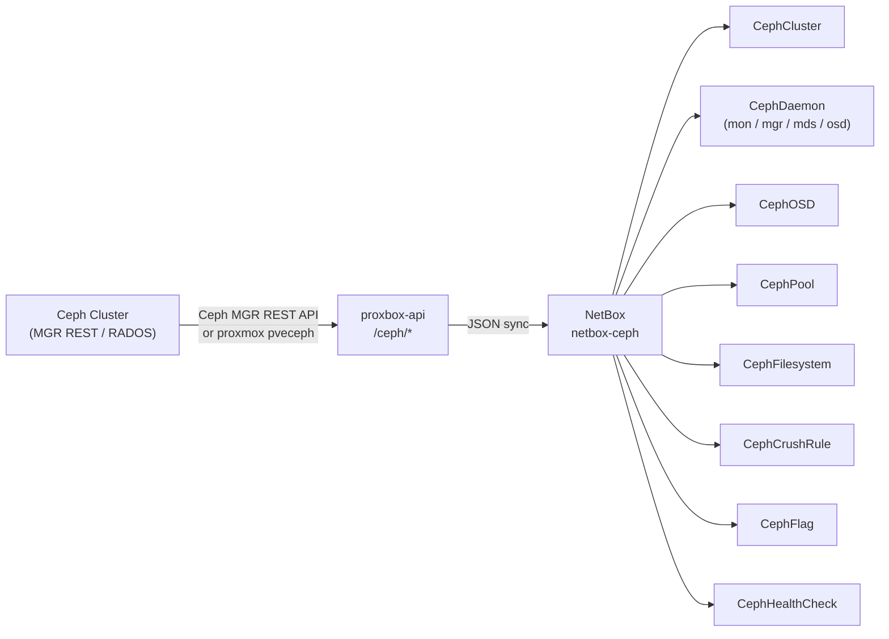
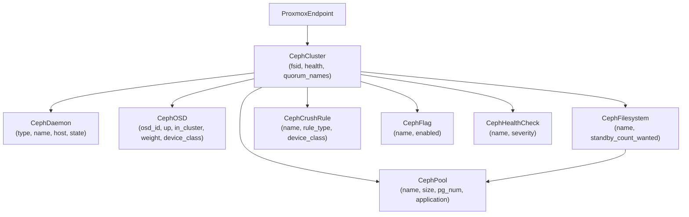
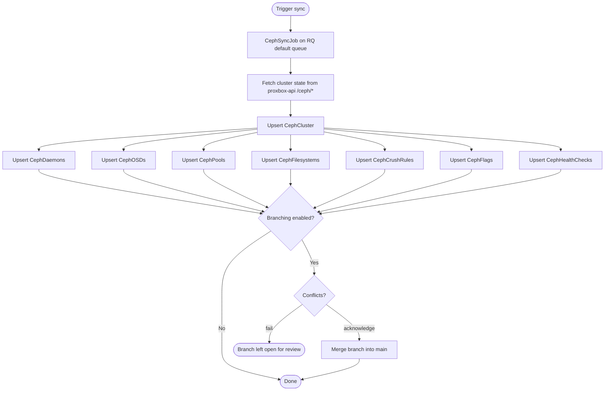

# netbox-ceph — Ceph Cluster Inventory

`netbox-ceph` is a standalone NetBox plugin that inventories **Ceph** storage clusters by syncing cluster state from the `proxbox-api` backend. Ceph is the distributed storage system used by Proxmox VE for RBD (block storage), CephFS (file storage), and hyper-converged storage pools. `netbox-ceph` gives operators a read-only view of cluster topology, OSD health, pool configuration, CRUSH rules, filesystem mounts, feature flags, and health alerts — all inside NetBox.

!!! info "Read-only in v1"
    All inventory models exposed by `netbox-ceph` v1 are **read-only** through the NetBox UI and REST API. The only editable object is `CephPluginSettings`.

## Architecture



## Data Models

### `CephCluster`

Top-level object representing one Ceph cluster, scoped to a `ProxmoxEndpoint`.

| Field | Type | Description |
|---|---|---|
| `endpoint` | FK → `ProxmoxEndpoint` | Proxmox VE endpoint that manages this cluster |
| `proxmox_cluster` | FK → `ProxmoxCluster` (nullable) | Linked Proxmox cluster object |
| `name` | string | Cluster name |
| `fsid` | string | Cluster FSID |
| `health` | choice | `HEALTH_OK` / `HEALTH_WARN` / `HEALTH_ERR` / `unknown` |
| `quorum_names` | JSON | Monitor quorum member names |
| `status` | JSON | Raw cluster status payload |
| `last_seen_at` | datetime | Most recent successful sync |

Uniqueness constraint: `(endpoint, name)`.

### `CephDaemon`

One Ceph service daemon (mon, mgr, mds, osd).

| Field | Type | Description |
|---|---|---|
| `endpoint` | FK → `ProxmoxEndpoint` | Proxmox VE endpoint |
| `cluster` | FK → `CephCluster` (nullable) | Parent cluster |
| `proxmox_node` | FK → `ProxmoxNode` (nullable) | Node hosting this daemon |
| `daemon_type` | choice | `mon` / `mgr` / `mds` / `osd` / `unknown` |
| `name` | string | Daemon name (e.g., `mon.pve-node01`) |
| `daemon_id` | string | Daemon identifier |
| `host` | string | Host on which the daemon runs |
| `state` | choice | `unknown` / `active` / `standby` / `running` / `stopped` / `error` |
| `status` | string | Short status label |
| `version` | string | Ceph version string |
| `metadata` | JSON | Additional daemon metadata |
| `last_seen_at` | datetime | Most recent sync timestamp |

Uniqueness constraint: `(endpoint, daemon_type, name)`.

### `CephOSD`

One Object Storage Daemon (OSD).

| Field | Type | Description |
|---|---|---|
| `endpoint` | FK → `ProxmoxEndpoint` | Proxmox VE endpoint |
| `cluster` | FK → `CephCluster` (nullable) | Parent cluster |
| `proxmox_node` | FK → `ProxmoxNode` (nullable) | Node hosting this OSD |
| `osd_id` | int | Numeric OSD ID |
| `name` | string | OSD name (e.g., `osd.3`) |
| `host` | string | Host running this OSD |
| `up` | bool | Whether the OSD is up |
| `in_cluster` | bool | Whether the OSD is in the CRUSH map |
| `status` | string | Short status label |
| `device_class` | string | `hdd` / `ssd` / `nvme` or custom |
| `weight` | float | CRUSH weight |
| `reweight` | float | CRUSH reweight |
| `used_bytes` | int | Bytes used |
| `available_bytes` | int | Bytes available |
| `total_bytes` | int | Raw device capacity |
| `pgs` | int | Number of placement groups assigned |
| `metadata` | JSON | Additional OSD metadata |
| `last_seen_at` | datetime | Most recent sync timestamp |

Uniqueness constraint: `(endpoint, osd_id)`.

### `CephPool`

One Ceph storage pool.

| Field | Type | Description |
|---|---|---|
| `endpoint` | FK → `ProxmoxEndpoint` | Proxmox VE endpoint |
| `cluster` | FK → `CephCluster` (nullable) | Parent cluster |
| `name` | string | Pool name |
| `pool_id` | int | Numeric pool ID |
| `size` | int | Replica count |
| `min_size` | int | Minimum replica count |
| `pg_num` | int | Number of placement groups |
| `pg_autoscale_mode` | string | PG autoscale mode (e.g., `on`, `warn`, `off`) |
| `crush_rule` | string | CRUSH rule name |
| `application` | string | Pool application tag (e.g., `rbd`, `cephfs`, `rgw`) |
| `used_bytes` | int | Bytes used by pool data |
| `max_available_bytes` | int | Bytes available in the pool |
| `percent_used` | float | Percentage of pool capacity used |
| `status` | JSON | Raw pool status payload |
| `last_seen_at` | datetime | Most recent sync timestamp |

Uniqueness constraint: `(endpoint, name)`.

### `CephFilesystem`

A CephFS filesystem (metadata server + data pools).

| Field | Type | Description |
|---|---|---|
| `endpoint` | FK → `ProxmoxEndpoint` | Proxmox VE endpoint |
| `cluster` | FK → `CephCluster` (nullable) | Parent cluster |
| `name` | string | Filesystem name |
| `metadata_pool` | FK → `CephPool` (nullable) | MDS metadata pool |
| `data_pools` | JSON | Data pool names (list) |
| `standby_count_wanted` | int | Desired standby MDS count |
| `status` | JSON | Raw CephFS status |
| `last_seen_at` | datetime | Most recent sync timestamp |

Uniqueness constraint: `(endpoint, name)`.

### `CephCrushRule`

One CRUSH placement rule.

| Field | Type | Description |
|---|---|---|
| `endpoint` | FK → `ProxmoxEndpoint` | Proxmox VE endpoint |
| `cluster` | FK → `CephCluster` (nullable) | Parent cluster |
| `name` | string | Rule name |
| `rule_id` | int | Numeric CRUSH rule ID |
| `rule_type` | string | Rule type string |
| `device_class` | string | Device class targeted by this rule |
| `steps` | JSON | CRUSH rule steps |
| `raw` | JSON | Raw rule payload |
| `last_seen_at` | datetime | Most recent sync timestamp |

Uniqueness constraint: `(endpoint, name)`.

### `CephFlag`

A Ceph OSD flag (e.g., `noout`, `norebalance`, `pause`).

| Field | Type | Description |
|---|---|---|
| `endpoint` | FK → `ProxmoxEndpoint` | Proxmox VE endpoint |
| `cluster` | FK → `CephCluster` (nullable) | Parent cluster |
| `name` | string | Flag name |
| `enabled` | bool | Whether the flag is set |
| `value` | string | Flag value string |
| `raw` | JSON | Raw flag payload |
| `last_seen_at` | datetime | Most recent sync timestamp |

Uniqueness constraint: `(endpoint, name)`.

### `CephHealthCheck`

One active health alert from the cluster status payload.

| Field | Type | Description |
|---|---|---|
| `endpoint` | FK → `ProxmoxEndpoint` | Proxmox VE endpoint |
| `cluster` | FK → `CephCluster` (nullable) | Parent cluster |
| `name` | string | Health-check code (e.g., `OSD_DOWN`) |
| `severity` | choice | `HEALTH_OK` / `HEALTH_WARN` / `HEALTH_ERR` / `unknown` |
| `summary` | string | Short human-readable description |
| `detail` | JSON | Detailed check entries |
| `source` | string | Check source module |
| `first_seen_at` | datetime | When the check was first observed |
| `last_seen_at` | datetime | When the check was last observed |

Uniqueness constraint: `(endpoint, name)`.

### `CephPluginSettings`

Singleton settings row editable from **Ceph → Plugin Settings**.

| Field | Default | Description |
|---|---|---|
| `branching_enabled` | `false` | Create a `netbox-branching` branch per sync run |
| `branch_name_prefix` | `"ceph-sync"` | Prefix for auto-created branch names |
| `branch_on_conflict` | `fail` | `fail` (leave branch open for review) or `acknowledge` (merge despite conflicts) |

## Cluster Model Hierarchy



## Sync Flow



## Navigation

The plugin registers a **Ceph** top-level menu with an **Inventory** group:

- **Clusters** — list / detail
- **Daemons** — global list
- **OSDs** — global list
- **Pools** — global list
- **Filesystems** — list / detail
- **CRUSH Rules** — list / detail
- **Flags** — list / detail
- **Health Checks** — list / detail
- **Plugin Settings** — singleton edit

## REST API

Read-only REST API under `/api/plugins/ceph/` (GET / HEAD / OPTIONS only in v1):

| Endpoint | Description |
|---|---|
| `/api/plugins/ceph/clusters/` | Ceph clusters |
| `/api/plugins/ceph/daemons/` | Service daemons |
| `/api/plugins/ceph/osds/` | Object Storage Daemons |
| `/api/plugins/ceph/pools/` | Storage pools |
| `/api/plugins/ceph/filesystems/` | CephFS filesystems |
| `/api/plugins/ceph/crush-rules/` | CRUSH placement rules |
| `/api/plugins/ceph/flags/` | OSD flags |
| `/api/plugins/ceph/health-checks/` | Active health alerts |
| `/api/plugins/ceph/settings/` | Plugin settings (GET, PUT, PATCH) |

## Installation

### pip

```bash
source /opt/netbox/venv/bin/activate
pip install netbox-ceph
```

### git (development build)

```bash
source /opt/netbox/venv/bin/activate
pip install git+https://github.com/emersonfelipesp/netbox-ceph.git
```

### Enable in NetBox

Add to `configuration.py` after `netbox_proxbox`:

```python
PLUGINS = [
    "netbox_proxbox",
    "netbox_ceph",
]
```

Run migrations and restart:

```bash
cd /opt/netbox/netbox
python3 manage.py migrate netbox_ceph
python3 manage.py collectstatic --no-input
sudo systemctl restart netbox netbox-rq
```

### Docker

Add to `plugin_requirements.txt`:

```
netbox-ceph
```

Add to `configuration/plugins.py`:

```python
PLUGINS = [
    "netbox_proxbox",
    "netbox_ceph",
]
```

## Configuration

No `PLUGINS_CONFIG` entries are required. All runtime options are stored in the `CephPluginSettings` singleton, editable from **Ceph → Plugin Settings**.

## NetBox Compatibility

| netbox-ceph | NetBox |
|---|---|
| `0.0.1+` | 4.5.8 – 4.6.x |
