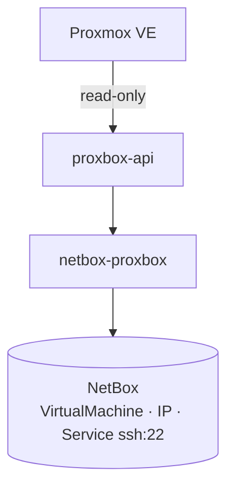
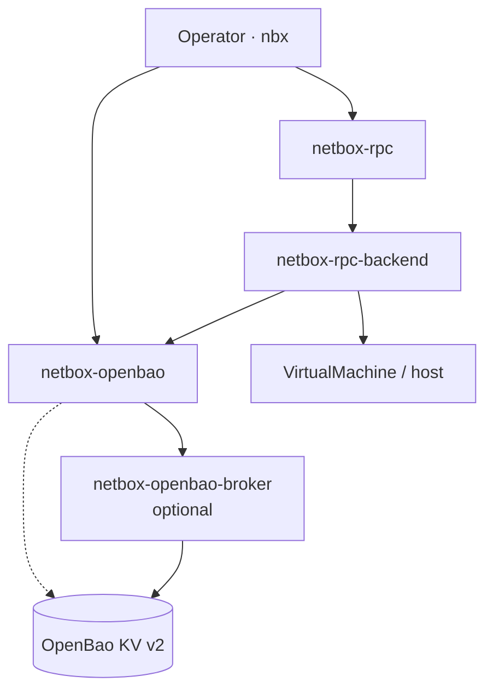

# netbox-openbao — Proxbox credentials

The complete target architecture, migration matrix and setup runbook are in
[Audited Proxmox writes with RPC and OpenBao](./audited-proxmox-writes.md).
Mandatory RPC writes and generic OpenBao-backed procedure variables are planned;
the endpoint storage integration described here already exists.

Unavailable required credentials fail explicitly at secret-access boundaries.
Password-reuse readiness and list views report SSH as unavailable instead of
failing the entire response. SSH password reuse returns a safe 503 when stored material cannot be
resolved; a token-only endpoint still returns 422 because an API token is not an
SSH password. Scheduled monitoring records an affected endpoint's failure and
continues evaluating other endpoints.

Endpoint edit forms preserve masked values from the original storage backend,
using the submitted authentication selection after explicit clears. A complete
new token pair can repair an endpoint that has no stored credentials. An existing
unresolved counterpart reference still blocks preservation until the operator
repairs, replaces, or explicitly clears that credential. The requesting actor is
retained for authorized OpenBao reads and writes.

`netbox-openbao` is a **separate** NetBox plugin from the Proxbox suite. It is
not a companion plugin in the same sense as netbox-pbs or netbox-ceph — you do
not install it through proxbox-api sync jobs — but it is the supported way to
store SSH login material for Proxmox guests that netbox-proxbox already models
in NetBox.

## Problem split

| Concern | Plugin | Storage |
|---|---|---|
| Discover VMs, LXC, interfaces, IPs | **netbox-proxbox** (+ proxbox-api) | NetBox PostgreSQL |
| Store SSH passwords and keypairs | **netbox-openbao** | OpenBao KV v2 + NetBox metadata |
| Optional vault credential isolation | **netbox-openbao-broker** | AppRole off the NetBox host |
| Audited SSH / host procedures | **netbox-rpc** (+ rpc-backend) | Procedure catalog in NetBox |

Proxbox answers *what exists*. Openbao answers *how you log in* — after the
object exists. RPC answers *what automated host operations are allowed* — through
a catalogued executor, not ad-hoc shell.

!!! important "No secrets in the sync pipeline"
    Proxmox guest credentials — cloud-init passwords, hypervisor-stored root
    passwords, QEMU agent secrets — are **not** part of the proxbox discovery
    contract. A proxbox job failure must not rotate credentials; a credential
    reveal must not call the Proxmox API.

## Architecture

### Inventory lane (netbox-proxbox)



### Target secrets and automation stack

The RPC-to-OpenBao executor link below is the planned generic integration. Its
presence in this diagram does not establish runtime support in an installed
executor; verify the capability and version contract before enabling writes.



The inventory and secrets lanes meet on the same `VirtualMachine` (or `Device`)
row. Guest assignment coordinates through NetBox objects and OpenBao assignments.
Endpoint storage additionally uses Proxbox's optional `integrations/openbao.py`
adapter, which imports OpenBao models and services at call time.

## Endpoint and node credentials vs guest credentials

netbox-proxbox can also store **Proxmox endpoint** tokens and SSH secrets
through netbox-openbao when
`ProxboxPluginSettings.credential_storage_backend = openbao`. Automatic (the
blank default) selects that backend only when `netbox_openbao` is enabled in
`PLUGINS`; otherwise it selects legacy Fernet. Explicit selections remain
authoritative and never downgrade when OpenBao becomes unavailable. That
path secures *how NetBox talks to Proxmox*, not *how operators SSH into a synced
guest*.

Per-node SSH credentials used by hardware discovery and the node terminal use
the same effective backend selection as their `ProxmoxEndpoint`. With OpenBao
selected, Proxbox writes `ssh-password` and `ssh-keypair` material through the
provider-owned transaction and persists opaque UUID references on
`NodeSSHCredential`. The authentication method selected on the node credential
is assigned to the linked `dcim.Device` as the primary credential for the
`login` purpose.

A node may receive OpenBao material before sync has linked it to a
`dcim.Device`. Proxbox deliberately keeps that credential unassigned until the
link exists. Saving the node after a link, relink, or unlink automatically
creates, moves, or removes only the Proxbox-owned primary login assignment;
unrelated assignments and the OpenBao credential material remain intact.
Conflicting foreign primary login assignments fail closed instead of being
replaced.

FastAPI backend tokens, PBS tokens, PDM tokens, and Firecracker agent tokens
follow the same effective storage selection. With OpenBao selected, each owner
stores one opaque credential UUID and clears its legacy Fernet ciphertext only
after the provider write succeeds. All four use credential type `api-token`;
FastAPI/PBS/PDM assignments use purpose `api`, and Firecracker host assignments
use purpose `agent`. Firecracker discovery and REST writes therefore store a
new token in the effective backend instead of assuming local encryption.

Changing the effective backend does not migrate material. Legacy-to-OpenBao
occurs only when an operator explicitly supplies new material. OpenBao-to-legacy
is refused while a UUID reference or owned assignment remains, preserving the
state needed for an explicit cleanup or migration workflow.

The UI and REST mutation handlers enter the provider material transaction
before NetBox opens its own atomic edit, delete, or bulk-operation block. The
request actor is carried through that outer boundary for credential and
assignment permission checks. Direct `QuerySet.update()`, `bulk_update()`,
`bulk_create()`, `delete()`, and raw-delete bypasses are rejected whenever they
could skip OpenBao reconciliation. Deleting a linked `Device`, `ProxmoxNode`,
or `ProxmoxEndpoint` is likewise refused while node references or assignments
remain. Operators must first use the supported node-credential cleanup path;
signal handlers never attempt provider cleanup from inside Django's deletion
collector transaction.

The node credential metadata response exposes
`openbao_assignment_ready`, `openbao_assignment_detail`, and the secret-free
`openbao_assignment_lookup` selectors (`assigned_object_type`,
`assigned_object_id`, and `purpose`). Ansible-compatible consumers may use
those selectors against netbox-openbao's assignment API. Hardware discovery
continues to obtain material only from the authenticated, token-protected node
credential endpoint; readiness and lookup responses never contain a live
password, private key, or credential UUID.

OpenBao resolution is strict. A missing or stale UUID, unavailable provider,
invalid material shape, or denied reveal produces a sanitized error and never
downgrades to a populated legacy Fernet column. When Legacy encrypted is
explicitly selected, node passwords and private keys continue to use the local
Fernet ciphertext columns and configured plugin encryption key.

Changing an endpoint or the global default from OpenBao to legacy is refused
while node UUID references or assignments remain. If netbox-openbao has been
removed prematurely, the validation error instructs the operator to restore
the provider and run explicit cleanup; raw import failures and secret values
are not exposed.

Missing OpenBao references and invalid or unavailable material fail explicitly
with the endpoint and credential field named. Existing stored backend choices
are preserved during upgrade; the automatic default does not migrate secrets.
See [credential storage configuration](../configuration/plugin-settings.md#encryption-and-credential-storage)
before changing the enabled plugin set.

At startup, Proxbox registers its endpoint and companion endpoint model labels
with netbox-openbao's assignment registry. Endpoint material writes select only
the configured `openbao_policy_slug` on the default engine and persist the
credential UUID, assignment, material version, audit witness, and final
metadata projection through netbox-openbao's transaction contract. A missing
policy, denied permission, stale reference, CAS conflict, or assignment conflict
rolls back the database graph and compensates only the material version owned by
the failed attempt. Deployments using an older netbox-openbao release retain
their configured allowlist and receive a startup warning instead of an import
failure. That compatibility is registration-only: endpoint material writes
require netbox-openbao 0.1.0 or newer and material transaction contract version
1, and otherwise fail with an actionable validation error before persistence.

| Credential | Stored by | Bound to |
|---|---|---|
| Proxmox API token / endpoint SSH | proxbox + openbao integration | `ProxmoxEndpoint` |
| Proxmox node SSH login | proxbox + openbao integration | `NodeSSHCredential` + linked `dcim.Device` primary `login` assignment |
| FastAPI/PBS/PDM API token | proxbox + openbao integration | owning endpoint primary `api` assignment |
| Firecracker agent token | proxbox + openbao integration | `FirecrackerHost` primary `agent` assignment |
| VM cloud-init password / private key | proxbox + openbao integration | parent `VirtualMachine` `login` assignment; primary follows `ssh_pwauth` |
| Guest SSH login | openbao quick-add | `VirtualMachine` + optional `ipam.Service` |

Do not conflate the two: rotating an endpoint token does not create a guest SSH
credential, and quick-add on a VM does not replace endpoint API authentication.
The node integration is also the public replacement for the retired private
unrelated credential-provider fallback: Proxbox owns node metadata and netbox-openbao owns
credential material and assignments, with no private-plugin lookup.

Cloud-init intent accepts password and private-key material only through
write-only REST inputs when OpenBao is selected. The provider stores them as
`password` and `ssh-keypair` credentials assigned to the parent NetBox VM for
the `login` purpose. When `ssh_pwauth=true`, the password is primary; otherwise
the keypair is primary when configured. The public `sshkeys` reflection and
encrypted `sshkeys_intent` bundle never enter an OpenBao payload. Selected
OpenBao reads fail closed and never treat `credential_reference_id` as secret
material. Explicit legacy mode preserves that opaque external reference;
cross-store migration remains owned by a separate feature in the canonical
Gitea workflow.

## Operator workflow

1. **Sync inventory** — manual sync, scheduled job, or proxbox-api SSE workflow
   so the VM or container exists under the correct cluster and node.
2. **Add SSH access** — on the VirtualMachine page, use netbox-openbao's
   quick-add to create `Credential`, assignments, and `ssh` service (when
   services are modeled) in one transaction.
3. **Reveal when needed** — operators or automation with `reveal_credential`
   POST to `/api/plugins/openbao/credentials/{id}/reveal/`; material never
   appears on GET or in exports.
4. **Optional automation** — use the installed RPC release's supported fixed
   host procedures. Generic execution-bound OpenBao resolution is part of the
   integration plan; do not assume every executor implements it.

## Installation

Install the plugins in NetBox; proxbox must be present before sync can create VM
rows:

```bash
pip install netbox-proxbox netbox-openbao netbox-rpc
```

```python
PLUGINS = [
    "netbox_proxbox",
    "netbox_openbao",
    "netbox_rpc",
]
```

Deploy **netbox-openbao-broker** when broker mode should keep AppRole material
off the NetBox host. Configure OpenBao engines and policy tiers per
[netbox-openbao installation](https://github.com/emersonfelipesp/netbox-openbao/blob/main/docs/installation.md).

## Further reading

- [netbox-openbao: OpenBao, broker, and RPC stack](https://github.com/emersonfelipesp/netbox-openbao/blob/main/docs/architecture/openbao-broker-rpc.md)
- [netbox-openbao: Proxmox VM secrets architecture](https://github.com/emersonfelipesp/netbox-openbao/blob/main/docs/architecture/proxmox-vm-secrets.md)
- [netbox-openbao: Quick-add SSH](https://github.com/emersonfelipesp/netbox-openbao/blob/main/docs/quick-add-ssh.md)
- [Interactive diagrams on emersonfelipesp.com](https://emersonfelipesp.com/netbox-openbao/proxmox-secrets)
- [Companion plugins overview](./index.md)
