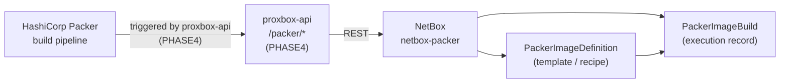
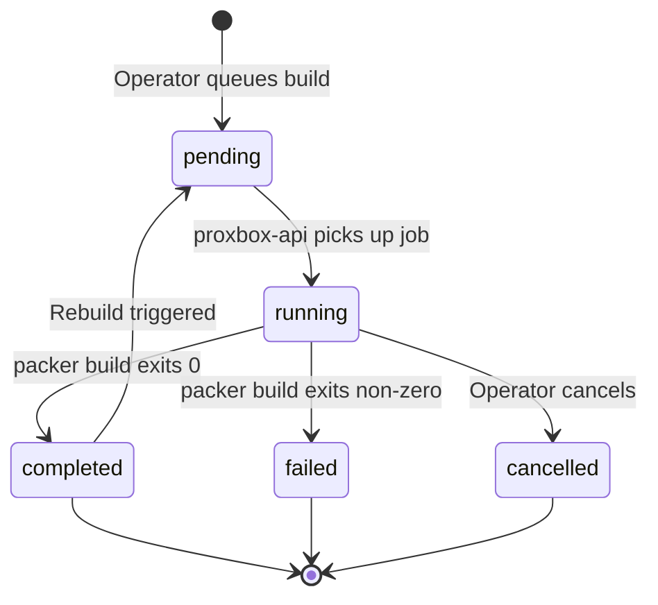
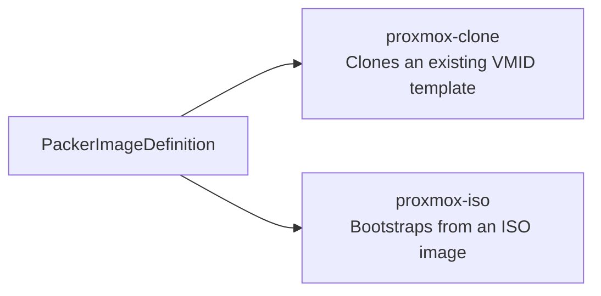
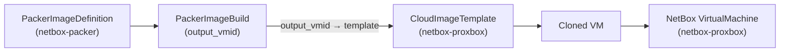

# netbox-packer — Packer Image Factory

`netbox-packer` is a standalone NetBox plugin that tracks **HashiCorp Packer** image definitions and build execution records inside NetBox. It provides a source-of-truth registry for machine images (Proxmox VM templates built from clones or ISO installs) and their build history, making image lifecycle visible alongside the VMs and infrastructure managed by the other Proxbox plugins.

!!! info "PHASE4 build dispatch"
    Active Packer build dispatch (triggering `packer build` runs from NetBox) is planned for PHASE4. In the current release, `netbox-packer` provides the data model, the image definition registry, and the build-record history. The build job is dispatched via `proxbox-api` and records results back into `PackerImageBuild`.

## Architecture



## Data Models

### `PackerImageDefinition`

Describes one image template — the recipe that Packer uses to build a Proxmox VM image.

| Field | Type | Description |
|---|---|---|
| `name` | string (unique) | Template name |
| `slug` | slug (unique) | URL-safe identifier |
| `description` | text | Human-readable description |
| `enabled` | bool | Whether this definition is active |
| `builder_type` | choice | `proxmox-clone` / `proxmox-iso` |
| `proxmox_endpoint` | FK → `ProxmoxEndpoint` | Target Proxmox VE cluster |
| `target_cluster` | FK → `virtualization.Cluster` (nullable) | NetBox cluster for the resulting template |
| `target_node` | string | Proxmox node name where the build runs |
| `source_template_vmid` | int (nullable) | Source VMID for `proxmox-clone` builds |
| `iso_url` | URL (nullable) | ISO download URL for `proxmox-iso` builds |
| `iso_checksum` | string | SHA-256 checksum (`sha256:…`) for the ISO |
| `iso_storage` | string | Proxmox storage reference for a pre-uploaded ISO |
| `default_storage` | string | Proxmox storage for the output disk |
| `default_bridge` | string | Network bridge (default `vmbr0`) |
| `os_family` | choice | `ubuntu` / `debian` / `rocky` / `almalinux` / `freebsd` |
| `os_release` | string | OS release version string (e.g., `24.04`) |
| `default_ciuser` | string | Default cloud-init user (default `ubuntu`) |
| `provisioner_recipe` | choice | `ubuntu-base` / `debian-base` / `docker-host` / `qemu-agent` |
| `default_variables` | JSON | Default variable overrides injected at build time |
| `allowed_tenants` | M2M → `tenancy.Tenant` | Tenants allowed to use this definition |

#### Builder validation

- `proxmox-clone` requires `target_cluster` and `source_template_vmid`.
- `proxmox-iso` requires either `iso_url` or `iso_storage`.

### `PackerImageBuild`

One execution record for a Packer image build.

| Field | Type | Description |
|---|---|---|
| `definition` | FK → `PackerImageDefinition` | Template that was built |
| `status` | choice | `pending` / `running` / `failed` / `completed` / `cancelled` |
| `backend_build_id` | string | Build ID assigned by `proxbox-api` |
| `proxmox_endpoint` | FK → `ProxmoxEndpoint` | Proxmox VE cluster used for this build |
| `target_node` | string | Proxmox node where the build ran |
| `output_vmid` | int | Proxmox VMID of the produced template |
| `output_name` | string | Human-readable artifact label |
| `image_version` | string | Version string for this build |
| `started_at` | datetime | Build start timestamp |
| `completed_at` | datetime | Build completion timestamp |
| `created_by` | FK → User | NetBox user who triggered the build |
| `netbox_job_id` | int (nullable) | Linked NetBox background job ID |
| `cloud_image_template` | FK → `CloudImageTemplate` (nullable) | Produced cloud image template |
| `backend_response` | JSON | Raw response from `proxbox-api` |
| `error` | text | Error detail on failure |

### Build Status Badge Colors

The NetBox UI renders colored status badges on build records:

| Status | Color |
|---|---|
| `completed` | Green |
| `running` | Blue |
| `failed` | Red |
| `cancelled` | Yellow |
| `pending` | Grey |

### `PackerPluginSettings`

Singleton settings row editable from **Packer → Plugin Settings**.

| Field | Default | Description |
|---|---|---|
| `image_factory_enabled` | `false` | Master switch for the image factory |
| `image_factory_max_concurrent_builds` | `1` | Maximum parallel Packer build jobs |
| `image_factory_default_job_timeout` | `14400` | Default build timeout in seconds (4 hours) |
| `image_factory_allow_iso_builds` | `false` | Allow `proxmox-iso` builder type |
| `image_factory_allow_custom_variables` | `false` | Allow operators to override default variables per build |

## Image Definition → Build Lifecycle



## Builder Types

`netbox-packer` currently supports two builder types targeting Proxmox VE:



The `proxmox-clone` builder produces a new template by cloning and re-provisioning an existing VMID, while `proxmox-iso` performs a full OS install from a downloaded or pre-uploaded ISO. Both builders produce a Proxmox VM template VMID recorded in `PackerImageBuild.output_vmid`.

## Relationship to proxbox-api and CloudImageTemplate

Successful builds feed into the broader Proxmox template lifecycle:



## Navigation

The plugin registers a **Packer** top-level menu with an **Image Factory** group:

- **Image Definitions** — list / detail / add / edit
- **Image Builds** — list / detail
- **Plugin Settings** — singleton edit

## REST API

Read-write REST API under `/api/plugins/packer/`:

| Endpoint | Methods | Description |
|---|---|---|
| `/api/plugins/packer/image-definitions/` | GET, POST | Image definition registry |
| `/api/plugins/packer/image-builds/` | GET, POST | Build execution records |
| `/api/plugins/packer/settings/` | GET, PUT, PATCH | Plugin settings |

## Installation

### pip

```bash
source /opt/netbox/venv/bin/activate
pip install netbox-packer
```

### git (development build)

```bash
source /opt/netbox/venv/bin/activate
pip install git+https://github.com/emersonfelipesp/netbox-packer.git
```

### Enable in NetBox

Add to `configuration.py` after `netbox_proxbox`:

```python
PLUGINS = [
    "netbox_proxbox",
    "netbox_packer",
]
```

Run migrations and restart:

```bash
cd /opt/netbox/netbox
python3 manage.py migrate netbox_packer
python3 manage.py collectstatic --no-input
sudo systemctl restart netbox netbox-rq
```

### Docker

Add to `plugin_requirements.txt`:

```
netbox-packer
```

Add to `configuration/plugins.py`:

```python
PLUGINS = [
    "netbox_proxbox",
    "netbox_packer",
]
```

## Configuration

No `PLUGINS_CONFIG` entries are required. All runtime options are stored in the `PackerPluginSettings` singleton, editable from **Packer → Plugin Settings**.

## NetBox Compatibility

| netbox-packer | NetBox |
|---|---|
| `0.0.1+` | 4.5.8 – 4.6.x |
