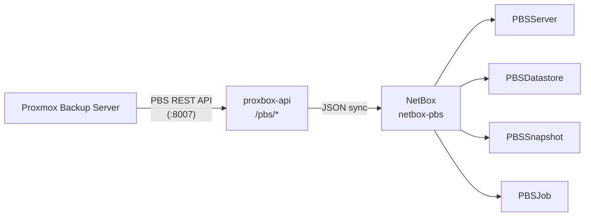
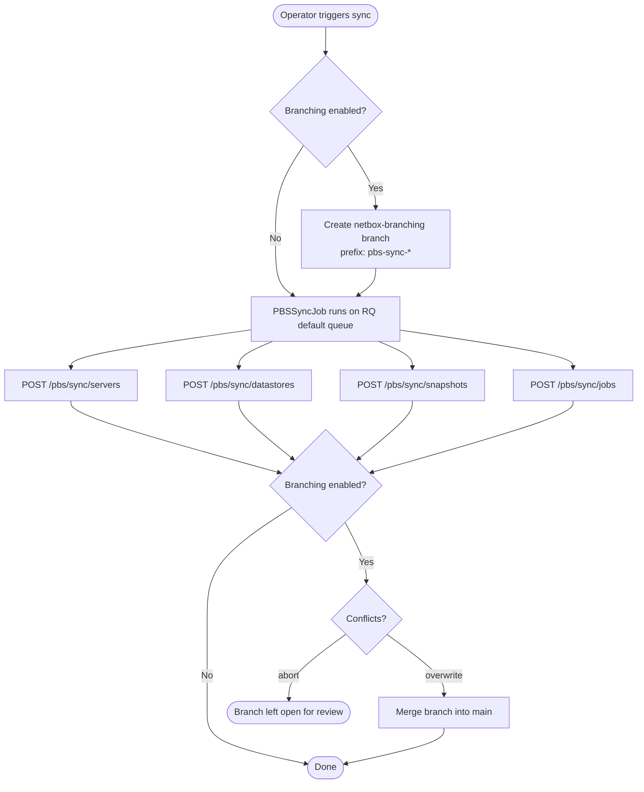

# netbox-pbs — Proxmox Backup Server

`netbox-pbs` is a standalone NetBox plugin that inventories **Proxmox Backup Server (PBS)** infrastructure by syncing data from the `proxbox-api` backend. It gives operators a unified view of backup servers, datastores, snapshots, and job history alongside the VMs and nodes tracked by `netbox-proxbox`.

## Architecture



## Data Models

### `PBSServer`

Represents one Proxmox Backup Server instance registered in NetBox.

| Field | Type | Description |
|---|---|---|
| `name` | string (unique) | Human-readable label |
| `host` | string | Hostname or IP address |
| `port` | int | API port (default `8007`) |
| `token_id` | string | PBS API token identifier |
| `fingerprint` | string | TLS fingerprint for certificate pinning |
| `verify_ssl` | bool | Whether to verify TLS certificates |
| `status` | choice | `unknown` / `reachable` / `unreachable` |
| `version` | string | PBS version string reported by the API |
| `last_seen_at` | datetime | Most recent successful API contact |

### `PBSDatastore`

One backup datastore on a PBS server.

| Field | Type | Description |
|---|---|---|
| `server` | FK → `PBSServer` | Owning PBS server |
| `name` | string | Datastore name as reported by PBS |
| `path` | string | Filesystem path on the PBS host |
| `used_bytes` | int | Used capacity (bytes) |
| `total_bytes` | int | Total capacity (bytes) |
| `avail_bytes` | int | Available capacity (bytes) |
| `gc_status` | choice | `ok` / `running` / `error` / `pending` / `unknown` |
| `comment` | string | Optional annotation |
| `last_seen_at` | datetime | Most recent sync timestamp |

Uniqueness constraint: `(server, name)`.

### `PBSSnapshot`

One backup snapshot stored in a datastore.

| Field | Type | Description |
|---|---|---|
| `server` | FK → `PBSServer` | Owning PBS server |
| `datastore_name` | string | Datastore name (denormalized) |
| `backup_type` | choice | `vm` / `ct` / `host` / `unknown` |
| `backup_id` | string | Proxmox VMID or hostname |
| `backup_time` | datetime | Snapshot creation timestamp |
| `size_bytes` | int | Snapshot size (bytes) |
| `owner` | string | PBS ownership token or user |
| `protected` | bool | Protected from garbage collection |
| `comment` | string | Optional annotation |
| `verification_state` | string | Integrity verification result |
| `last_seen_at` | datetime | Most recent sync timestamp |

Uniqueness constraint: `(server, datastore_name, backup_type, backup_id, backup_time)`.

### `PBSJob`

A PBS scheduled job (verify / prune / garbage-collect / sync / tape).

| Field | Type | Description |
|---|---|---|
| `server` | FK → `PBSServer` | Owning server |
| `job_type` | choice | `verify` / `prune` / `gc` / `sync` / `tape` / `unknown` |
| `job_id` | string | PBS job identifier |
| `store` | string | Target datastore name |
| `schedule` | string | Cron/calendar schedule expression |
| `comment` | string | Job comment |
| `disable` | bool | Whether the job is disabled |
| `last_run_state` | choice | `ok` / `error` / `warning` / `running` / `unknown` |
| `last_run_endtime` | datetime | Last execution end timestamp |
| `next_run` | datetime | Next scheduled execution |
| `last_seen_at` | datetime | Most recent sync timestamp |

Uniqueness constraint: `(server, job_type, job_id)`.

### `PBSPluginSettings`

Singleton settings row editable from **PBS → Plugin Settings**.

| Field | Default | Description |
|---|---|---|
| `proxbox_api_url` | `""` | Fallback URL used when `FastAPIEndpoint` resolution is unavailable |
| `proxbox_api_key` | `""` | Optional bearer token for the standalone URL |
| `branching_enabled` | `false` | Create a `netbox-branching` branch per sync run |
| `branch_name_prefix` | `"pbs-sync"` | Prefix for auto-created branch names |
| `branch_on_conflict` | `abort` | `abort` (leave branch open) or `overwrite` (merge despite conflicts) |

## Sync Flow



## Navigation

The plugin registers a **PBS** top-level menu with an **Inventory** group:

- **Servers** — list / detail / add
- **Datastores** — list / detail
- **Snapshots** — list / detail
- **Jobs** — list / detail
- **Plugin Settings** — singleton edit

## REST API

The plugin exposes a read-write REST API under `/api/plugins/pbs/`:

| Endpoint | Methods |
|---|---|
| `/api/plugins/pbs/servers/` | GET, POST |
| `/api/plugins/pbs/datastores/` | GET, POST |
| `/api/plugins/pbs/snapshots/` | GET, POST |
| `/api/plugins/pbs/jobs/` | GET, POST |
| `/api/plugins/pbs/settings/` | GET, PUT, PATCH |

## Installation

### pip

```bash
source /opt/netbox/venv/bin/activate
pip install netbox-pbs
```

### git (development build)

```bash
source /opt/netbox/venv/bin/activate
pip install git+https://github.com/emersonfelipesp/netbox-pbs.git
```

### Enable in NetBox

Add to `configuration.py` **after** `netbox_proxbox`:

```python
PLUGINS = [
    "netbox_proxbox",
    "netbox_pbs",
    # other companion plugins …
]
```

Run migrations and restart:

```bash
cd /opt/netbox/netbox
python3 manage.py migrate netbox_pbs
python3 manage.py collectstatic --no-input
sudo systemctl restart netbox netbox-rq
```

### Docker

Add to `plugin_requirements.txt`:

```
netbox-pbs
```

Add to `configuration/plugins.py`:

```python
PLUGINS = [
    "netbox_proxbox",
    "netbox_pbs",
]
```

## Configuration

No `PLUGINS_CONFIG` entries are required. All runtime options are stored in the `PBSPluginSettings` singleton and are editable from the NetBox UI at **PBS → Plugin Settings**.

## NetBox Compatibility

| netbox-pbs | NetBox |
|---|---|
| `0.0.1+` | 4.5.8 – 4.6.x |

`netbox-proxbox` must be installed at the same NetBox compatibility level.
