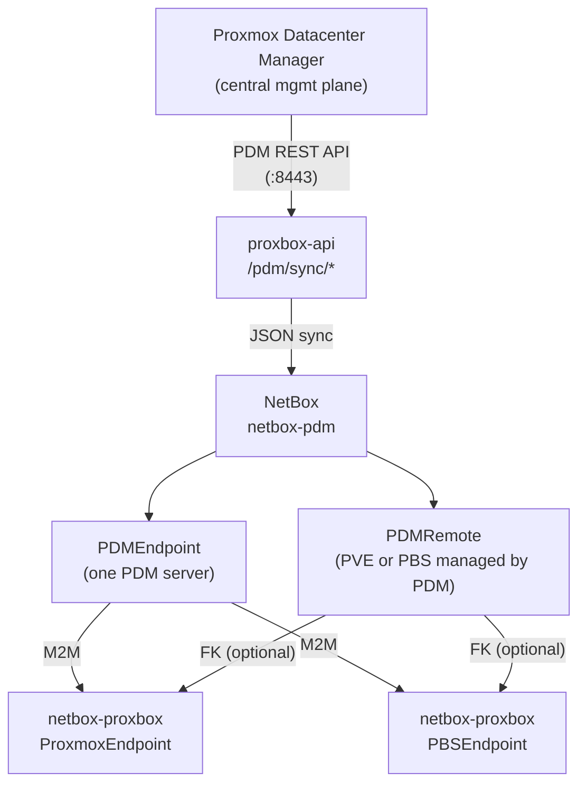
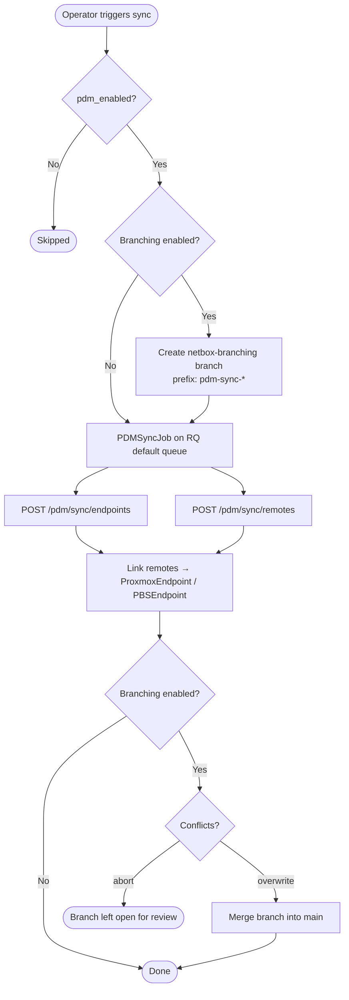
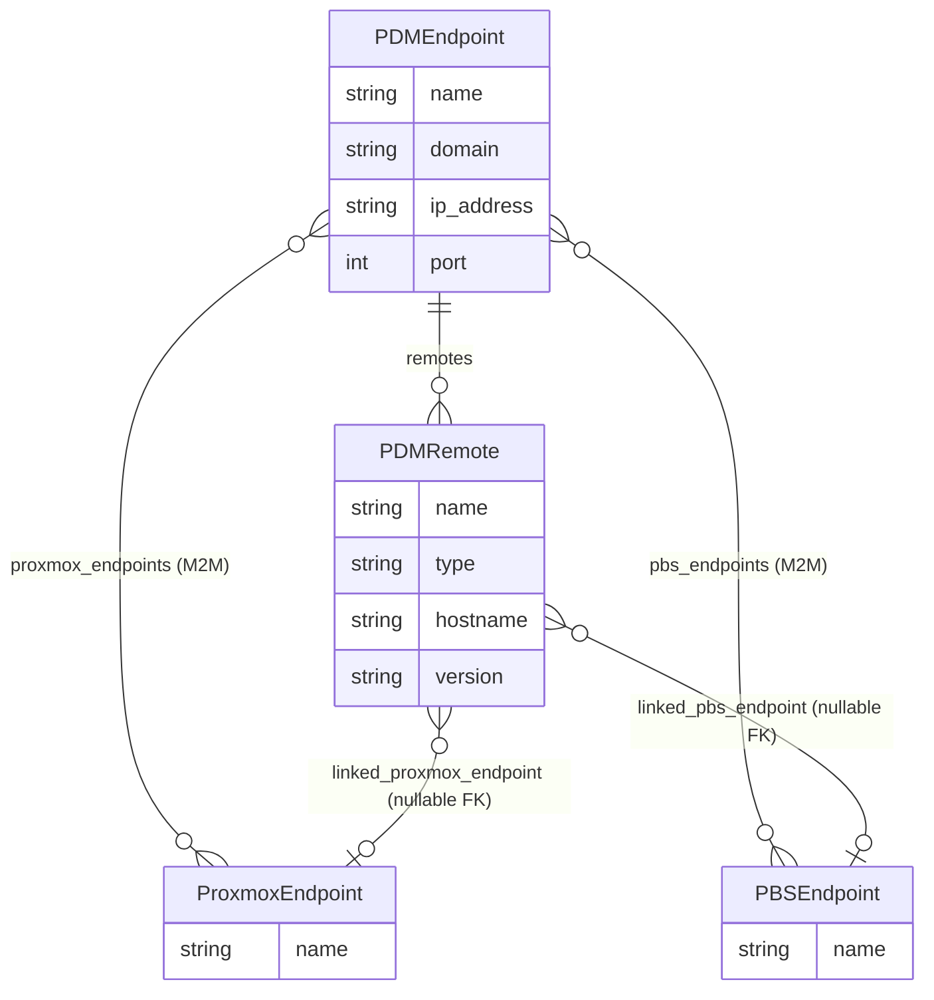

# netbox-pdm — Proxmox Datacenter Manager

`netbox-pdm` is a standalone NetBox plugin that inventories **Proxmox Datacenter Manager (PDM)** infrastructure. PDM is the centralized management plane that sits above individual Proxmox VE clusters and PBS servers. `netbox-pdm` reflects PDM endpoint metadata and the remotes they manage (PVE nodes and PBS servers) into NetBox, and links them to the `ProxmoxEndpoint` and `PBSEndpoint` objects tracked by the sibling plugins.

## Architecture



## Data Models

### `PDMEndpoint`

Mirrors one Proxmox Datacenter Manager server registered in NetBox.

| Field | Type | Description |
|---|---|---|
| `name` | string | Human-readable label (unique) |
| `domain` / `ip_address` | string / FK → `ipam.IPAddress` | Endpoint host source; the model exposes computed `host` for proxbox-api compatibility |
| `port` | int | API port (default `8443`) |
| `token_id` | string | PDM API token identifier |
| `token_secret_enc` | string | Fernet-encrypted PDM API token secret ciphertext |
| `fingerprint` | string | TLS fingerprint for certificate pinning |
| `verify_ssl` | bool | Whether to verify TLS certificates |
| `allow_writes` | bool | Reserved — enables write-back operations (default `false`) |
| `timeout` | int | Optional per-request timeout; computed `timeout_seconds` defaults to `30` |
| `enabled` | bool | Disabled rows remain inventory-only and cannot run sync jobs |
| `site` | FK → `dcim.Site` | Physical site |
| `tenant` | FK → `tenancy.Tenant` | Tenant scoping |
| `proxmox_endpoints` | M2M → `ProxmoxEndpoint` | Proxmox VE clusters managed through this PDM |
| `pbs_endpoints` | M2M → `PBSEndpoint` | PBS endpoints managed through this PDM |

### `PDMRemote`

One row of PDM's `/pdm/remotes` response — a single PVE cluster or PBS server that PDM has discovered and is managing.

| Field | Type | Description |
|---|---|---|
| `pdm_endpoint` | FK → `PDMEndpoint` | Parent PDM server |
| `name` | string | Remote name as reported by PDM |
| `type` | choice | `pve` (Proxmox VE) or `pbs` (Proxmox Backup Server) |
| `hostname` | string | Primary hostname reported by PDM |
| `fingerprint` | string | TLS fingerprint reported by PDM |
| `version` | string | Proxmox version string reported by the remote |
| `last_seen_at` | datetime | Most recent successful contact |
| `linked_proxmox_endpoint` | FK → `ProxmoxEndpoint` (nullable) | Links to the matching `netbox-proxbox` endpoint |
| `linked_pbs_endpoint` | FK → `PBSEndpoint` (nullable) | Links to the matching `netbox-proxbox` PBS endpoint |

Uniqueness constraint: `(pdm_endpoint, name)`.

### `PDMPluginSettings`

Singleton settings row editable from **PDM → Plugin Settings** in the NetBox UI.

| Field | Default | Description |
|---|---|---|
| `proxbox_api_url` | `""` | Fallback URL used when `FastAPIEndpoint` resolution is unavailable |
| `proxbox_api_key` | `""` | Optional bearer token for the standalone URL |
| `branching_enabled` | `false` | Create a `netbox-branching` branch per sync run |
| `branch_name_prefix` | `"pdm-sync"` | Prefix for auto-created branch names |
| `branch_on_conflict` | `abort` | `abort` (leave branch open) or `overwrite` (merge despite conflicts) |
| `pdm_fetch_concurrency` | `8` | Maximum concurrent requests when fetching PDM data |
| `pdm_enabled` | `true` | Master switch — disabling skips all PDM sync operations |

## Sync Flow



## Cross-Plugin Relationships

`netbox-pdm` is the only companion plugin that references models from two sibling plugins:



!!! warning "Install order"
    When using the standalone companion plugins, run PBS migrations before PDM migrations so PDM can resolve PBS-side references.

## Navigation

The plugin registers a **PDM** top-level menu with an **Inventory** group:

- **PDM Endpoints** — list / detail / add
- **PDM Remotes** — list / detail
- **Plugin Settings** — singleton edit

## REST API

The plugin exposes a read-write REST API under `/api/plugins/pdm/`:

| Endpoint | Methods |
|---|---|
| `/api/plugins/pdm/endpoints/` | GET, POST |
| `/api/plugins/pdm/remotes/` | GET, POST |
| `/api/plugins/pdm/settings/` | GET, PUT, PATCH |

## Installation

!!! warning "Dependencies"
    `netbox-proxbox` **and** `netbox-pbs` must be installed and migrated before `netbox-pdm`.

### pip

```bash
source /opt/netbox/venv/bin/activate
pip install netbox-pbs netbox-pdm
```

### git (development build)

```bash
source /opt/netbox/venv/bin/activate
pip install git+https://github.com/emersonfelipesp/netbox-pdm.git
```

### Enable in NetBox

Add to `configuration.py` in this order:

```python
PLUGINS = [
    "netbox_proxbox",
    "netbox_pbs",   # must come before netbox_pdm
    "netbox_pdm",
]
```

Run migrations and restart:

```bash
cd /opt/netbox/netbox
python3 manage.py migrate netbox_pbs
python3 manage.py migrate netbox_pdm
python3 manage.py collectstatic --no-input
sudo systemctl restart netbox netbox-rq
```

### Docker

Add to `plugin_requirements.txt`:

```
netbox-pbs
netbox-pdm
```

Add to `configuration/plugins.py`:

```python
PLUGINS = [
    "netbox_proxbox",
    "netbox_pbs",
    "netbox_pdm",
]
```

## Configuration

No `PLUGINS_CONFIG` entries are required. All runtime options are stored in the `PDMPluginSettings` singleton and editable from **PDM → Plugin Settings**.

## NetBox Compatibility

| netbox-pdm | NetBox |
|---|---|
| `0.0.1+` | 4.5.8 – 4.6.x |
