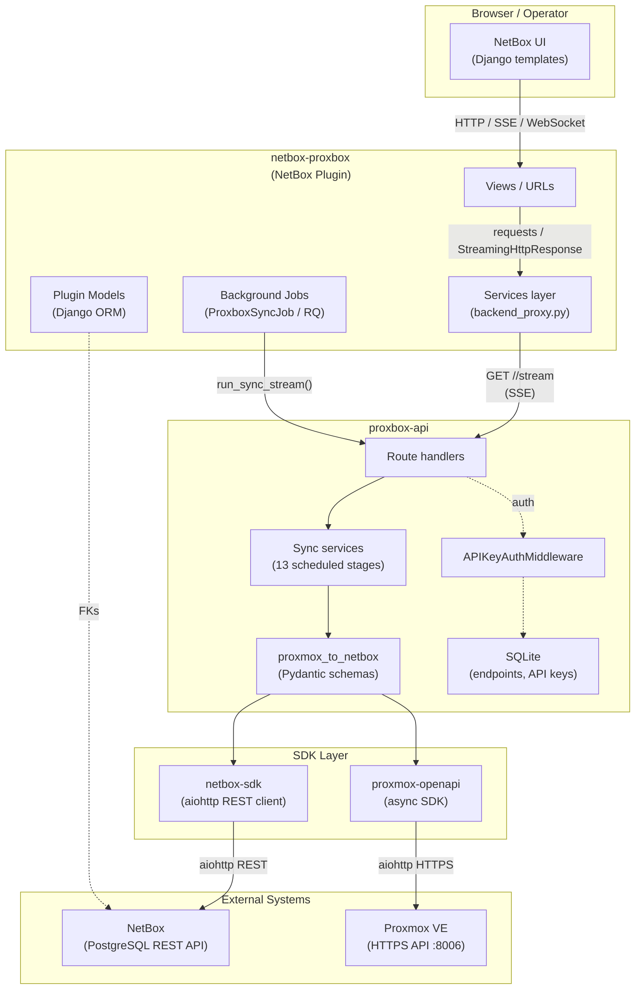
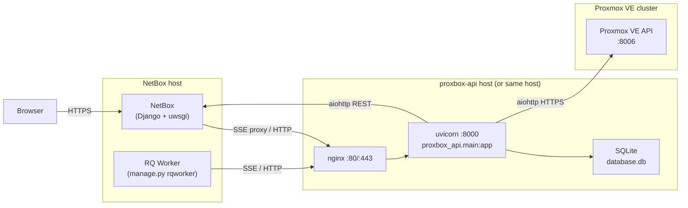

# Architecture Overview

Proxbox is a **four-repository ecosystem** that synchronizes Proxmox VE infrastructure into NetBox in real time. Together, the components form a layered pipeline: NetBox provides the data model and UI, a FastAPI backend orchestrates all sync work, and two Python SDKs handle the low-level API communication with NetBox and Proxmox respectively.

---

## System Component Map

---

## Deployment Topology

In a typical production deployment all components run as separate processes. The NetBox plugin runs **inside** the NetBox Django process (or uwsgi worker). The FastAPI backend runs as a standalone uvicorn service and is usually placed behind nginx.

!!! info "Docker deployments"
    When using Docker the pattern is the same but each component runs in its own container. The `proxbox-api` image exposes port `8000` internally and the host maps it to `8800` (`-p 8800:8000`). See [Installing the Plugin (Docker)](../installation/3-installing-plugin-docker.md) for details.

---

## Component Summary

| Component | Repository | Primary Stack | Responsibility |
|---|---|---|---|
| **netbox-proxbox** | `netbox-proxbox/` | Python, Django, NetBox plugin framework | NetBox plugin: UI, models, API, background jobs, backend proxy |
| **proxbox-api** | `proxbox-api/` | Python, FastAPI, SQLite | Sync services, per-stage SSE streaming, endpoint management |
| **netbox-sdk** | `netbox-sdk/` | Python, aiohttp | Async NetBox REST API client with typed models and caching |
| **proxmox-openapi** | `proxmox-sdk/` | Python, aiohttp | Async Proxmox VE API client (646 endpoints, mock/real modes) |

---

## Request Lifecycle at a Glance

A sync triggered from the NetBox UI follows this high-level path:

1. **Browser** sends a form POST to a NetBox plugin view
2. The **plugin view** enqueues a `ProxboxSyncJob` on the RQ `default` queue
3. An **RQ worker** picks up the job and calls `run_sync_stream()` in the services layer
4. The services layer opens one or more **streaming GET** calls to the stage
   paths in `netbox_proxbox/sync_types.py`
5. **proxbox-api** runs each requested stage, emitting SSE progress events
6. Each stage fetches data from **Proxmox VE** via the proxmox-openapi SDK, transforms it, and writes to **NetBox** via netbox-sdk
7. SSE events flow back through the plugin and are attached to the NetBox **Job** record
8. The browser polls the Job detail page to see live log output

---

!!! tip "Where to go next"
    - [Component Deep Dive](component-deep-dive.md) — internal architecture of each repository
    - [Sync Pipeline](sync-pipeline.md) — the 13-stage scheduled full-update sequence
    - [Data Flow](data-flow.md) — Proxmox payload → NetBox object transformation
    - [Backend Integration](backend-integration.md) — plugin ↔ proxbox-api communication
    - [Streaming Protocol](streaming-protocol.md) — SSE and WebSocket protocol specification
    - [Authentication](authentication.md) — all auth boundaries documented
