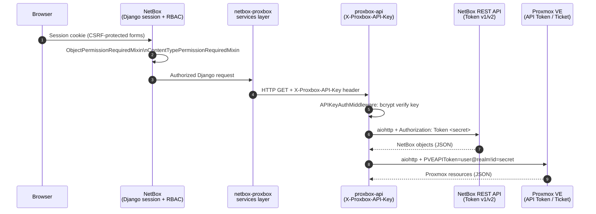

# Authentication Flows

Proxbox spans four distinct authentication boundaries. This page documents each one, from browser session through to the Proxmox VE API.

---

## Full Authentication Chain



---

## Boundary 1: Browser ↔ NetBox Plugin

The browser interacts with the plugin through standard NetBox Django views. All authentication is handled by NetBox's Django session framework.

### Permission Model

| View category | Mixin | Required permission |
|---|---|---|
| Endpoint CRUD (`ProxmoxEndpoint`, `NetBoxEndpoint`, `FastAPIEndpoint`) | `ObjectPermissionRequiredMixin` (NetBox generic) | `view`, `add`, `change`, `delete` on the model |
| Sync action views | `ContentTypePermissionRequiredMixin` | `add` on `core.Job` (for enqueue), `delete` on `core.Job` (for cancel) |
| WebSocket test / status pages | `TokenConditionalLoginRequiredMixin` | `view` on `FastAPIEndpoint` |
| Dashboard / JSON endpoints | `ConditionalLoginRequiredMixin` | At least `view` on `ProxmoxEndpoint` or `NetBoxEndpoint` |
| Plugin REST API | `NetBoxModelViewSet` (standard DRF) | Standard NetBox API token required |

```python title="netbox_proxbox/views/proxbox_access.py (pattern)"
class SyncNowView(ContentTypePermissionRequiredMixin, View):
    def get_required_permission(self):
        return "core.add_job"   # operator must have permission to queue jobs
```

---

## Boundary 2: NetBox Plugin ↔ proxbox-api

The plugin authenticates to proxbox-api using a **bcrypt-hashed API key** sent in the `X-Proxbox-API-Key` HTTP header.

### API Key Adoption and Bootstrap

`FastAPIEndpoint.save()` is the credential persistence boundary. UI, import,
REST, and direct-model writes converge there; Django signals only authenticate
an already-persisted key before downstream endpoint delivery. The plugin never
generates a hidden key.

Successful adoption persists a credential-free SHA-256
`backend_key_target_fingerprint` alongside the ciphertext. The fingerprint
binds the candidate to the canonical primary HTTP authority, fallback IP,
port, HTTP/TLS flags, and WebSocket authority flags. Every runtime HTTP and
WebSocket credential lookup recomputes it, using a fresh IP foreign-key value,
and refuses to return the key if any bound value drifted. Legacy rows created
before migration `0075_fastapi_backend_key_target_fingerprint` remain blank
until an operator reviews the target and runs `proxbox_fix_tokens --fix`.

Before any bootstrap-status request, the adoption service validates and
canonicalizes the target authority. DNS names follow the model hostname
contract, IP literals are parsed, IPv6 is bracketed, and URL userinfo, paths,
queries, fragments, malformed ports, and authority-injection strings are
rejected without network traffic. Redirect rejection is therefore defense in
depth rather than the first authority boundary.

```mermaid
sequenceDiagram
    participant Operator
    participant NB as NetBox Plugin
    participant API as proxbox-api /auth/

    Operator->>NB: Save enabled endpoint with explicit retained candidate
    NB->>NB: Lock row; compare trust-boundary snapshot
    NB->>API: GET /auth/bootstrap-status (redirects disabled)
    alt no backend keys
        API-->>NB: needs_bootstrap=true, has_db_keys=false
        NB->>API: POST /auth/register-key once (redirects disabled)
        API->>API: bcrypt.hash(candidate) → store in ApiKey table
        API-->>NB: 201 Created
    else initialized backend
        API-->>NB: needs_bootstrap=false, has_db_keys=true
        NB->>API: GET /auth/keys with candidate header (redirects disabled)
        API-->>NB: 200 + valid key-list schema
    end
    NB->>NB: Encrypt and persist the same candidate
```

!!! info "First key only"
    `POST /auth/register-key` is **exempt from authentication** but accepts only
    the **first** API key. It is used only after a consistent empty-state
    response and only for the candidate the operator explicitly supplied.
    HTTP `409` is failure, never proof of adoption. Subsequent key management
    requires authentication via `POST /auth/keys` and
    `DELETE /auth/keys/{id}`.

!!! warning "Disabled means no connection"
    A new disabled FastAPI endpoint stays keyless. Disabled rows are skipped by
    signals, jobs, status checks, WebSocket/storage views, and
    `proxbox_fix_tokens`, including `--fix`.
    Enabling a row, moving it to a different URL/TLS target, or rotating its key
    requires explicitly resubmitting the candidate. Rejections and transport
    failures preserve the prior ciphertext.

The WebSocket bridge applies the same durable trust check before opening a
connection, again after the handshake, periodically while a busy stream is
running, and before queued messages are sent. It disables ambient proxy use and
refuses a server-selected redirect before adding the API-key header. Saving the
endpoint cancels the old client so a stale task cannot continue with the prior
target or key.

### APIKeyAuthMiddleware

Every request to proxbox-api (except bootstrap routes) passes through `APIKeyAuthMiddleware`:

1. Extract `X-Proxbox-API-Key` from the request headers
2. Check if the client IP is locked out (`AuthLockout` table)
3. Verify the key against all stored bcrypt hashes via `ApiKey.verify_any_async()`
4. On failure: increment attempt counter; lock out IP after **5 failed attempts** for **300 seconds**
5. On success: clear the failure counter and proceed

```python title="proxbox_api/auth.py"
_LOCKOUT_DURATION = 300   # seconds
_MAX_FAILED_ATTEMPTS = 5

async def check_auth_header_with_session_async(session, api_key, client_ip):
    if await is_locked_out_async(session, client_ip):
        return False, "Too many failed authentication attempts."
    if not await ApiKey.verify_any_async(session, api_key):
        await record_failed_attempt_async(session, client_ip)
        ...
    await clear_failed_attempts_async(session, client_ip)
    return True, None
```

---

## Boundary 3: proxbox-api ↔ NetBox REST API

proxbox-api accesses NetBox via the **netbox-sdk** `api()` facade. It supports both NetBox token formats:

=== "Token v1 (classic)"
    ```
    Authorization: Token <token_secret>
    ```
    A single opaque token stored in the `NetBoxEndpoint.token_secret` field (encrypted at rest in NetBox).

=== "Token v2 (newer)"
    ```
    Authorization: Bearer nbt_<key>.<secret>
    ```
    Split into `token_key` and `token_secret`. The `nbt_` prefix identifies v2 format. The netbox-sdk handles encoding automatically.

```python title="proxbox_api/session/netbox.py"
def netbox_config_from_endpoint(endpoint: NetBoxEndpoint) -> Config:
    tv = (endpoint.token_version or "v1").lower()   # "v1" or "v2"
    return Config(
        base_url=endpoint.url,
        token_version=tv,
        token_key=key,          # None for v1; key part of nbt_ token for v2
        token_secret=decrypted_token,
        timeout=_resolve_netbox_timeout(),
        ssl_verify=endpoint.verify_ssl,
    )
```

The token is decrypted from the SQLite `NetBoxEndpoint` model using `get_decrypted_token()` — proxbox-api stores it encrypted at rest using the `cryptography` package.

---

## Boundary 4: proxbox-api ↔ Proxmox VE

=== "API Token (recommended)"
    ```
    PVEAPIToken=user@realm!tokenid=<uuid-secret>
    ```
    Token is stored in the `ProxmoxEndpoint` table in proxbox-api's SQLite database. The proxmox-openapi SDK reads the token at session creation and includes it in the `Authorization` header for every request. No renewal needed.

    ```python title="proxbox-api session/proxmox_core.py (simplified)"
    sdk = ProxmoxSDK(
        host=endpoint.host,
        port=endpoint.port,
        token=endpoint.token,       # "PVEAPIToken=root@pam!mytoken=<uuid>"
        verify_ssl=endpoint.verify_ssl,
    )
    ```

=== "Password / Ticket"
    ```python
    sdk = ProxmoxSDK(
        host=endpoint.host,
        username="root@pam",
        password="secret",
        # TOTP optional: otp="123456"
    )
    ```
    The SDK performs a POST to `/api2/json/access/ticket` to obtain a short-lived `PVEAuthCookie` + `CSRFPreventionToken` pair. The ticket is valid for **2 hours** and is renewed automatically. Credentials are redacted from all log output by `SensitiveDataFilter`.

SSL verification is controlled per endpoint via `verify_ssl`. When `verify_ssl=False` the same SSL context is applied to both the auth request and all subsequent API calls.

---

## Django Signal Responsibilities

`signals.py` never adopts or persists a FastAPI credential. Its
`FastAPIEndpoint` receiver only confirms that the model gate completed. The
`NetBoxEndpoint` and `ProxmoxEndpoint` receivers resolve an enabled
`FastAPIEndpoint`, authenticate its stored key through the read-only adoption
check, and then push those downstream endpoint records to proxbox-api.
The `FastAPIEndpoint` receiver itself performs no request and repeated receiver
invocation cannot generate, bootstrap, or rewrite a key.

This separation matters because signal exceptions can roll back the database
transaction after a remote bootstrap has succeeded. The operator-retained
candidate makes that state recoverable: retry the save with the same key, which
the initialized backend can authenticate. The `proxbox_fix_tokens` command is
an explicit legacy-repair path; without `--fix` it is read-only, and `--fix`
records a reviewed legacy target after authenticating its durably stored key;
it bootstraps that same key only when the backend reports no keys. A blank
legacy fingerprint is never probed without `--fix`, and a nonblank fingerprint
that no longer matches is refused without network traffic.
