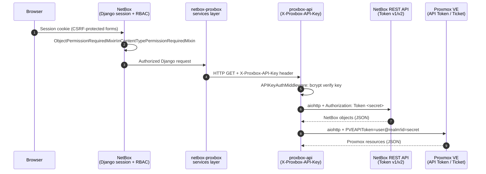
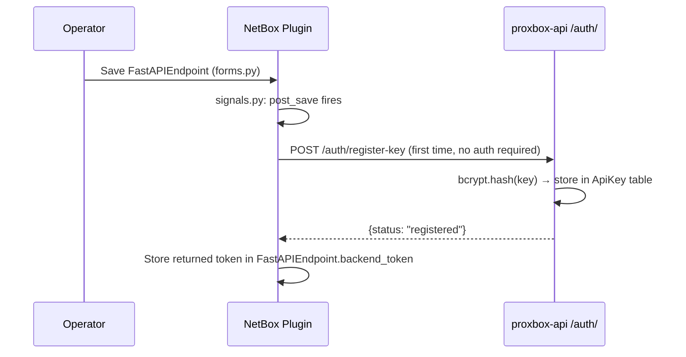

# Authentication Flows

Proxbox spans four distinct authentication boundaries. This page documents each one, from browser session through to the Proxmox VE API.

---

## Full Authentication Chain



---

## Boundary 1: Browser ↔ NetBox Plugin

The browser interacts with the plugin through standard NetBox Django views. All authentication is handled by NetBox's Django session framework.

### Permission Model

| View category | Mixin | Required permission |
|---|---|---|
| Endpoint CRUD (`ProxmoxEndpoint`, `NetBoxEndpoint`, `FastAPIEndpoint`) | `ObjectPermissionRequiredMixin` (NetBox generic) | `view`, `add`, `change`, `delete` on the model |
| Sync action views | `ContentTypePermissionRequiredMixin` | `add` on `core.Job` (for enqueue), `delete` on `core.Job` (for cancel) |
| WebSocket test / status pages | `TokenConditionalLoginRequiredMixin` | `view` on `FastAPIEndpoint` |
| Dashboard / JSON endpoints | `ConditionalLoginRequiredMixin` | At least `view` on `ProxmoxEndpoint` or `NetBoxEndpoint` |
| Plugin REST API | `NetBoxModelViewSet` (standard DRF) | Standard NetBox API token required |

```python title="netbox_proxbox/views/proxbox_access.py (pattern)"
class SyncNowView(ContentTypePermissionRequiredMixin, View):
    def get_required_permission(self):
        return "core.add_job"   # operator must have permission to queue jobs
```

---

## Boundary 2: NetBox Plugin ↔ proxbox-api

The plugin authenticates to proxbox-api using a **bcrypt-hashed API key** sent in the `X-Proxbox-API-Key` HTTP header.

### API Key Registration (Bootstrap Flow)

When a `FastAPIEndpoint` is saved in NetBox, a Django signal auto-registers the plugin with proxbox-api:



!!! info "First key only"
    `POST /auth/register-key` is **exempt from authentication** but only accepts the **first** API key. Subsequent key management (list, rotate, delete) requires authentication via `POST /auth/keys` and `DELETE /auth/keys/{id}`.

### APIKeyAuthMiddleware

Every request to proxbox-api (except bootstrap routes) passes through `APIKeyAuthMiddleware`:

1. Extract `X-Proxbox-API-Key` from the request headers
2. Check if the client IP is locked out (`AuthLockout` table)
3. Verify the key against all stored bcrypt hashes via `ApiKey.verify_any_async()`
4. On failure: increment attempt counter; lock out IP after **5 failed attempts** for **300 seconds**
5. On success: clear the failure counter and proceed

```python title="proxbox_api/auth.py"
_LOCKOUT_DURATION = 300   # seconds
_MAX_FAILED_ATTEMPTS = 5

async def check_auth_header_with_session_async(session, api_key, client_ip):
    if await is_locked_out_async(session, client_ip):
        return False, "Too many failed authentication attempts."
    if not await ApiKey.verify_any_async(session, api_key):
        await record_failed_attempt_async(session, client_ip)
        ...
    await clear_failed_attempts_async(session, client_ip)
    return True, None
```

---

## Boundary 3: proxbox-api ↔ NetBox REST API

proxbox-api accesses NetBox via the **netbox-sdk** `api()` facade. It supports both NetBox token formats:

=== "Token v1 (classic)"
    ```
    Authorization: Token <token_secret>
    ```
    A single opaque token stored in the `NetBoxEndpoint.token_secret` field (encrypted at rest in NetBox).

=== "Token v2 (newer)"
    ```
    Authorization: Bearer nbt_<key>.<secret>
    ```
    Split into `token_key` and `token_secret`. The `nbt_` prefix identifies v2 format. The netbox-sdk handles encoding automatically.

```python title="proxbox_api/session/netbox.py"
def netbox_config_from_endpoint(endpoint: NetBoxEndpoint) -> Config:
    tv = (endpoint.token_version or "v1").lower()   # "v1" or "v2"
    return Config(
        base_url=endpoint.url,
        token_version=tv,
        token_key=key,          # None for v1; key part of nbt_ token for v2
        token_secret=decrypted_token,
        timeout=_resolve_netbox_timeout(),
        ssl_verify=endpoint.verify_ssl,
    )
```

The token is decrypted from the SQLite `NetBoxEndpoint` model using `get_decrypted_token()` — proxbox-api stores it encrypted at rest using the `cryptography` package.

---

## Boundary 4: proxbox-api ↔ Proxmox VE

=== "API Token (recommended)"
    ```
    PVEAPIToken=user@realm!tokenid=<uuid-secret>
    ```
    Token is stored in the `ProxmoxEndpoint` table in proxbox-api's SQLite database. The proxmox-openapi SDK reads the token at session creation and includes it in the `Authorization` header for every request. No renewal needed.

    ```python title="proxbox-api session/proxmox_core.py (simplified)"
    sdk = ProxmoxSDK(
        host=endpoint.host,
        port=endpoint.port,
        token=endpoint.token,       # "PVEAPIToken=root@pam!mytoken=<uuid>"
        verify_ssl=endpoint.verify_ssl,
    )
    ```

=== "Password / Ticket"
    ```python
    sdk = ProxmoxSDK(
        host=endpoint.host,
        username="root@pam",
        password="secret",
        # TOTP optional: otp="123456"
    )
    ```
    The SDK performs a POST to `/api2/json/access/ticket` to obtain a short-lived `PVEAuthCookie` + `CSRFPreventionToken` pair. The ticket is valid for **2 hours** and is renewed automatically. Credentials are redacted from all log output by `SensitiveDataFilter`.

SSL verification is controlled per endpoint via `verify_ssl`. When `verify_ssl=False` the same SSL context is applied to both the auth request and all subsequent API calls.

---

## Django Signal Auto-Registration

When an operator creates or updates a `FastAPIEndpoint` record in NetBox, the plugin automatically:

1. Calls `POST /auth/register-key` with a freshly generated token (if none stored yet)
2. Stores the returned token in `FastAPIEndpoint.backend_token`
3. Calls `POST /netbox/endpoints/` to register the `NetBoxEndpoint` details with proxbox-api

This is implemented in `netbox_proxbox/signals.py` using Django's `post_save` signal.

```python title="netbox_proxbox/signals.py (simplified)"
@receiver(post_save, sender=FastAPIEndpoint)
def register_fastapi_endpoint(sender, instance, created, **kwargs):
    if created:
        _bootstrap_backend_auth(instance)
    _sync_netbox_endpoint_to_backend(instance)
```

!!! tip "Manual registration"
    If auto-registration fails (e.g., proxbox-api is not running when the endpoint is saved), you can trigger it manually via the **Sync Endpoints** button on the FastAPIEndpoint detail page.
