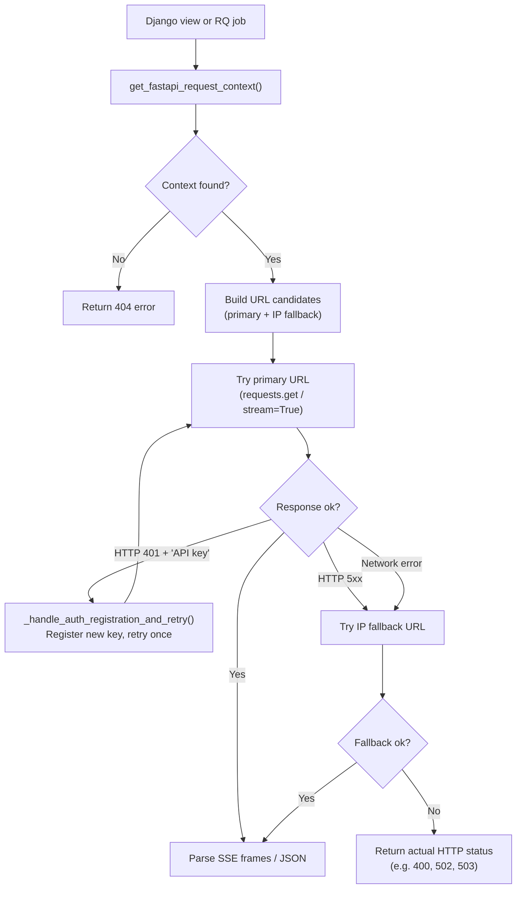
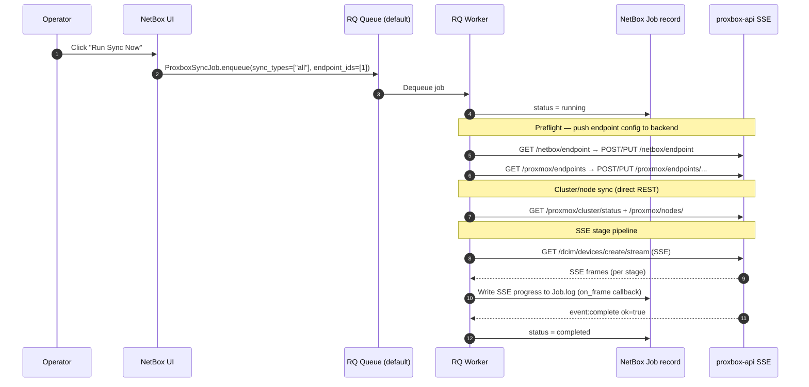

# Backend Integration

This page documents how the `netbox-proxbox` plugin communicates with the `proxbox-api` FastAPI backend — covering the service layer architecture, the two sync transport modes, background job execution, and URL fallback strategy.

---

## Service Layer Architecture

All backend communication is isolated inside `netbox_proxbox/services/`:

| Module | Purpose |
|---|---|
| `backend_context.py` | Resolves the active `FastAPIEndpoint` and builds the `BackendRequestContext` dataclass (URL, headers, SSL flag) |
| `backend_proxy.py` | HTTP client helpers: SSE streaming (`run_sync_stream`, `iter_backend_sse_lines`), JSON requests (`sync_resource`, `sync_full_update_resource`) |
| `backend_auth.py` | Token registration bootstrap, backend readiness check (`wait_for_backend_ready()`), per-path HTTP timeout lookup |
| `http_client.py` | Low-level session management and retry helpers |
| `individual_sync.py` | Per-object sync handlers for "Sync Now" buttons on cluster, node, storage, and VM detail pages |
| `openapi_schema.py` | Caches the proxbox-api OpenAPI schema for UI features |
| `service_status.py` | `ServiceStatus` — aggregates endpoint health for dashboard keepalive cards |

---

## Request Context Resolution

Every backend call starts with resolving the `FastAPIEndpoint`:

```python title="netbox_proxbox/services/backend_context.py (simplified)"
def get_fastapi_request_context(endpoint_id: int | None = None) -> BackendRequestContext | None:
    if endpoint_id:
        ep = FastAPIEndpoint.objects.filter(id=endpoint_id).first()
    else:
        ep = FastAPIEndpoint.objects.first()   # always uses first row
    if ep is None:
        return None
    return BackendRequestContext(
        http_url=ep.http_url,
        ip_address_url=ep.ip_url,   # fallback URL if domain unreachable
        headers={"X-Proxbox-API-Key": ep.backend_token},
        verify_ssl=ep.verify_ssl,
    )
```

!!! warning "Single endpoint assumption"
    The plugin always uses `FastAPIEndpoint.objects.first()` when no explicit `endpoint_id` is passed. Keep exactly one `FastAPIEndpoint` row, or ensure your most-used endpoint sorts first.

---

## Request Lifecycle



---

## Two Sync Transport Modes

=== "SSE Streaming (background jobs)"
    Used by `ProxboxSyncJob` and the Django `StreamingHttpResponse` sync views.

    ```python title="netbox_proxbox/services/backend_proxy.py"
    def run_sync_stream(
        path: str,
        query_params: dict | None = None,
        on_frame: Callable[[str, dict], None] | None = None,
        endpoint_id: int | None = None,
    ) -> tuple[dict, int]:
        """GET a backend SSE URL to completion.
        Consumes all SSE frames, calls on_frame for each, returns final payload."""
        context = get_fastapi_request_context(endpoint_id=endpoint_id)
        ...
        response = requests.get(url, stream=True, timeout=(5, 3600))
        return _consume_sse_until_complete(response, on_frame=on_frame)
    ```

    - `stream=True` keeps the connection open while frames arrive
    - Read timeout is `(connect=5s, read=3600s)` — the 3600 s budget is per-chunk, not total
    - The `on_frame` callback is used by `ProxboxSyncJob` to write progress to the NetBox Job log

=== "JSON Response (synchronous)"
    Used by non-streaming UI flows and older sync helpers.

    ```python title="netbox_proxbox/services/backend_proxy.py"
    def sync_full_update_resource(query_params=None) -> tuple[dict, int]:
        """GET /full-update and wait for a single JSON response."""
        context = get_fastapi_request_context()
        return request_backend_resource(
            context, "full-update",
            timeout=http_timeout_for_sync_path("full-update"),
        )
    ```

    Suitable for small environments. On large clusters with many VMs this will time out.

=== "Per-object sync"
    ```python title="netbox_proxbox/services/individual_sync.py (pattern)"
    def sync_cluster(cluster_id: int) -> dict:
        return sync_resource(f"proxmox/clusters/{cluster_id}/sync")

    def sync_vm(vm_id: int) -> dict:
        return sync_resource(f"virtualization/virtual-machines/{vm_id}/sync")
    ```

---

## URL Fallback Strategy

When the primary domain URL fails (DNS resolution error, TCP refused), the plugin automatically retries using the `IPAddress`-based fallback URL stored on the `ProxmoxEndpoint` or `FastAPIEndpoint`:

```python
def _build_request_candidates(http_url, ip_address_url, path, verify_ssl):
    candidates = [(f"{http_url}/{path}", verify_ssl)]
    if ip_address_url and ip_address_url != http_url:
        candidates.append((f"{ip_address_url}/{path}", verify_ssl))
    return candidates
```

5xx errors and network errors cause the fallback to be tried. 4xx client errors do **not** trigger the fallback (except 401 which triggers key re-registration). The actual backend HTTP status code is propagated back to the caller — a `400` from the backend is returned as `400`, not `503`, so the retry logic (`>= 500`) does not misfire.

---

## Background Jobs (ProxboxSyncJob)

Before any SSE stage runs, the job executes a **preflight push** that ensures both
`NetBoxEndpoint` and `ProxmoxEndpoint` data are present in the backend's SQLite database.
This closes the gap where a `post_save` signal was silently missed because the backend was
offline when the endpoint was first configured.

See [Endpoint Data Exchange](endpoint-sync.md) for the full mechanism.



### Key Properties

- **Queue**: `default` RQ queue (`RQ_QUEUE_DEFAULT`) — picked up by a stock `manage.py rqworker` with no queue arguments
- **Timeout**: 7200 s (`PROXBOX_SYNC_JOB_TIMEOUT`) — overrides NetBox's default 300 s `RQ_DEFAULT_TIMEOUT`
- **Ownership guard**: `_claim_rq_sync_ownership()` prevents two jobs for the same endpoint from running concurrently

```python title="netbox_proxbox/jobs.py (simplified)"
class ProxboxSyncJob(JobRunner):
    class Meta:
        name = "Proxbox Sync"

    def run(self):
        if not _claim_rq_sync_ownership(self.job):
            logger.warning("Another sync job is already running")
            return
        try:
            result, status = run_sync_stream(
                "full-update/stream",
                on_frame=self._write_frame_to_job,
            )
        finally:
            _release_rq_sync_ownership(self.job)
```

### Scheduled Sync

The plugin supports scheduled sync via NetBox's built-in job scheduling. The `ProxboxPluginSettings.sync_interval` field controls the cadence. The **Schedule Sync** form on the plugin home page creates a scheduled NetBox Job.

---

## Error Handling and Diagnosis

### Understanding Job States

| Job state | Likely cause | Action |
|---|---|---|
| `pending` | No RQ worker running, or worker not listening to `default` queue | Start/restart `manage.py rqworker` |
| `running` (long time) | proxbox-api is still syncing; check Job log for SSE progress | Wait or inspect proxbox-api logs |
| `errored: JobTimeoutException` | RQ wall-clock limit hit | Increase `PROXBOX_SYNC_JOB_TIMEOUT`; check why sync is slow |
| `errored: ProxboxException` | proxbox-api returned an error SSE event | Check Job log for `error_detail` event with suggestion |
| `failed` (after Cancel) | User cancelled; normal | Use "Run now" on the finished row to re-queue |

### Cancel and Run Now

The plugin injects two action buttons on the NetBox Job detail page for Proxbox Sync jobs:

- **Cancel job**: available when job is `pending`, `scheduled`, or `running`. Requires `delete` on `core.Job`. Cancels the RQ job and marks the NetBox job `failed`.
- **Run now**: available only when job is in a **terminal** state (`completed`, `errored`, `failed`). Re-enqueues a new sync with the same parameters.

!!! note
    Use **Cancel** first if a queued job should be abandoned, then **Run now** on the finished row to re-queue.

### SSE Error Frames

When the plugin cannot reach proxbox-api, it emits synthetic SSE error frames so the browser gets a structured failure rather than a broken stream:

```python title="netbox_proxbox/services/backend_proxy.py"
def sse_error_frames(message, *, final_message="Stream request failed."):
    yield "event: error\n"
    yield f"data: {SseErrorPayload(step='stream', status='failed', error=message).model_dump_json()}\n\n"
    yield "event: complete\n"
    yield f"data: {SseCompletePayload(ok=False, message=final_message).model_dump_json()}\n\n"
```
