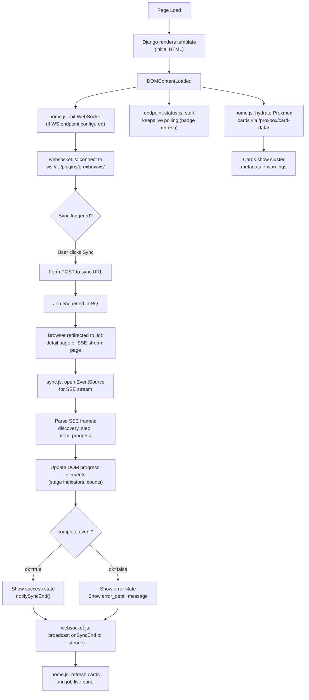

# Browser Frontend

The netbox-proxbox plugin delivers its UI through standard Django templates bundled with the plugin, augmented by JavaScript for real-time SSE streaming, keepalive polling, WebSocket updates, and dashboard card hydration.

---

## Template Hierarchy

All plugin templates live under `netbox_proxbox/templates/netbox_proxbox/`. They extend NetBox's base templates to inherit the standard NetBox chrome (navigation, header, breadcrumbs).

```
templates/netbox_proxbox/
├── base/               Base plugin page template (extends NetBox layout)
├── home/               Plugin dashboard / home page
│   ├── index.html      Main plugin home
│   └── partials/       Card and widget fragments
├── fastapi/            FastAPI endpoint detail and test pages
├── proxmox/            ProxmoxEndpoint detail and cluster/node pages
├── table/              Shared table fragment templates
├── test/               WebSocket and SSE test/debug pages
└── partials/           Reusable fragment templates (status badges, etc.)
```

### Template Extensions

`netbox_proxbox/template_content.py` injects custom panels and buttons into standard NetBox pages **outside** the plugin:

| Extension class | Target model | What it adds |
|---|---|---|
| `ProxboxJobButtons` | `core.Job` | "Cancel job" / "Run now" buttons on Job detail pages for Proxbox Sync jobs |
| `ProxboxVMPanel` | `virtualization.VirtualMachine` | ProxBox data panel (snapshots, backups, task history) on VM detail pages |

---

## Static Assets

```
static/netbox_proxbox/
├── css/                Compiled CSS for specific plugin pages
├── js/                 Browser-side JavaScript (12 files)
└── styles/             SCSS sources and compiled theme assets
```

---

## JavaScript Files

| File | Purpose |
|---|---|
| `common.js` | Shared helpers: badge state, tooltip setup, CSRF token retrieval |
| `home.js` | Dashboard initialization: WebSocket setup, keepalive badge refresh, Proxmox card hydration |
| `sync.js` | SSE consumer: `EventSource` management, frame parsing, DOM progress updates |
| `job_log_view.js` | Renders streamed Proxbox job log payloads on Job detail pages |
| `job_live_panel.js` | Live job progress panel on the home page (polls job status, updates summary panel) |
| `websocket.js` | WebSocket integration: `onSyncEnd(listener)` and `notifySyncEnd(obj)` hooks |
| `endpoint-status.js` | Periodic keepalive/status badge refresh for dashboard and list pages |
| `polling.js` | Generic repeated-polling helpers |
| `logs.js` | Backend logs page behavior |
| `device.js` | Client behavior for device/node sync views |
| `virtual_machine.js` | Client behavior for VM sync views |
| `table.js` | Table-specific dynamic behavior |

---

## Browser Page Lifecycle



---

## Dashboard Hydration

The plugin home page (`home/index.html`) loads with skeleton card elements and then hydrates them asynchronously:

1. `home.js` calls `GET /plugins/proxbox/card-data/` for each configured ProxmoxEndpoint
2. The Django view returns a JSON payload with cluster metadata, node counts, VM counts, and any warnings
3. `home.js` updates the DOM card with the received data

The **keepalive badges** for each endpoint (Proxmox, NetBox, FastAPI) are refreshed by `endpoint-status.js` on a configurable interval. The keepalive JSON views are protected by the normal login requirement and use restricted querysets.

---

## SSE Rendering

`sync.js` is the SSE consumer for both the direct streaming views and the background job stream:

```js title="static/netbox_proxbox/js/sync.js (pattern)"
function connectToSyncStream(streamUrl, onFrame, onComplete) {
    const evtSource = new EventSource(streamUrl);

    evtSource.addEventListener("step", (e) => {
        const data = JSON.parse(e.data);
        updateStageIndicator(data.step, data.status, data.result);
    });

    evtSource.addEventListener("item_progress", (e) => {
        const data = JSON.parse(e.data);
        incrementProgressCounter(data.type, data.status);
    });

    evtSource.addEventListener("complete", (e) => {
        const data = JSON.parse(e.data);
        evtSource.close();
        onComplete(data);
        notifySyncEnd(data);
    });

    evtSource.addEventListener("error", (e) => {
        const data = JSON.parse(e.data);
        showErrorBanner(data.error, data.detail);
    });
}
```

---

## Job Log Viewer

When an operator opens a NetBox Job detail page for a Proxbox Sync job, `job_log_view.js` is loaded by the template extension. It renders the stored SSE log payload — which was captured by the `on_frame` callback during the job's `run()` execution — into a structured UI with per-stage indicators, object counts, and error messages.

---

## WebSocket Integration

`websocket.js` provides a thin integration layer on top of the browser WebSocket API:

```js title="static/netbox_proxbox/js/websocket.js"
// Register a callback that fires when any sync operation completes
onSyncEnd(function(syncData) {
    refreshDashboardCards();
    updateJobLivePanel(syncData);
});

// Called by sync.js when the complete event arrives
notifySyncEnd(completePayload);
```

The WebSocket URL is injected into the page template from `FastAPIEndpoint.websocket_url`. If no WebSocket endpoint is configured, `websocket.js` degrades gracefully and the dashboard falls back to polling-only mode.

---

## Forms and Sync Actions

Sync action buttons are implemented as native HTML forms with `data-sync-url` attributes rather than fetch/AJAX calls. The form submission navigates to the sync URL, which either:

- Returns a `StreamingHttpResponse` (SSE stream) for browser-facing streaming views
- Redirects to the NetBox Job detail page after enqueuing a background job

This means sync actions work correctly without JavaScript — JS only adds the real-time progress overlay.
