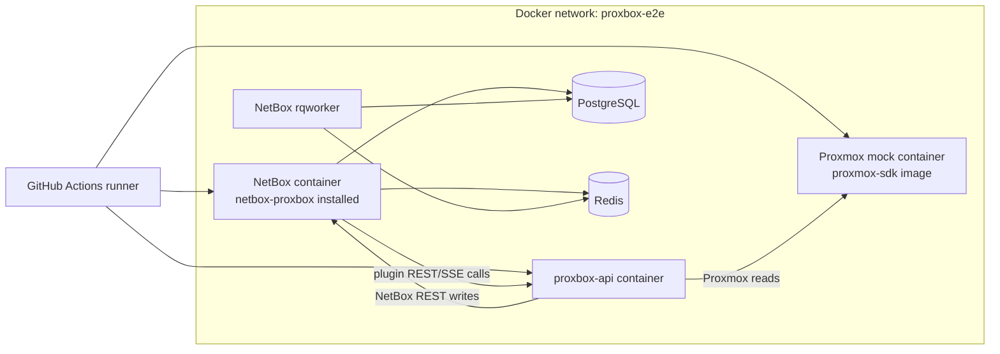
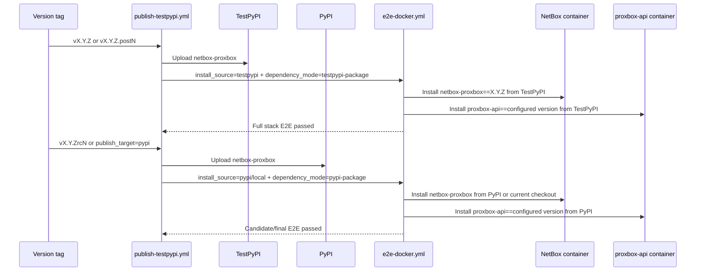

# CI and E2E Workflows

This page documents the developer-facing GitHub Actions surface for
`netbox-proxbox`: the fast CI checks, the Docker E2E stack, docs automation, and
the staged TestPyPI/PyPI release pipeline.

## Workflow Map

| Workflow | Trigger | Purpose |
|---|---|---|
| `.github/workflows/ci.yml` | Push and pull request | Runs lint, type checks, compile checks, and the mocked pytest suite. |
| `.github/workflows/e2e-docker.yml` | Manual, scheduled, reusable workflow call | Builds a real NetBox stack with the plugin, rqworker, `proxbox-api`, PostgreSQL, Redis, and a mocked Proxmox API. |
| `.github/workflows/publish-testpypi.yml` | `v*rc*` tag push (TestPyPI), GitHub release published (PyPI), manual dispatch | Publishes immutable package versions through TestPyPI, PyPI release candidates, final PyPI releases, and post-release fixes. Official PyPI releases are cut from `develop` via `gh release create`; plain non-rc tag pushes do not trigger publishing. |
| `.github/workflows/docs.yml` | Docs changes on main / PR | Builds and publishes the MkDocs site. |
| `.github/workflows/docs-screenshots.yml` | Manual dispatch | Refreshes committed UI screenshots used by the docs site. |
| `.github/workflows/nightly-contracts.yml` | Schedule / manual dispatch | Checks cross-repo contracts that must stay aligned with `proxbox-api`. |

## Docker E2E Stack

`e2e-docker.yml` validates the real runtime integration. The plugin is installed
inside NetBox, while the backend is always a separate HTTP service.

The reusable inputs select what is under test:

| Input | Values | Effect |
|---|---|---|
| `install_source` | `local`, `pypi`, `testpypi`, `container`, `both` | Selects how `netbox-proxbox` is installed inside the NetBox container. |
| `dependency_mode` | `dev`, `published`, `testpypi-package`, `pypi-package` | Selects how the separate `proxbox-api` container is built or installed. |
| `proxbox_api_version` | Version string | Pins the backend package version for TestPyPI/PyPI package-index E2E modes. |
| `netbox_image` | Full image ref | Overrides the NetBox image; default matrix covers `v4.5.8`, `v4.5.9`, and `v4.6.0`. |
| `proxmox_service` | `pve`, `pbs`, `pdm`, `all` | Selects the proxmox-sdk mock image suffix. `all` runs the full per-service matrix. |

### Proxmox Service Matrix

The mock container is split by service: `emersonfelipesp/proxmox-sdk:latest-pve`,
`latest-pbs`, and `latest-pdm`. The default `proxmox_service: all` expands all
three. `pve` runs the full sync flow; `pbs` and `pdm` run stack health and
plugin-internal contract checks while skipping PVE-specific object assertions.

## Release Validation

The release workflow intentionally never reuses a consumed package version.
Failures after package upload move forward to the next `.postN` or `rcN`.

## Developer Checklist

- Keep package version metadata synchronized across `pyproject.toml`,
  `netbox_proxbox/__init__.py`, `uv.lock`, and the Git tag.
- Use TestPyPI `proxbox-api` for TestPyPI `netbox-proxbox` E2E.
- Use PyPI `proxbox-api` for PyPI release-candidate and final E2E.
- Do not add `twine --skip-existing`; consumed versions are immutable and must
  be fixed forward.
- When changing sync contracts shared with the backend, run the mocked tests,
  the workflow contract tests, and a Docker E2E run before release.
