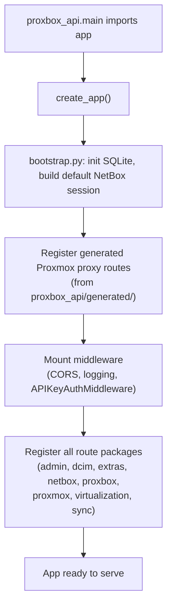
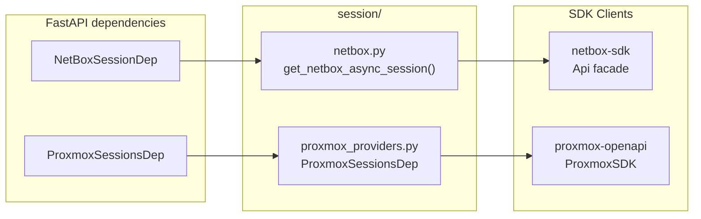
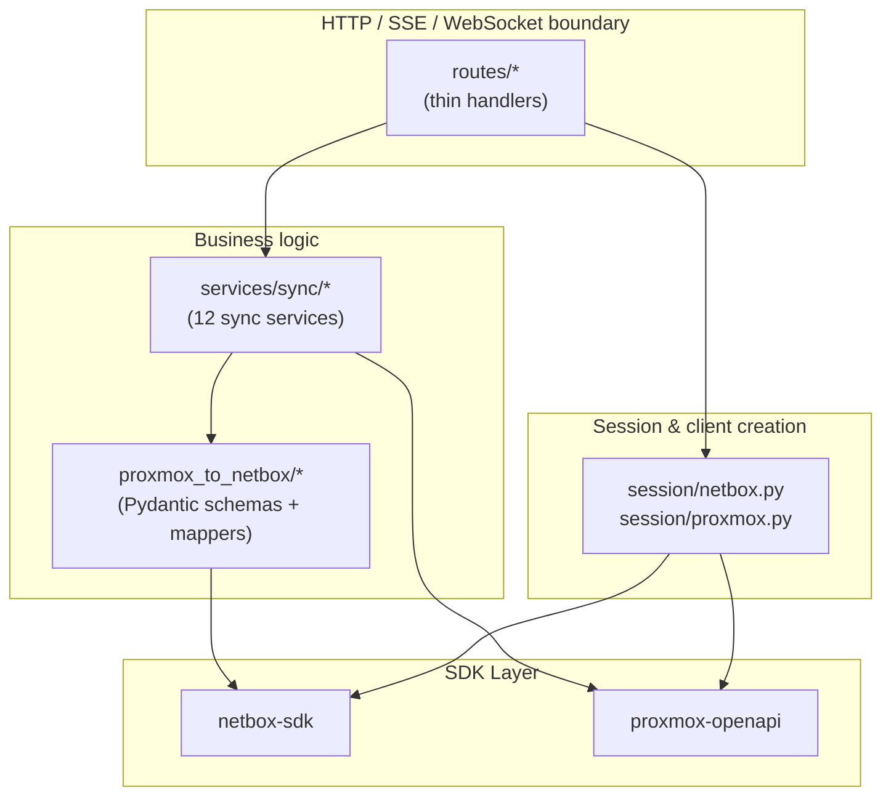

# Component Deep Dive

This page documents the internal architecture of each of the four Proxbox repositories and explains how they fit together.

---

## netbox-proxbox — The NetBox Plugin

`netbox-proxbox` is a standard Django/NetBox plugin. It is installed into the NetBox virtualenv and declared in `PLUGINS` inside NetBox's `configuration.py`. The plugin adds a new menu section, plugin models, a REST API, background jobs, views, templates, and static JavaScript.

### Package Layout

| Directory / File | Purpose |
|---|---|
| `netbox_proxbox/__init__.py` | Plugin registration (`PluginConfig`), version `0.0.11`, NetBox compatibility `4.5.x` |
| `netbox_proxbox/models/` | 13 persisted Django models (see [Data Model](data-model.md)) |
| `netbox_proxbox/views/` | Dashboard, endpoint CRUD, sync actions, job helpers, status checks |
| `netbox_proxbox/api/` | NetBox plugin REST API (`NetBoxModelViewSet`, serializers, filtersets) |
| `netbox_proxbox/services/` | Backend HTTP proxy, keepalive checks, schema caching, sync coordination |
| `netbox_proxbox/jobs.py` | `ProxboxSyncJob` — NetBox background job wrapping the FastAPI SSE sync |
| `netbox_proxbox/templates/` | Django templates for all plugin pages |
| `netbox_proxbox/static/` | JavaScript (`sync.js`, `home.js`, `websocket.js`, …), CSS, SCSS, images |
| `netbox_proxbox/forms/` | Create/edit, filter, and scheduling forms |
| `netbox_proxbox/tables/` | List-view table classes |
| `netbox_proxbox/filtersets.py` | NetBox filtersets for list views and API filtering |
| `netbox_proxbox/navigation.py` | Plugin menu groups and buttons |
| `netbox_proxbox/urls.py` | URL map for all plugin views |
| `netbox_proxbox/template_content.py` | Template extensions that inject buttons/panels into NetBox's Job and VirtualMachine detail pages |
| `netbox_proxbox/signals.py` | Django signals for auto token generation when `FastAPIEndpoint` is created |
| `netbox_proxbox/sync_stages.py` | Runs a single named sync stage against the backend SSE stream |
| `netbox_proxbox/websocket_client.py` | Long-lived WebSocket client and message queue for backend broadcast messages |

### Key Classes

`ProxboxSyncJob` (`jobs.py`)
:   A `JobRunner` subclass that enqueues on NetBox's `default` RQ queue. Its `run()` method calls `run_sync_stream()` to consume the FastAPI SSE endpoint and writes progress to the Job record. Ownership guards prevent concurrent duplicate runs. Default RQ wall-clock timeout: **7200 s**.

`get_fastapi_request_context()` (`services/backend_context.py`)
:   Resolves the active `FastAPIEndpoint` (always the first row from the queryset), builds the HTTP URL and auth headers, and returns a `BackendRequestContext` dataclass used by all backend HTTP helpers.

`ServiceStatus` (`services/service_status.py`)
:   Aggregates health checks for all three endpoint types (Proxmox, NetBox, FastAPI) into a unified status used by dashboard cards and keepalive polling.

### NetBox Integration Points

=== "Plugin registration"
    ```python title="netbox_proxbox/__init__.py"
    class ProxboxConfig(PluginConfig):
        name = "netbox_proxbox"
        verbose_name = "Proxbox"
        version = "0.0.11"
        min_version = "4.5.0"
        max_version = "4.5.99"
    ```

=== "Background jobs (RQ)"
    ```python title="netbox_proxbox/jobs.py"
    from netbox.constants import RQ_QUEUE_DEFAULT
    from netbox.jobs import JobRunner

    class ProxboxSyncJob(JobRunner):
        class Meta:
            name = "Proxbox Sync"

        def run(self, *args, **kwargs):
            ...
            result, status = run_sync_stream("full-update/stream", ...)
    ```

=== "Template extensions"
    ```python title="netbox_proxbox/template_content.py"
    # Injects "Run Sync" / "Cancel" buttons on the NetBox Job detail page
    class ProxboxJobButtons(PluginTemplateExtension):
        model = "core.job"
        ...
    ```

---

## proxbox-api — The FastAPI Backend

`proxbox-api` is a standalone async FastAPI service. It holds its own SQLite database for endpoint records and API key storage and orchestrates all Proxmox-to-NetBox synchronization work.

### Application Factory and Startup



!!! note
    `PROXBOX_STRICT_STARTUP=1` turns generated-route load failures into fatal startup errors. By default failures are logged but the app still starts.

### Route Namespaces

| Prefix | Package | Contents |
|---|---|---|
| `/admin` | `routes/admin/` | HTML admin dashboard, backend log buffer |
| `/dcim` | `routes/dcim/` | NetBox device, interface, VLAN, IP sync routes |
| `/extras` | `routes/extras/` | NetBox custom fields and tags used by sync |
| `/netbox` | `routes/netbox/` | NetBox endpoint CRUD, status, OpenAPI proxy |
| `/proxbox` | `routes/proxbox/` | Proxbox plugin configuration routes |
| `/proxmox` | `routes/proxmox/` | Proxmox session, node, cluster, replication, viewer, codegen |
| `/virtualization` | `routes/virtualization/` | VM creation, disks, backups, snapshots, interfaces |
| `/sync` | `routes/sync/` | Internal sync helper routes, individual object sync |
| `/full-update` | `app/full_update.py` | Full 12-stage sync (JSON and SSE stream variants) |
| `/ws` | `app/websockets.py` | WebSocket connection manager for broadcast messages |
| `/auth` | `routes/auth.py` | API key registration, management, bootstrap |
| `/cache` | `app/cache_routes.py` | Cache control and invalidation |

### Session Layer



Route handlers receive pre-built SDK clients through FastAPI's dependency injection system. The session layer handles connection bootstrapping, token resolution, and retry configuration. Session factories read endpoint records from the SQLite database and apply environment variable overrides (`PROXBOX_NETBOX_TIMEOUT`, `PROXBOX_NETBOX_MAX_RETRIES`, etc.).

### Internal Layer Architecture



---

## netbox-sdk — The NetBox REST SDK

`netbox-sdk` is a standalone async Python library for the NetBox REST API. `proxbox-api` uses it as its only NetBox client. It is also shipped with its own Typer CLI (`netbox_cli/`) and Textual TUI (`netbox_tui/`), but those are not used by Proxbox.

### Three Public API Layers

=== "Raw client"
    ```python
    from netbox_sdk.client import NetBoxApiClient

    client = NetBoxApiClient(base_url="https://netbox.example.com", token="abc123")
    resp = await client.get("/api/virtualization/virtual-machines/")
    ```
    Direct aiohttp-based HTTP client. Full control, no schema awareness.

=== "Async facade (used by Proxbox)"
    ```python
    from netbox_sdk.facade import api

    nb = api(url="https://netbox.example.com", token="abc123")
    vms = await nb.virtualization.virtual_machines.all()
    vm  = await nb.virtualization.virtual_machines.get(id=42)
    created = await nb.virtualization.virtual_machines.create(payload={...})
    ```
    PyNetBox-style attribute navigation. proxbox-api builds this via `netbox_config_from_endpoint()` + `api()`.

=== "Typed client"
    ```python
    from netbox_sdk.typed_api import typed_api

    nb = typed_api(url="...", token="...", version="4.5")
    vms = await nb.virtualization.virtual_machines.all()
    # returns typed VirtualMachine objects with IDE completion
    ```
    Versioned typed bindings for NetBox 4.3, 4.4, 4.5. Not currently used by proxbox-api.

### Config and Authentication

```python title="proxbox_api/session/netbox.py"
def netbox_config_from_endpoint(endpoint: NetBoxEndpoint) -> Config:
    """Build netbox-sdk Config from stored endpoint (v1 or v2 token)."""
    tv = (endpoint.token_version or "v1").lower()   # "v1" or "v2"
    return Config(
        base_url=endpoint.url,
        token_version=tv,
        token_key=key,          # v2 only: key portion of nbt_key.secret
        token_secret=decrypted_token,
        timeout=_resolve_netbox_timeout(),  # PROXBOX_NETBOX_TIMEOUT env var
        ssl_verify=endpoint.verify_ssl,
    )
```

**Token v1** — classic `Authorization: Token <value>` header.  
**Token v2** — newer `nbt_<key>.<secret>` form; the SDK handles the split and encoding automatically.

---

## proxmox-openapi — The Proxmox SDK

`proxmox-openapi` is a schema-driven package covering the Proxmox VE REST API (646 pre-generated endpoints for PVE 8.1). It operates in two modes: **mock** (in-memory CRUD, used in development/tests) and **real** (proxy to actual Proxmox VE).

### Dual-Mode Operation

| Mode | How to enable | Behaviour |
|---|---|---|
| **Mock** (default) | `PROXMOX_API_MODE=mock` | In-memory CRUD backed by `SharedMemoryMockStore`. Returns realistic-shaped responses with no real Proxmox needed. |
| **Real** | `PROXMOX_API_MODE=real` | All requests are forwarded to a live Proxmox VE host at `PROXMOX_URL`. |

### SDK Attribute-Based Navigation

```python
from proxmox_openapi.sdk import ProxmoxSDK

sdk = ProxmoxSDK(host="192.168.1.10", port=8006, token="root@pam!mytoken=<uuid>")

# List all nodes
nodes = await sdk.nodes.get()

# Get QEMU config for VM 100 on node "pve1"
config = await sdk.nodes("pve1").qemu(100).config.get()

# List storage on a specific node
storages = await sdk.nodes("pve1").storage.get()

# Get cluster resources
resources = await sdk.cluster.resources.get()
```

Attribute access (`sdk.nodes`) returns a `Resource` navigator. Calling it with an argument (`sdk.nodes("pve1")`) inserts a path segment. Terminal `.get()`, `.post()`, `.put()`, `.delete()` methods execute the HTTP request.

### Transport Backends

| Backend | Class | Use case |
|---|---|---|
| **HTTPS** (default) | `HttpsBackend` | Production — aiohttp to Proxmox VE API |
| **Mock** | `MockBackend` | Tests and local development |
| **Local pvesh** | `LocalBackend` | Runs `pvesh` CLI on the Proxmox host |
| **SSH Paramiko** | `SshParamikoBackend` | SSH to Proxmox host, runs pvesh remotely |
| **OpenSSH** | `OpensshBackend` | Same as above via openssh-wrapper |

### Authentication

=== "API Token (recommended)"
    ```
    PVEAPIToken=user@realm!tokenid=<uuid-secret>
    ```
    No ticket renewal needed. Used by proxbox-api in production.

=== "Password / Ticket"
    ```python
    sdk = ProxmoxSDK(host="...", username="root@pam", password="secret")
    # SDK handles TFA/TOTP if configured
    ```
    Short-lived ticket + CSRF token. Requires renewal every 2 hours.

proxbox-api creates Proxmox sessions through `session/proxmox_core.py` and `session/proxmox_providers.py`, which resolve endpoint records from the SQLite database and instantiate the SDK with the correct credentials.
