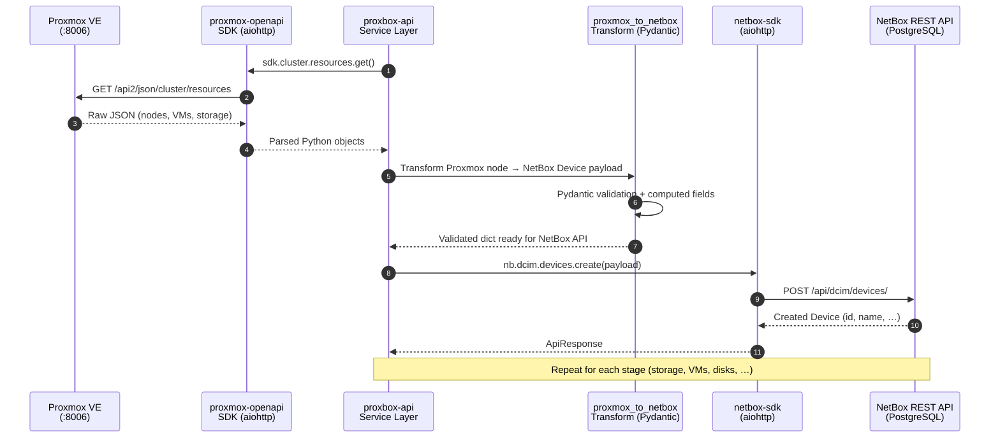
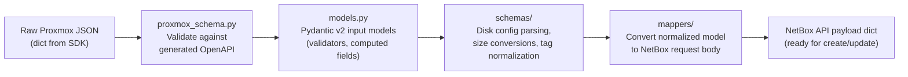

# Data Flow

This page traces the complete data journey from a raw Proxmox API response all the way to a persisted NetBox object, covering the SDK layer, transformation pipeline, and idempotency logic.

---

## End-to-End Sequence



---

## Transform Layer

The `proxbox_api/proxmox_to_netbox/` package is the normalization boundary. **All parsing and type conversion must happen inside Pydantic schemas**; route handlers and service functions only orchestrate.



### Worked Example: VM Sync

=== "1. Raw Proxmox payload (from `/cluster/resources`)"
    ```json
    {
      "vmid": 100,
      "name": "web-server-01",
      "type": "qemu",
      "status": "running",
      "maxcpu": 4,
      "maxmem": 8589934592,
      "maxdisk": 42949672960,
      "node": "pve1",
      "pool": "production"
    }
    ```

=== "2. Pydantic model validation (`models.py`)"
    ```python
    class ProxmoxVM(BaseModel):
        vmid: int
        name: str
        type: Literal["qemu", "lxc"]
        status: str
        maxcpu: int
        maxmem: int                     # bytes
        maxdisk: int                    # bytes
        node: str
        pool: str | None = None

        @computed_field
        @property
        def memory_mb(self) -> int:
            return self.maxmem // (1024 * 1024)

        @computed_field
        @property
        def disk_gb(self) -> int:
            return self.maxdisk // (1024 ** 3)
    ```

=== "3. NetBox payload (from mapper)"
    ```json
    {
      "name": "web-server-01",
      "cluster": 1,
      "status": "active",
      "vcpus": 4,
      "memory": 8192,
      "disk": 40,
      "custom_fields": {
        "proxbox_vmid": 100,
        "proxbox_node": "pve1"
      },
      "tags": [{"name": "proxbox"}]
    }
    ```

=== "4. netbox-sdk API call"
    ```python
    # service layer (simplified)
    payload = mapper.vm_to_netbox(proxmox_vm, cluster_id=cluster.id)

    existing = await nb.virtualization.virtual_machines.get(
        name=proxmox_vm.name, cluster_id=cluster.id
    )
    if existing:
        await nb.virtualization.virtual_machines.update(existing.id, payload)
    else:
        await nb.virtualization.virtual_machines.create(payload)
    ```

---

## Idempotency

Every sync service is designed to be **safe to run repeatedly**. The general pattern is:

1. Fetch the list of objects from Proxmox
2. For each Proxmox object, **look up** an existing NetBox object by a stable identifier (VM name + cluster, node name + device type, etc.)
3. If found → **update** the NetBox object (only changed fields are sent)
4. If not found → **create** a new NetBox object
5. Objects that exist in NetBox but are no longer in Proxmox may be deleted (configurable — e.g., `delete_nonexistent_backup=True` in backup sync)

This means running the same sync twice produces the same result with no duplicate objects.

---

## Proxmox Codegen Pipeline

The proxmox-openapi package ships with **646 pre-generated Proxmox VE 8.1 API endpoints** as a checked-in OpenAPI schema. The schema is produced by a Playwright-based crawler in `proxmox_codegen/`:

```mermaid
flowchart LR
    A["Proxmox API Viewer\n(apidoc.js)"] --> B["proxmox_codegen/crawler.py\n(Playwright browser)"]
    B --> C["proxmox_codegen/apidoc_parser.py\nParse endpoint definitions"]
    C --> D["proxmox_codegen/normalize.py\nNormalize paths and methods"]
    D --> E["proxmox_codegen/openapi_generator.py\nEmit OpenAPI schema"]
    E --> F["proxmox_openapi/generated/\nChecked-in OpenAPI JSON"]
    F --> G["proxbox-api\nproxmox_to_netbox/proxmox_schema.py\nLoad & validate source contract"]
```



The checked-in schema is the source of truth for `proxmox_to_netbox/normalize.py` which uses it to assert that the Proxmox operations referenced by the sync services are actually available before attempting API calls.

---

## Caching

`proxbox-api` uses response caching to avoid hammering the NetBox API during large sync runs:

| Variable | Default | Behaviour |
|---|---|---|
| `PROXBOX_NETBOX_GET_CACHE_TTL` | 60 s | TTL for cached NetBox GET responses |
| `PROXBOX_NETBOX_GET_CACHE_MAX_ENTRIES` | 4096 | Maximum number of cached entries |
| `PROXBOX_NETBOX_GET_CACHE_MAX_BYTES` | 50 MB | Maximum cache size by byte count |
| `PROXBOX_DEBUG_CACHE` | 0 | Enable debug-level cache logging |

Set `PROXBOX_NETBOX_GET_CACHE_TTL=0` to disable caching entirely (useful when debugging sync correctness).

---

## NetBox SDK Retry Logic

The `netbox-sdk` client and proxbox-api session layer include retry logic for transient failures:

| Variable | Default | Behaviour |
|---|---|---|
| `PROXBOX_NETBOX_MAX_RETRIES` | 5 | Retry attempts for transient failures |
| `PROXBOX_NETBOX_RETRY_DELAY` | 2.0 s | Base retry delay (exponential backoff) |
| `PROXBOX_NETBOX_TIMEOUT` | 120 s | Per-request timeout for all NetBox API calls |
