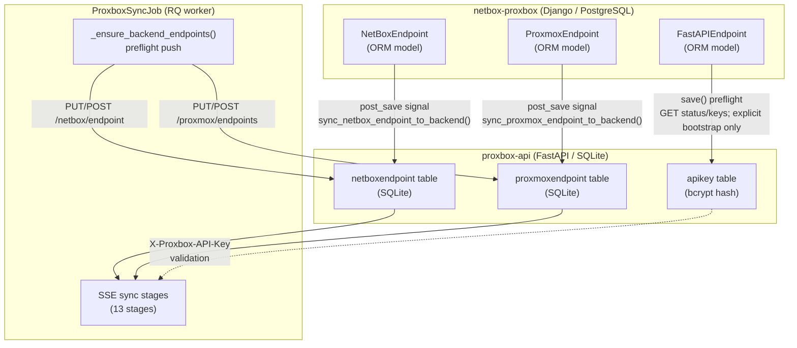
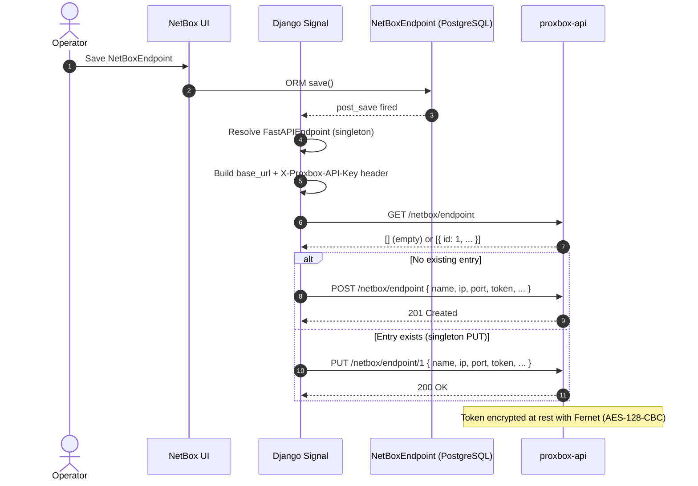
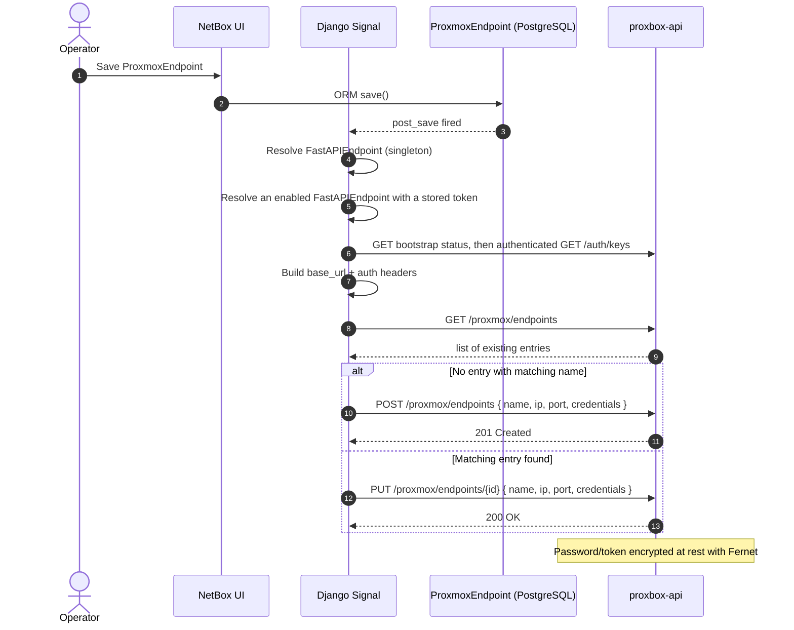
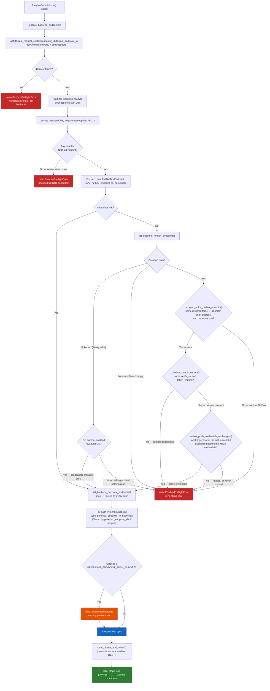
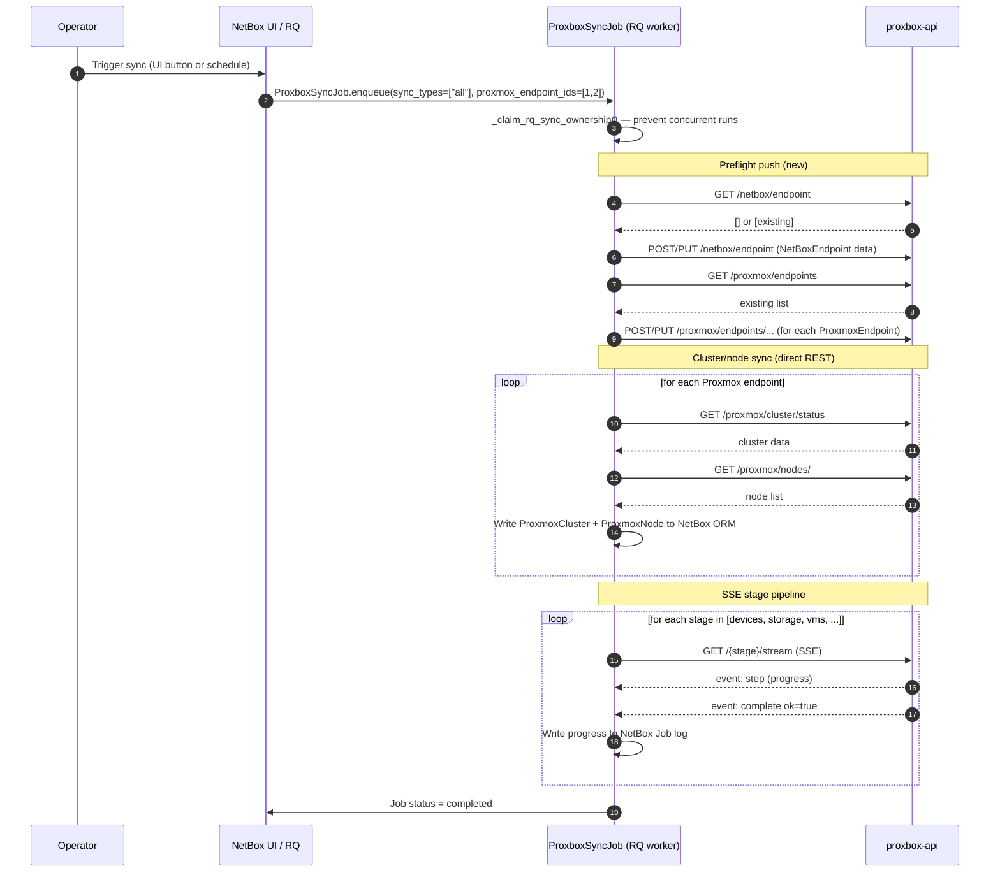
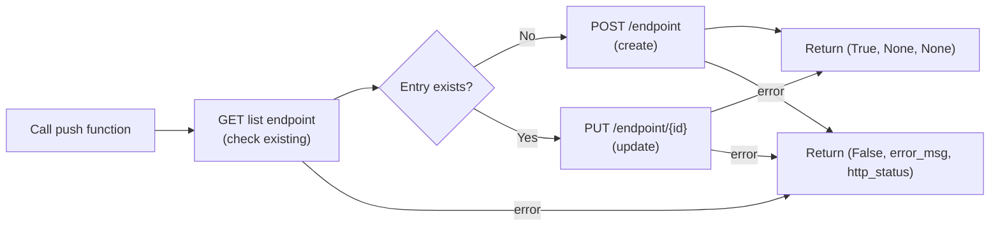
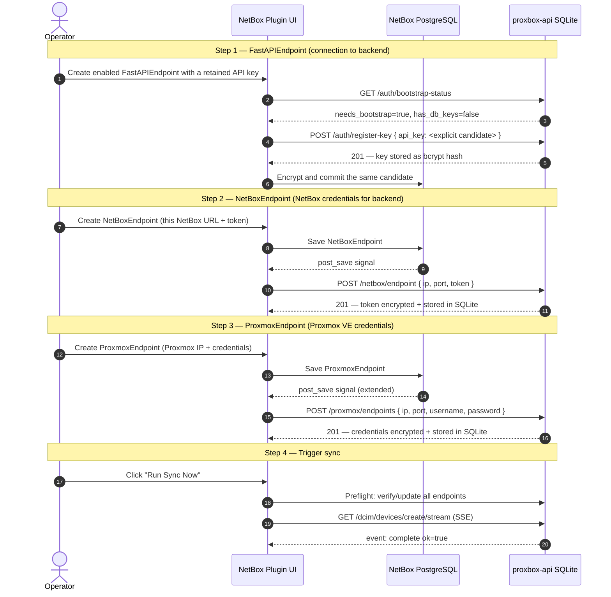
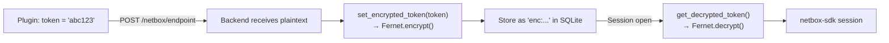

# Endpoint Data Exchange

This page explains how the `netbox-proxbox` plugin automatically keeps its endpoint configuration
in sync with the `proxbox-api` backend — covering the problem, the three delivery mechanisms,
the complete data flow, and the security model.

---

## The Problem

The plugin and the backend are two **separate processes with separate databases**:

| System | Database | Endpoint Model |
|---|---|---|
| `netbox-proxbox` (Django plugin) | NetBox PostgreSQL | `NetBoxEndpoint`, `ProxmoxEndpoint`, `FastAPIEndpoint` (ORM models) |
| `proxbox-api` (FastAPI backend) | Local SQLite (`database.db`) | `NetBoxEndpoint`, `ProxmoxEndpoint` (SQLModel tables) |

When an operator registers a `NetBoxEndpoint` in the plugin's UI, that record lives only in
PostgreSQL. The backend needs its own copy in SQLite to open a NetBox API session — without it,
every SSE sync stage fails immediately:

```
ProxboxException: No NetBox endpoint found
detail: Please add a NetBox endpoint in the database
```

The same gap exists for `ProxmoxEndpoint`: the backend needs Proxmox credentials in its own
SQLite table before it can open a Proxmox session for sync stages.

---

## System Overview



---

## Delivery Mechanism 1 — model gate and `post_save` signals

`FastAPIEndpoint.save()` is the persistence boundary for backend keys. UI,
import, REST, and direct-model writes all converge there; form validation and
`save(commit=False)` remain network-free. REST serializers translate its Django
error to a DRF validation response. The three `post_save` signals still
coordinate endpoint delivery, but they never invent, bootstrap, rotate, or
persist a credential.

### `FastAPIEndpoint` → fail-closed API key adoption

**Files:** `netbox_proxbox/models/fastapi_endpoint.py` and
`netbox_proxbox/services/backend_key_adoption.py`

```mermaid
sequenceDiagram
    autonumber
    actor Op as Operator
    participant NB as NetBox UI
    participant FA as FastAPIEndpoint (PostgreSQL)
    participant API as proxbox-api

    Op->>NB: Save with an explicit retained candidate
    NB->>FA: save() / prepare_backend_key_transition()
    FA->>FA: Lock row and compare loaded trust-boundary snapshot
    FA->>API: GET /auth/bootstrap-status (redirects disabled)
    alt backend has no keys
        API-->>FA: { "needs_bootstrap": true }
        FA->>API: POST /auth/register-key { "api_key": candidate } (once; redirects disabled)
        API-->>FA: 201 Created
    else backend is initialized
        API-->>FA: { "needs_bootstrap": false }
        FA->>API: GET /auth/keys + candidate header (redirects disabled)
        API-->>FA: 200 Accepted
    end
    FA->>FA: Encrypt and persist candidate
    Note over FA,API: Any rejection or transport failure preserves the prior DB value
```

The backend stores only the bcrypt hash. The plugin stores the candidate in the
encrypted `token_enc` model field and exposes it through the compatibility
`token` property. An initialized backend is never sent the bootstrap POST;
`409` is failure, not adoption. The in-memory validation proof is bound to the
candidate, URL, scheme, port, and TLS-verification setting so changing the
target before persistence forces a fresh check. A new disabled row is stored
without a key and performs no HTTP request. Enabling it, changing the target, or
rotating the key requires the candidate to be explicitly resubmitted. A
same-key target change reuses the exact ciphertext after authenticating against
the new target. Security-sensitive saves use a row lock plus an optimistic
snapshot so a stale model instance cannot overwrite a newer key or target.
Blank or null `token` values on an existing REST partial update are treated as
omitted, preserving the exact ciphertext; they do not satisfy the explicit-key
requirement for enable or target transitions.

The adoption service canonicalizes the target before its first request. It
rejects authority injection and URL userinfo/path/query/fragment syntax,
validates DNS/IP values, and brackets IPv6 literals. Invalid direct-model input
therefore cannot redirect the candidate header to a different authority.

The one-time bootstrap POST necessarily precedes the local database commit. If
the database transaction later rolls back, retrying with the same retained
candidate is recoverable: the now-initialized backend authenticates that
candidate through `GET /auth/keys`, and the retry commits it locally. Hidden or
server-generated bootstrap candidates are forbidden because they could be lost
in that failure window.

---

### `NetBoxEndpoint` → backend SQLite sync

**File:** `netbox_proxbox/signals.py` — `sync_netbox_endpoint_to_backend`  
**Shared function:** `netbox_proxbox/views/backend_sync.py` — `sync_netbox_endpoint_to_backend()`



The payload contains the IP address, port, SSL flag, token version, and credential material.
On the backend, tokens are encrypted with Fernet before storage — see
[Security Model](#security-model) below.

---

### `ProxmoxEndpoint` → backend SQLite sync

**File:** `netbox_proxbox/signals.py` — `ensure_proxmox_endpoint_has_fastapi_token`  
**Shared function:** `netbox_proxbox/views/backend_sync.py` — `sync_proxmox_endpoint_to_backend()`



The endpoint name uses the stable format `"{name} (nb:{pk})"` so that the same Proxmox cluster
registered under different NetBox PKs is treated as a distinct backend entry.

---

## Delivery Mechanism 2 — Sync Job Preflight

The NetBox/Proxmox endpoint-delivery `post_save` signals are best-effort: if the
backend was offline when either downstream endpoint was saved, that push is
lost. The **preflight step** in `ProxboxSyncJob.run()` closes this delivery gap
by pushing all endpoint data immediately before any SSE stage starts —
regardless of whether the signals previously succeeded — and then verifies
that the backend actually holds a NetBox endpoint before letting the run
continue. Backend key adoption is different: its model-level preflight fails
the `FastAPIEndpoint` save instead of accepting an unverified key.

**File:** `netbox_proxbox/jobs.py` — `_ensure_backend_endpoints()`



!!! note "Best-effort, with six blocking exceptions"
    Most of what the preflight does is advisory: a failed readiness probe, a failed key
    registration, or a failed **Proxmox** endpoint push is logged as a warning and the sync
    continues, because the backend may already hold a usable record.

    Six conditions stop the run:

    1. **No usable backend.** `get_fastapi_request_context()` returns nothing — there is no
       enabled `FastAPIEndpoint`, or the one this job selected is unusable. Every stage is
       an HTTP call to that backend, so there is nothing left to attempt. The error names
       the selected endpoint id when the job pinned one, and points at
       **Proxbox → Endpoints → FastAPI**.
    2. **No enabled `NetBoxEndpoint` in this NetBox.** Zero enabled rows is not a failed
       push — it is this NetBox declining to be written to at all, the documented
       disabled-endpoint no-connection gate. It blocks **unconditionally**, and the
       backend's stored rows are deliberately *not* consulted:
       `list_backend_netbox_endpoints()` is never even called. proxbox-api may still hold
       credentials issued before the row was disabled, so honouring them would let the sync
       keep writing with exactly the authorization the operator revoked.
    3. **Confirmed-empty backend.** The **NetBox** endpoint push is what installs the
       credentials proxbox-api writes NetBox objects with, so if that push fails **and** a
       follow-up `GET /netbox/endpoint` confirms the backend holds *no* NetBox endpoint at
       all, no stage can succeed and the job raises `ProxboxPreflightError` immediately.
    4. **Stored rows that point at a different NetBox.** The push failed, the backend *does*
       hold rows, but none of them provably points at *this* NetBox. See the next note.
    5. **Nothing pushed and nothing readable.** The push failed for *every* enabled row
       **and** `list_backend_netbox_endpoints()` itself failed, so there is no evidence at
       all that the backend's credentials belong to this NetBox — only that it may hold
       somebody's. This is the one place "unknown" must not read as "ours": the branch is
       reachable only *after* a failed push, and continuing would reintroduce exactly the
       cross-instance write escalation 4 blocks, just through an ambiguous read instead of a
       mismatched row. The exception is a run where *some* enabled row pushed successfully —
       that push wrote this NetBox's credentials into the singleton, so the unreadable
       listing has nothing left to add and the run continues with a warning.
    6. **A stored row that is ours, but was written with credentials we have since
       replaced.** The push failed, a stored row passes escalation 4's identity *and*
       currency checks, and the API token behind it has been rotated in place since the last
       successful push. `NetBoxEndpointResponse` withholds `token`/`token_key`, so the secret
       cannot be compared against the wire at all — it is compared **locally**, against the
       fingerprint the last successful push recorded. Continuing would let proxbox-api keep
       writing with the credential the operator has just revoked, which is the one outcome
       rotating a token is meant to prevent. See the fingerprint note below.

    Escalation 3 is deliberately narrow, and 5 does not widen it. A failed listing is still
    *unknown* rather than *empty*; what 5 says is that "unknown" is not enough **on its own**
    to license a sync, once the push that would have made it known has already failed. A
    listing that errors after a *successful* push stays non-fatal, and only a definitive
    empty list triggers 3.

!!! danger "A stored row is not evidence until it is *identified*"
    The backend's NetBox endpoint is a **singleton** on proxbox-api:
    `sync_netbox_endpoint_to_backend()` updates the first (and only) stored entry by
    *position*, never by name. Unlike the Proxmox side — whose payload name embeds the
    plugin pk as `"<name> (nb:<pk>)"` — the NetBox payload's `name` is free text. So the
    mere *presence* of a row proves nothing about whose credentials it carries.

    When the push fails and rows exist, `backend_holds_netbox_endpoint()` decides whether
    any of them is ours. Identity is the **resolved connection target**, not the name and not
    a field-by-field comparison. proxbox-api's own `NetBoxEndpoint.url` property builds the
    address it dials as `host = domain if domain else ip_address` — so the target is
    `(domain or ip_address)` plus `port`, with `domain`/`ip_address` read from the *model* by
    `_netbox_endpoint_identity(endpoint)`. Both sides must resolve a target, and the two
    targets must be equal.

    **Compare the resolved target, not each field in turn.** An earlier rule required that
    every host field both sides declare agree and that at least one positively match; it is
    wrong in *both* directions. It **accepts** rows it should not — a stored row blank on
    `domain` at our IP is a NetBox reached *by address*, a different service from ours
    reached by vhost name at that same address, and a blank stored field is data, not a gap.
    The mirror case is a stored row naming *another* domain at our IP while we are IP-only:
    that row dials their vhost. And it **rejects** rows it should not — once a domain is set
    the address is never dialled, so our own record whose stored IP has since changed is
    still ours.

    `port` is **required on both sides**, not "checked when present". proxbox-api declares it
    non-optional on `NetBoxEndpointResponse` and `GET /endpoint` returns
    `list[NetBoxEndpointResponse]`, so every row this backend produces carries one. A row
    without it is not something this backend produced, and a port we cannot parse is a
    service we cannot identify. Same host, different port is a different service.

    A match means the failed push was a transient *refresh* failure and the stored credentials
    are still ours — warn and continue. No match means proxbox-api is holding another NetBox
    instance's credentials, and continuing would sync this estate's Proxmox data **into
    someone else's NetBox**. That blocks.

    **Identity selects a candidate row; currency is what accepts it.** Proving a row describes
    *this* NetBox does not prove it still describes it *correctly*. The push body carries
    `verify_ssl` and `token_version` alongside the target, so an operator who hardens TLS
    verification or rotates the token scheme and then hits a transient push failure would
    otherwise continue the run with proxbox-api writing under the **superseded** posture.
    `_netbox_row_is_current()` therefore also requires both fields to match, read from the
    model for the same reason the target is — going through `_netbox_endpoint_backend_payload()`
    would warn and materialise the API token merely to answer a comparison. An **absent**
    `verify_ssl` or `token_version` reads as drifted: a `False` here blocks the whole run, so
    unknown must fail closed, unlike the Proxmox-side twin where an unknown merely costs one
    extra push.

    The comparable set is bounded by what the backend returns. `NetBoxEndpointResponse`
    carries `id, name, ip_address, domain, port, token_version, verify_ssl, enabled` and
    deliberately withholds `token`/`token_key` — so a rotated **secret** under an unchanged
    scheme is invisible to *every* comparison made against the stored row, and is checked
    locally instead (next paragraph). `name` **is** returned and is deliberately **not**
    compared: it is free text, and a rename must not hard-fail an otherwise safe run.

    **The secret is compared against a local fingerprint, not against the backend.** Each
    successful push records `netbox_credential_fingerprint(payload)` — a keyed HMAC-SHA256
    over `token_version`, `token_key` and `token`, joined by `\x1f` so no two distinct
    credential triples can concatenate to the same input — on
    `NetBoxEndpoint.pushed_credential_fingerprint` (migration `0073`).
    `netbox_push_credentials_unchanged()` re-derives it from the endpoint as it stands *now*
    and compares with `hmac.compare_digest`. The stored value is **not** a credential:
    `salted_hmac` keys off NetBox's `SECRET_KEY`, so the digest is non-reversible and is not
    even comparable across installs. Three details are load-bearing: it fingerprints the
    **payload** rather than the model, so the record cannot drift from what proxbox-api was
    actually handed; it is written with `type(endpoint).objects.filter(pk=pk).update(...)`
    and never `save()`, because `NetBoxEndpoint`'s `post_save` handler re-pushes to the
    backend; and a `DatabaseError` is logged rather than raised, so an install that has not
    applied `0073` yet degrades to "fingerprint absent" instead of failing the push. An
    **empty** stored fingerprint reads as *changed* — never pushed, or a first run after
    upgrading into this check — which is the fail-closed reading, and one successful push
    clears it permanently.

    The row loop **keeps scanning** rather than returning the first identity-matched row's
    currency verdict, so a stale duplicate ordered ahead of a current row cannot decide the
    answer — and a current row belonging to a *different* NetBox never rescues our own drifted
    one.

    **Do not read identity off `_netbox_endpoint_backend_payload()`.** That is the *push
    body*, and it substitutes `"127.0.0.1"` whenever the row has no linked IP so the backend
    still has something to dial. *Every* domain-only NetBox therefore pushes the same
    loopback string, and matching on it let one domain-only instance identify as another
    instance's stored record. `_netbox_endpoint_identity()` reads the model instead: only an
    explicitly configured IP is evidence here, and an absent one contributes nothing.

    The check is fail-closed throughout: an empty or `None` list, a local row that resolves
    no host, a stored row that resolves no host, a different resolved target, a missing or
    unparseable `port` on either side, or a missing currency field all return "not held". A
    run that cannot prove the backend is pointed at it — and still configured the way this
    NetBox declares — does not proceed.

!!! warning "The selected-object batch path runs the same preflight"
    A "sync selected objects" run reaches proxbox-api through `sync_individual()` rather
    than the SSE stage loop, but the **writes land in NetBox exactly the same way**. The
    batch branch of `run()` therefore calls `_ensure_backend_endpoints()` and raises on
    `blocking_error` before touching `_run_batch_selected_sync()` — otherwise a NetBox that
    had disabled its own endpoint could still be written to using whatever credentials the
    backend happened to still hold, which is the one thing the gate exists to prevent.

    The batch path also threads `fastapi_endpoint_id` down to every per-object call:
    `_run_batch_selected_sync(..., fastapi_endpoint_id=…)` →
    `sync_individual_with_dependencies(..., fastapi_endpoint_id=…)` → `sync_individual()` →
    `get_first_fastapi_context(endpoint_id=…)`, including the recursive dependency syncs.
    Each of those calls resolves its own backend, so without the pin a multi-backend install
    would validate one proxbox-api in the preflight and then sync against whichever row
    sorts first. The batch response carries `endpoint_runtimes` built from the preflight
    phases, same as a staged run.

    `netbox_branch_schema_id` is threaded the same way, and for a sharper reason: it must
    travel as an **argument**, not only as a query param on the first call.
    `_sync_dependency()` rebuilds each dependent call's params from scratch out of
    `_CONTEXT_KEYS`, and that tuple does not contain `netbox_branch_schema_id` — so a schema
    id carried only in `query_params` reaches the selected object and is then dropped for
    everything resolved off it. The object lands on the branch schema while its dependencies
    are written to **main**. `_run_batch_selected_sync()` therefore sets both the query param
    and the keyword, and `sync_individual_with_dependencies()` re-injects the keyword on
    every recursive call.

!!! danger "…and the batch path resolves the same Proxmox endpoint scope"
    The preflight settles the **NetBox** side. It does not decide which **Proxmox**
    endpoints a run may touch — the staged path settles that separately, and the batch
    path has to as well. Every `sync/individual/*` route on proxbox-api resolves its
    Proxmox sessions through the *same* `ProxmoxSessionsDep` the stage routes use, and
    that dependency reads a **missing** `proxmox_endpoint_ids` as *"use every endpoint I
    hold"*.

    So an unscoped selected-object sync is **not** a narrower request than a staged one —
    it is the widest request the backend accepts, reaching endpoints this NetBox has
    disabled and endpoints left over from a previous deployment. `run()` therefore calls
    `_batch_wire_endpoint_scope()` immediately after the preflight and fails the job with
    `Selected-object sync did not run: …` when nothing resolves, reusing the staged path's
    `_no_endpoint_scope_reason()` so both refuse in the same words. No proxbox-api call is
    made in that case.

    The resolved comma-separated backend ids then travel as `proxmox_wire_endpoint_ids=`
    into `_run_batch_selected_sync()`, which — exactly like the branch schema, and for the
    same `_CONTEXT_KEYS` reason — sets **both** `query_params["proxmox_endpoint_ids"]` and
    the explicit `proxmox_endpoint_ids=` argument on
    `sync_individual_with_dependencies()` → `_sync_dependency()` → `sync_individual()`.
    Here the argument matters more, not less: a scope that reached the selected object but
    not its dependencies would resolve those dependencies against the **whole** backend
    estate.

    A **partial** resolution is deliberately not an error. `_batch_wire_endpoint_scope()`
    returns `(scope, skipped_plugin_pks, error, wire_id_by_plugin_pk)`; unresolved endpoints
    are logged as a warning naming them and the run continues on the narrowed scope. Failing
    outright because one unrelated endpoint drifted would be a regression, and the narrowed
    scope is still strictly safer than the unscoped request it replaces.

!!! danger "The job-wide scope is not narrow enough on its own — pin each object"
    An earlier version of this page claimed an object living on a skipped endpoint "fails
    loudly at the backend". **That is only true when no *other* in-scope endpoint can answer
    it.** Proxmox identifiers are unique per endpoint, not across the estate: a
    selected-object request names a cluster, a node and a VMID and carries nothing else, so
    two unrelated Proxmox installations each holding a `cluster01/pve1/100` **both** answer,
    and whichever the backend picked is written into this object's NetBox row with no error
    anywhere.

    The fourth return value closes that. It maps **plugin `ProxmoxEndpoint` pk → backend wire
    id**, and `_run_batch_selected_sync()` resolves each object's owner through
    `ProxmoxCluster.netbox_cluster` / `ProxmoxCluster.endpoint` — one grouped query for the
    whole batch, issued beside the object fetch rather than per object in front of a
    per-object HTTP call — then:

    | Owner | Scope used | Why |
    |---|---|---|
    | Resolved, and present in the map | that endpoint's wire id **alone** | only one estate can answer, so a duplicate identifier elsewhere cannot be matched |
    | Resolved, but **absent** from the map (its endpoint drifted and was skipped) | none — the object fails with HTTP **424** naming the endpoint id | asking the *remaining* endpoints is precisely the wrong-estate write; the rest of the batch still runs |
    | **Ambiguous** — two or more endpoints claim the object's core cluster | none — the object fails with HTTP **424** naming every claimant | two endpoints reflecting one cluster is *proof* the duplicated namespace exists here, so widening would ask both and keep whichever answered; picking one would be a *guess* about where the object lives |
    | Not resolvable at all — no cluster, or nothing has reflected a `ProxmoxCluster` for it yet | the job-wide scope | a first-ever sync has nothing to resolve an owner from and must still be discoverable |

    The fallback cannot be a regression: the job-wide scope is exactly what this path sent
    before pinning existed. But **unknown and ambiguous are different states** — collapsing
    the ambiguous row back into the fallback restores the widening this pinning removes.

    Whatever those per-object refusals amount to, they also **fail the enclosing job**. Every
    object in a selected-object run was named by an operator, so there is no "partial success"
    reading of a list somebody typed out: a non-zero `failed` count raises rather than
    finishing **completed** with the errors buried in `job.data`. `job.data` is persisted
    *before* the raise, so the failed row still carries the per-object status and error, and
    the raise happens *before* the branch merge, so a partial result is never promoted into
    main. The job-log line names the failed objects (up to `BATCH_FAILURE_DETAIL_LIMIT`) and
    summarises the rest.

    All five batch types converge on a core `virtualization.Cluster` id by different routes
    (`_batch_object_core_cluster_id()`). A VM and a `ProxmoxStorage` carry it directly —
    `ProxmoxStorage.cluster` FKs to `virtualization.Cluster`, **not** to `ProxmoxCluster` — a
    backup resolves through its *storage* (the cluster its own sync parameters are built
    from), and snapshots and task-history rows through their VM. This mirrors
    `views/vm_sync_now.py::_endpoint_ids_for_vm()`, which scopes the per-VM Sync Now button
    the same way.

!!! note "Scoped to the backend the stages will use"
    `run()` threads its own `fastapi_endpoint_id` into the preflight, which passes it to
    both `get_fastapi_request_context()` and `ensure_backend_key_registered()`, and on into
    wire-id resolution. With two enabled backends, resolving without the id checks the
    *wrong* one — which would hard-fail a sync that works, or pass one that cannot. The
    plugin's `ProxmoxEndpoint` pk is also **not** proxbox-api's own endpoint id; wire ids
    are always resolved against the selected backend.

    The same id is threaded into the four service passes that run *before* the SSE stages —
    `sync_cluster_and_nodes()`, `sync_firewall()`, `sync_datacenter()`, and
    `sync_vm_templates()` — each of which takes `fastapi_endpoint_id` and forwards it as
    `get_fastapi_request_context(endpoint_id=…)`. Pass the **id**, never a `fastapi_url`:
    those functions only read the resolved context's `verify_ssl` on the branch where
    `fastapi_url` is falsy, so supplying a URL silently forces TLS verification on and breaks
    deployments that deliberately disabled it.

!!! tip "Cold-start budgets"
    A freshly started proxbox-api spends its first seconds opening SQLite and resolving the
    NetBox OpenAPI schema. The preflight therefore waits for `/health` first
    (`PREFLIGHT_READY_*` in `services/backend_auth.py` — a few short retries, not the
    minutes-long default), and gives the authenticated calls room to answer:
    `BOOTSTRAP_STATUS_TIMEOUT`, `REGISTER_KEY_TIMEOUT`, and
    `BACKEND_ENDPOINT_PUSH_TIMEOUT` (`views/backend_sync.py`). These are ceilings, not
    delays — a warm backend still answers in well under a second.

!!! warning "The push loop is time-boxed — softly, then hard"
    Those per-call ceilings are generous by design, which means an estate with many Proxmox
    endpoints and an unresponsive backend would serialize into (endpoints × timeout) seconds
    *before the first stage runs* — the preflight alone could consume the whole
    `PROXBOX_SYNC_JOB_TIMEOUT`. Two limits in `views/backend_sync.py` bound the loop:

    - `PREFLIGHT_ENDPOINT_PUSH_BUDGET` (600 s) is a **soft** budget. Past it the loop skips
      only endpoints whose backend row is already **current** — decided by
      `backend_holds_proxmox_endpoint()` against the Proxmox rows listed once at the top of
      the loop. Those rows are safe to skip: the push would have been a no-op refresh, and
      the stages can still resolve a wire id for them.
    - `PREFLIGHT_ENDPOINT_PUSH_HARD_CEILING` (1800 s, 25% of the default job timeout) is the
      real stop. Past it every remaining endpoint is skipped, current or not.

    The distinction is load-bearing. An endpoint the backend has *never* seen has no wire id,
    and "an endpoint that never resolved to a wire id fails the job" (below) — so skipping a
    fresh endpoint to save time would convert a slow sync into a failed one. That is exactly
    what a first run on a new install looks like: a cold backend, and every endpoint
    unregistered. So an unregistered endpoint is pushed even past the soft budget, and the
    job log says why. A listing call that *failed* reads the same way — "unknown" must never
    be the reason an endpoint is skipped into a fatal error.

    "Held" is not sufficient on its own, either. `backend_holds_proxmox_endpoint()` locates
    the row by `proxmox_backend_name()` — the same name the push itself matches on, so the
    check cannot drift from `sync_proxmox_endpoint_to_backend()` — and then requires
    `_proxmox_row_is_current()`: the resolved connection target must match, and so must the
    three pushed fields the backend both stores and returns (`username`, `access_methods`,
    `verify_ssl`). Skipping a **drifted** row would preserve exactly the stale row the
    resolvers below then refuse to sync against, turning a merely slow backend into a
    blocked endpoint. The same check covers `timeout`, `max_retries`, and
    `retry_backoff`: proxbox-api's public list schema returns those as
    `int` / `int` / `float`, matching the plugin payload, and drift changes live
    Proxmox request behavior. A globally inherited timeout change therefore
    remains push-required even after the soft budget is exhausted. Site/tenant
    display metadata remains excluded. A false "not current" costs one extra
    push, bounded by the hard ceiling.

    Skipped endpoints are never silent — each gets a `warning` runtime phase, and they are
    named in a job-log warning and in the preflight hint, with wording that distinguishes a
    soft-budget skip from a hard-ceiling one.

    For the same reason the loop lists the backend's Proxmox rows **once** and reuses them
    for every push, instead of paying a fresh listing per endpoint.

!!! danger "A located Proxmox row is not automatically a usable one"
    The push loop above only *warns* when a push fails. So a `ProxmoxEndpoint` retargeted in
    NetBox whose push then failed leaves proxbox-api holding the **previous** host under this
    endpoint's name — and a sync scoped through that wire id reflects the old Proxmox host's
    inventory into NetBox under the new endpoint. Nothing about the name can see that: the
    name embeds the plugin pk, so it proves the row was *created for* this endpoint and says
    nothing about where the row now points.

    `resolve_backend_endpoint_ids()` and `resolve_backend_endpoint_id()` therefore both route
    through `_resolve_backend_row_id()`, which locates the row by `proxmox_backend_name()`
    and then confirms it still dials the same service. Identity is the **resolved connection
    target** — `_proxmox_connection_target()` → `(domain or ip_address)` plus `port` — which
    mirrors proxbox-api's own `ProxmoxEndpoint.host` property (`return self.domain or
    self.ip_address`), exactly as on the NetBox side above. `port` is required on both sides:
    `ProxmoxEndpointPublic` declares it non-optional, and the same host on a different port
    is a different service.

    The singular resolver matters as much as the batch one. It backs the endpoint
    **Templates** tab and the create-instance wizard, so a stale row there would list one
    host's templates and provision onto another.

    Every failure mode fails closed and is **named** in the returned message — not
    registered, no resolvable host on either side, target mismatch (which reports the host
    the backend actually points at), or no usable id — so the operator sees a refusal to
    proceed instead of silently receiving the wrong estate's inventory. In the batch path the
    endpoint is omitted from the scope and the reason logged, which feeds the "endpoint that
    never resolved to a wire id fails the job" behaviour below.

    As on the NetBox side, the wanted values come from the **model**, never from
    `_proxmox_backend_payload()` — that payload's `get_ip_address_host()` fallback makes
    every domain-only endpoint push the identical `127.0.0.1` string, so comparing against it
    would make two unrelated endpoints look like the same host. An endpoint that resolves no
    target at all reads as *not current* everywhere, which costs nothing in practice:
    `EndpointBase.clean()` requires a domain or an IP address, so a validly saved row always
    resolves one.

### Failure attribution

Non-fatal preflight warnings are carried forward as a `preflight_hint` string and appended
to any later stage error. Without it, a preflight problem surfaces as whatever unrelated
symptom the backend happens to report first — a sync that failed because the backend had no
NetBox credentials would report `Error ensuring Proxbox tag` on the `devices` stage, several
minutes and several wasted stages later, sending operators to debug tags instead of
connectivity.

**An endpoint that never resolved to a wire id fails the job.** If a Proxmox endpoint cannot
be mapped to a backend endpoint id, no stage runs for it. The job does not report success:
it fails with `No sync stage ran` when *nothing* resolved, or names how many endpoints were
skipped when only some did. `job.data` is persisted **before** the failure is raised, so the
per-endpoint runtime breakdown stays readable on the failed row.

**Unless every selected stage was disabled anyway.** Wire-id resolution happens before the
per-stage sync-mode checks, so an endpoint whose selected stages are *all* sync-mode-disabled
used to hard-fail on a missing wire id it would never have used. That case is now recorded as
a `skipped` stage with the mode-disabled reason, not an `endpoint-scope` error. A `skipped`
stage does **not** count as "a stage ran": counting it would make `No sync stage ran`
unreachable as soon as any endpoint contributed a mode skip.

**Backend error details are redacted before they are logged.** The preflight pushes the
`NetBoxEndpoint` (carrying an API `token`) and each `ProxmoxEndpoint` (carrying `password` /
`token_value`). FastAPI answers a schema mismatch with a `422` whose `input` echoes the
submitted body verbatim, and that detail is written to job logs and `Job.error` — long-lived
rows readable by anyone with permission to view jobs. `extract_backend_error_detail()`
therefore runs every parsed body through `redact_sensitive()` first. It matches **keys**,
not values, so the operator still sees which field the backend rejected and why; only the
credential values become `[redacted]`.

Key matching alone is not enough, so two more passes run alongside it:

- A FastAPI `422` puts the secret in a **scalar** `input` whose own key is innocuous
  (`{"loc": ["body", "token"], "input": "<the secret>"}`). When the sibling `loc` names a
  credential field, `input` / `input_value` are redacted too.
- Pydantic and proxbox-api render rejected objects into `msg` / `python_exception` **prose**
  (`input_value={'token': 'nbt_…'}`, `Authorization: Bearer <jwt>`), where there is no
  mapping left to match. `redact_sensitive_text()` sweeps every string for those, and it also
  runs on transport errors that carry no response body at all — the exception text can still
  quote the request that failed.

Keys are normalized (case, `-`, `_`, spaces) before matching so the HTTP-header spellings
(`X-Proxbox-API-Key`, `Private-Key`) match the same markers as `api_key`. Nesting deeper than
the recursion limit yields `[redacted: nesting depth limit]` — never the raw object.

### Full Sync Job Sequence



---

## Delivery Mechanism 3 — Dashboard View Push

The existing `sync_proxmox_endpoint_to_backend()` call from dashboard card views acts as a
third, opportunistic push — whenever an operator opens the Proxbox dashboard, the currently
selected Proxmox endpoint is pushed to the backend. This was the only push mechanism before
the preflight and `post_save` signal were added.

It remains in place as a zero-cost "refresh on view" that keeps credentials current even
when the operator edits a Proxmox endpoint and then immediately opens the dashboard without
triggering a full sync.

---

## Shared Push Functions

Both signals and the preflight delegate to two shared functions in
`netbox_proxbox/views/backend_sync.py`:

```python title="netbox_proxbox/views/backend_sync.py"
def sync_netbox_endpoint_to_backend(
    endpoint: NetBoxEndpoint,
    *,
    base_url: str,
    auth_headers: dict[str, str] | None = None,
    backend_verify_ssl: bool = True,
    timeout: int = 10,
) -> tuple[bool, str | None, int | None]:
    """GET /netbox/endpoint, then PUT (update) or POST (create). Returns (ok, error, http_status)."""

def sync_proxmox_endpoint_to_backend(
    endpoint: ProxmoxEndpoint,
    *,
    base_url: str,
    auth_headers: dict[str, str] | None = None,
    backend_verify_ssl: bool = True,
    timeout: int = 15,
) -> tuple[bool, str | None, int | None]:
    """GET /proxmox/endpoints, then PUT (update) or POST (create). Returns (ok, error, http_status)."""
```

Both functions follow the same pattern:



!!! note "A successful NetBox push also leaves a receipt"
    On the success path only, `sync_netbox_endpoint_to_backend()` calls
    `_record_pushed_credential_fingerprint(endpoint, payload)`, storing a keyed HMAC of the
    credentials it just handed the backend on `NetBoxEndpoint.pushed_credential_fingerprint`.
    That receipt is what escalation 6 of the preflight compares against later, and it is the
    only way an in-place token rotation is detectable at all — proxbox-api never gives the
    secret back. It is written with `type(endpoint).objects.filter(pk=pk).update(...)`, never
    `save()`: `NetBoxEndpoint`'s `post_save` handler pushes to the backend, so saving from
    inside a push would recurse. A `DatabaseError` (including the `ProgrammingError` from an
    install that has not applied migration `0073`) is logged and swallowed — the push itself
    already succeeded, and failing it over a bookkeeping write would be the tail wagging the
    dog.

---

## Bootstrap Sequence (First-Time Setup)

When both systems start fresh (empty databases), the recommended setup order is:



!!! tip "Order matters"
    Create the enabled `FastAPIEndpoint` **first**, explicitly supplying a key
    you retain until the save succeeds. This gives the `post_save` signals for
    `NetBoxEndpoint` and `ProxmoxEndpoint` an authenticated backend connection.
    A disabled FastAPI row is inventory-only: it remains keyless and makes no
    connection. To activate it later, enable it and resubmit the candidate in
    the same save.

---

## HTTP Status Code Propagation

Before this implementation, `run_sync_stream()` always returned HTTP `503` when a stage failed,
even when the backend returned `400` (missing endpoint). This caused unnecessary retries — the
plugin retries on `>= 500` only.

Now `_try_sync_stream_url()` returns the actual backend status code as a fourth tuple element,
and `run_sync_stream()` propagates it:

```python title="netbox_proxbox/services/backend_proxy.py (simplified)"
# Before: always fell through to 503
return { "detail": last_detail }, 503

# After: propagates actual backend status
return { "detail": last_detail }, last_http_status or 503
```

| Backend response | Old plugin status | New plugin status | Retry triggered? |
|---|---|---|---|
| `400` missing endpoint | `503` | `400` | Yes (wrong) → **No (correct)** |
| `401` invalid API key | `503` | `401`; stored key is re-checked read-only | No credential substitution or bootstrap |
| `502` bad gateway | `503` | `502` | Yes (unchanged) |
| `503` backend overloaded | `503` | `503` | Yes (unchanged) |

---

## Security Model

### Authentication between plugin and backend

All plugin → backend requests include:

```
X-Proxbox-API-Key: <operator-retained backend key>
```

The plugin never generates a hidden key. The operator explicitly supplies and
retains the first candidate; bootstrap registers only its **bcrypt hash** in the
backend `apikey` table. Later rotations are created through the authenticated
key-management route and are accepted by the plugin only after a read-only
protected request succeeds. Every bootstrap-status, authenticated-key-list, and
registration request rejects redirects. The plaintext token is never stored on
the backend, included in diagnostic output, copied into validation errors, or
shown by `proxbox_fix_tokens`.

The backend's `APIKeyAuthMiddleware` validates the header on every non-exempt request.
Brute-force attempts are blocked by the `AuthLockout` table (5 attempts per IP in 300 s).

### Credential encryption on the backend

NetBox and Proxmox credentials stored in the backend's SQLite are encrypted at rest using
**Fernet (AES-128-CBC + HMAC-SHA256)** via the `cryptography` library:



The encryption key is resolved using the following priority chain:

1. **`PROXBOX_ENCRYPTION_KEY` environment variable** — set on the proxbox-api host (highest priority).
2. **`ProxboxPluginSettings.encryption_key`** — fetched from the NetBox plugin API via `settings_client.get_settings()` and configurable on the plugin settings page under **Encryption**.
3. **None** — credentials stored in plaintext; a `CRITICAL` warning is logged.

The raw key (from either source) is hashed with SHA-256 to derive exactly 32 bytes,
then base64url-encoded to form a valid Fernet key. If neither source is set, credentials
are stored in plaintext with a dev-mode warning logged.

### Token version support

`NetBoxEndpoint` supports both NetBox token formats:

| Version | Field | Backend payload |
|---|---|---|
| `v1` | `token.key` (FK to `users.Token`) | `token_version: "v1"`, `token: "<key>"` |
| `v2` | `token_key` + `token_secret` fields | `token_version: "v2"`, `token: "<secret>"`, `token_key: "<key>"` |

---

## Code Reference

| File | Role |
|---|---|
| `netbox_proxbox/models/fastapi_endpoint.py` | Transactional persistence gate, row lock, optimistic snapshot, and partial-update rules for backend-key adoption |
| `netbox_proxbox/services/backend_key_adoption.py` | Strict bootstrap/auth response validation, target binding, and secret-safe errors |
| `netbox_proxbox/services/http_client.py` | Redirect-disabled request adapter and transport-error normalization |
| `netbox_proxbox/signals.py` | Read-only FastAPI stored-key checks plus best-effort NetBox/Proxmox endpoint-delivery handlers |
| `netbox_proxbox/views/backend_sync.py` | Shared `sync_netbox_endpoint_to_backend()` and `sync_proxmox_endpoint_to_backend()`; `list_backend_netbox_endpoints()` (verification read); `backend_holds_netbox_endpoint()` + `_netbox_row_is_current()` (identity **and** currency) / `backend_holds_proxmox_endpoint()` (held **and** current); `netbox_credential_fingerprint()` / `netbox_push_credentials_unchanged()` / `_record_pushed_credential_fingerprint()` (local secret-rotation check, migration `0073`); `resolve_backend_endpoint_id()` / `resolve_backend_endpoint_ids()` (wire-id resolution, target-confirmed) |
| `netbox_proxbox/jobs.py` | `_ensure_backend_endpoints()` preflight; `PreflightResult`; `ProxboxPreflightError`; `ProxboxSyncJob.run()` (staged **and** selected-object batch branches) |
| `netbox_proxbox/sync_stages.py` | `_is_retryable_stage_failure()`; `preflight_hint` attribution on stage errors; `_no_endpoint_scope_reason()` / `_batch_wire_endpoint_scope()` (shared fail-loud endpoint-scope resolution, plus the plugin-pk → wire-id map); `_batch_object_core_cluster_id()` / `_batch_object_owner_endpoint_pks()` / `_owner_endpoint_pks_by_cluster_id()` (per-object owner resolution, tri-state: unknown / pinned / ambiguous); `_run_batch_selected_sync()` backend **and** per-object Proxmox-endpoint pinning |
| `netbox_proxbox/services/individual_sync.py` | `sync_individual()` / `sync_individual_with_dependencies()` — `fastapi_endpoint_id` and `proxmox_endpoint_ids` pinned through recursive dependency syncs |
| `netbox_proxbox/services/backend_auth.py` | Read-only stored-key verification, `wait_for_backend_ready()`, and cold-start timeout budgets |
| `netbox_proxbox/services/backend_proxy.py` | `run_sync_stream()`, `_try_sync_stream_url()` (HTTP status propagation) |
| `netbox_proxbox/services/backend_context.py` | `get_fastapi_request_context()` — URL + auth header resolution |
| `proxbox_api/routes/netbox/__init__.py` | `POST/PUT /netbox/endpoint` (backend CRUD) |
| `proxbox_api/routes/proxmox/__init__.py` | `POST/PUT /proxmox/endpoints` (backend CRUD) |
| `proxbox_api/session/netbox.py` | `get_netbox_session()` — reads SQLite, raises on empty |
| `proxbox_api/database.py` | `NetBoxEndpoint`, `ProxmoxEndpoint` SQLModel tables |
| `proxbox_api/credentials.py` | Fernet encryption helpers |
| `proxbox_api/routes/auth.py` | `/auth/register-key`, `/auth/bootstrap-status` |
