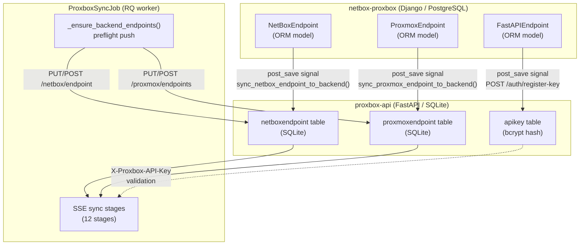
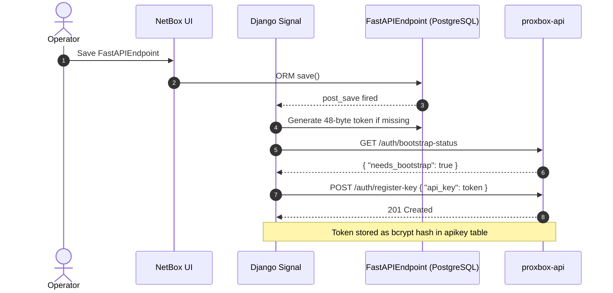
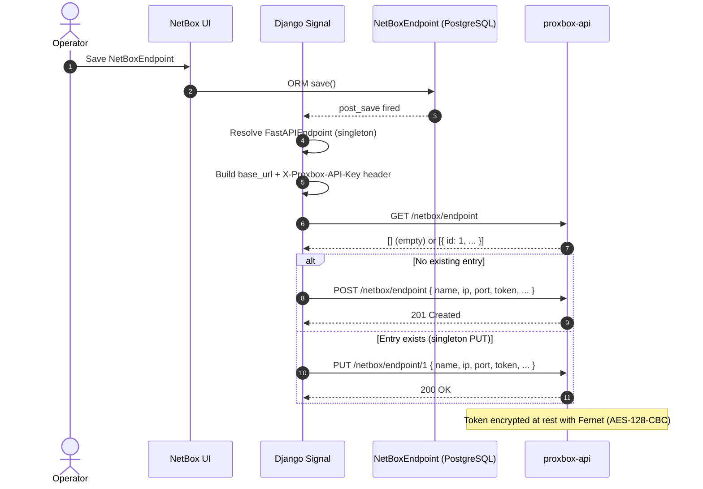
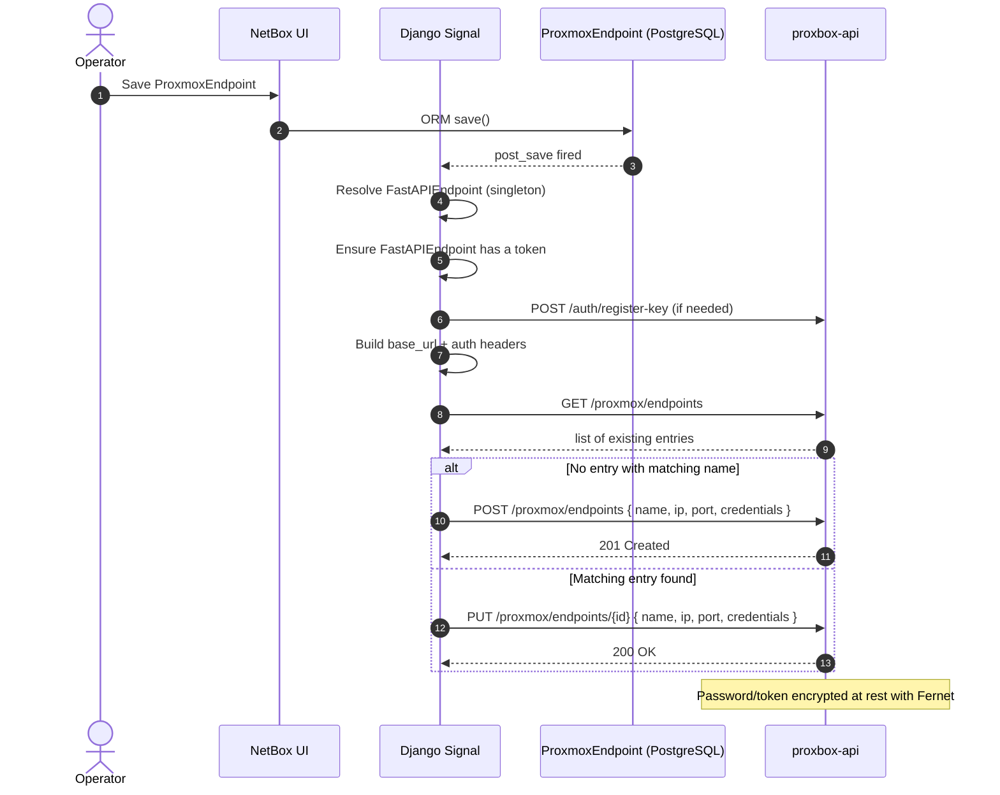
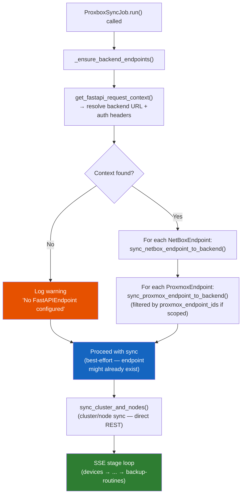
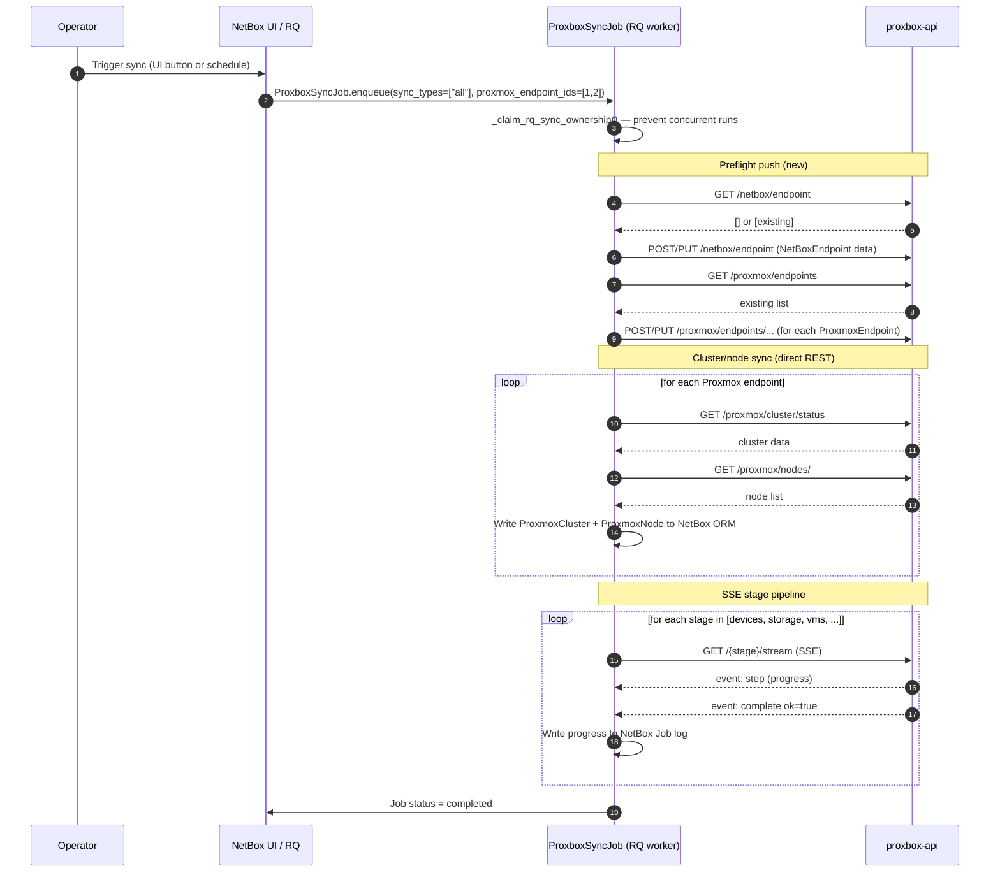
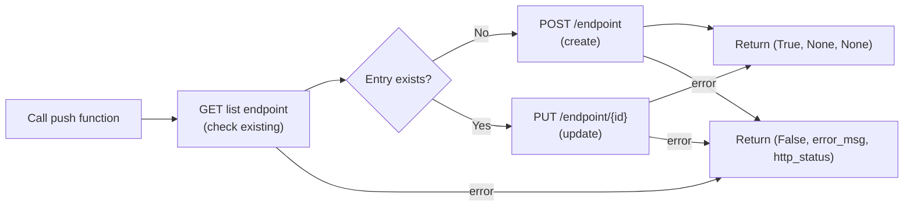
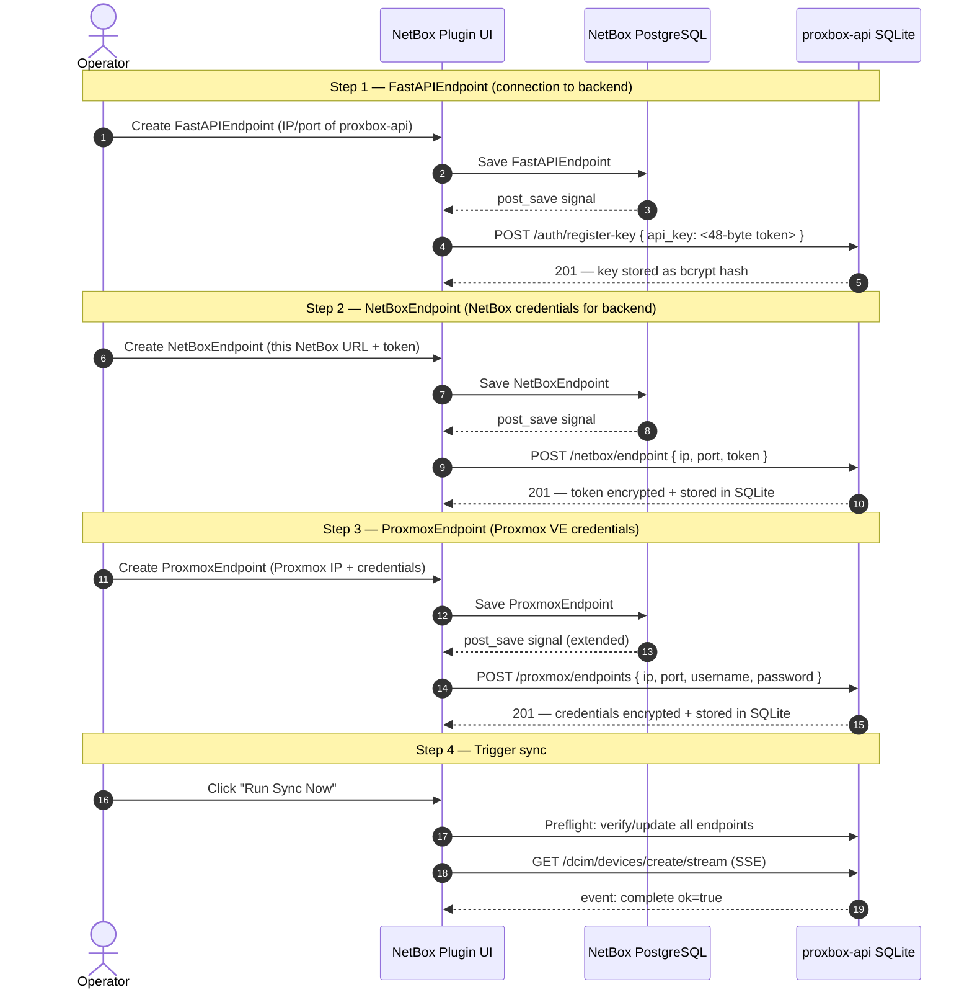
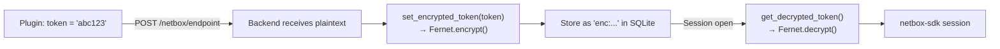

# Endpoint Data Exchange

This page explains how the `netbox-proxbox` plugin automatically keeps its endpoint configuration
in sync with the `proxbox-api` backend — covering the problem, the three delivery mechanisms,
the complete data flow, and the security model.

---

## The Problem

The plugin and the backend are two **separate processes with separate databases**:

| System | Database | Endpoint Model |
|---|---|---|
| `netbox-proxbox` (Django plugin) | NetBox PostgreSQL | `NetBoxEndpoint`, `ProxmoxEndpoint`, `FastAPIEndpoint` (ORM models) |
| `proxbox-api` (FastAPI backend) | Local SQLite (`database.db`) | `NetBoxEndpoint`, `ProxmoxEndpoint` (SQLModel tables) |

When an operator registers a `NetBoxEndpoint` in the plugin's UI, that record lives only in
PostgreSQL. The backend needs its own copy in SQLite to open a NetBox API session — without it,
every SSE sync stage fails immediately:

```
ProxboxException: No NetBox endpoint found
detail: Please add a NetBox endpoint in the database
```

The same gap exists for `ProxmoxEndpoint`: the backend needs Proxmox credentials in its own
SQLite table before it can open a Proxmox session for sync stages.

---

## System Overview



---

## Delivery Mechanism 1 — `post_save` Signals

All three `post_save` signals fire whenever an operator saves an endpoint record through
the plugin's UI or REST API. Each signal is **best-effort**: it logs on failure but never
raises an exception, so a transient backend outage does not break the Django request.

### `FastAPIEndpoint` → API key registration

**File:** `netbox_proxbox/signals.py` — `ensure_fastapi_endpoint_token`



The auto-generated token is stored on `FastAPIEndpoint.token` in PostgreSQL and used as the
`X-Proxbox-API-Key` header on every subsequent backend request. If the backend already has a
key (`needs_bootstrap: false`), the registration step is skipped.

---

### `NetBoxEndpoint` → backend SQLite sync

**File:** `netbox_proxbox/signals.py` — `sync_netbox_endpoint_to_backend`  
**Shared function:** `netbox_proxbox/views/backend_sync.py` — `sync_netbox_endpoint_to_backend()`



The payload contains the IP address, port, SSL flag, token version, and credential material.
On the backend, tokens are encrypted with Fernet before storage — see
[Security Model](#security-model) below.

---

### `ProxmoxEndpoint` → backend SQLite sync

**File:** `netbox_proxbox/signals.py` — `ensure_proxmox_endpoint_has_fastapi_token`  
**Shared function:** `netbox_proxbox/views/backend_sync.py` — `sync_proxmox_endpoint_to_backend()`



The endpoint name uses the stable format `"{name} (nb:{pk})"` so that the same Proxmox cluster
registered under different NetBox PKs is treated as a distinct backend entry.

---

## Delivery Mechanism 2 — Sync Job Preflight

`post_save` signals are best-effort: if the backend was offline when an endpoint was first
saved, the push is silently lost. The **preflight step** in `ProxboxSyncJob.run()` closes
this gap by pushing all endpoint data immediately before any SSE stage starts — regardless
of whether the signals previously succeeded.

**File:** `netbox_proxbox/jobs.py` — `_ensure_backend_endpoints()`



!!! note "Best-effort, never blocking"
    If `_ensure_backend_endpoints()` cannot reach the backend (network error, wrong URL), it
    logs a warning and returns without raising. The sync continues — a subsequent stage will
    fail with its own error if the endpoint is truly missing, giving the operator a clear
    log message.

### Full Sync Job Sequence



---

## Delivery Mechanism 3 — Dashboard View Push

The existing `sync_proxmox_endpoint_to_backend()` call from dashboard card views acts as a
third, opportunistic push — whenever an operator opens the Proxbox dashboard, the currently
selected Proxmox endpoint is pushed to the backend. This was the only push mechanism before
the preflight and `post_save` signal were added.

It remains in place as a zero-cost "refresh on view" that keeps credentials current even
when the operator edits a Proxmox endpoint and then immediately opens the dashboard without
triggering a full sync.

---

## Shared Push Functions

Both signals and the preflight delegate to two shared functions in
`netbox_proxbox/views/backend_sync.py`:

```python title="netbox_proxbox/views/backend_sync.py"
def sync_netbox_endpoint_to_backend(
    endpoint: NetBoxEndpoint,
    *,
    base_url: str,
    auth_headers: dict[str, str] | None = None,
    backend_verify_ssl: bool = True,
    timeout: int = 10,
) -> tuple[bool, str | None, int | None]:
    """GET /netbox/endpoint, then PUT (update) or POST (create). Returns (ok, error, http_status)."""

def sync_proxmox_endpoint_to_backend(
    endpoint: ProxmoxEndpoint,
    *,
    base_url: str,
    auth_headers: dict[str, str] | None = None,
    backend_verify_ssl: bool = True,
    timeout: int = 15,
) -> tuple[bool, str | None, int | None]:
    """GET /proxmox/endpoints, then PUT (update) or POST (create). Returns (ok, error, http_status)."""
```

Both functions follow the same pattern:



---

## Bootstrap Sequence (First-Time Setup)

When both systems start fresh (empty databases), the recommended setup order is:



!!! tip "Order matters"
    Create the `FastAPIEndpoint` **first** so that the `post_save` signals for
    `NetBoxEndpoint` and `ProxmoxEndpoint` have an active backend connection to push to.
    If you create endpoints in a different order, the preflight at sync time will still
    push everything correctly — but you will see warnings in the NetBox log for the missed
    signal pushes.

---

## HTTP Status Code Propagation

Before this implementation, `run_sync_stream()` always returned HTTP `503` when a stage failed,
even when the backend returned `400` (missing endpoint). This caused unnecessary retries — the
plugin retries on `>= 500` only.

Now `_try_sync_stream_url()` returns the actual backend status code as a fourth tuple element,
and `run_sync_stream()` propagates it:

```python title="netbox_proxbox/services/backend_proxy.py (simplified)"
# Before: always fell through to 503
return { "detail": last_detail }, 503

# After: propagates actual backend status
return { "detail": last_detail }, last_http_status or 503
```

| Backend response | Old plugin status | New plugin status | Retry triggered? |
|---|---|---|---|
| `400` missing endpoint | `503` | `400` | Yes (wrong) → **No (correct)** |
| `401` invalid API key | `503` | `401` → auto-retry with new key | Handled separately |
| `502` bad gateway | `503` | `502` | Yes (unchanged) |
| `503` backend overloaded | `503` | `503` | Yes (unchanged) |

---

## Security Model

### Authentication between plugin and backend

All plugin → backend requests include:

```
X-Proxbox-API-Key: <48-byte URL-safe random token>
```

The token is auto-generated on `FastAPIEndpoint.save()` (via `secrets.token_urlsafe(48)`)
and registered with the backend as a **bcrypt hash** stored in the `apikey` SQLite table.
The plaintext token is never stored on the backend.

The backend's `APIKeyAuthMiddleware` validates the header on every non-exempt request.
Brute-force attempts are blocked by the `AuthLockout` table (5 attempts per IP in 300 s).

### Credential encryption on the backend

NetBox and Proxmox credentials stored in the backend's SQLite are encrypted at rest using
**Fernet (AES-128-CBC + HMAC-SHA256)** via the `cryptography` library:



The encryption key is resolved using the following priority chain:

1. **`PROXBOX_ENCRYPTION_KEY` environment variable** — set on the proxbox-api host (highest priority).
2. **`ProxboxPluginSettings.encryption_key`** — fetched from the NetBox plugin API via `settings_client.get_settings()` and configurable on the plugin settings page under **Encryption**.
3. **None** — credentials stored in plaintext; a `CRITICAL` warning is logged.

The raw key (from either source) is hashed with SHA-256 to derive exactly 32 bytes,
then base64url-encoded to form a valid Fernet key. If neither source is set, credentials
are stored in plaintext with a dev-mode warning logged.

### Token version support

`NetBoxEndpoint` supports both NetBox token formats:

| Version | Field | Backend payload |
|---|---|---|
| `v1` | `token.key` (FK to `users.Token`) | `token_version: "v1"`, `token: "<key>"` |
| `v2` | `token_key` + `token_secret` fields | `token_version: "v2"`, `token: "<secret>"`, `token_key: "<key>"` |

---

## Code Reference

| File | Role |
|---|---|
| `netbox_proxbox/signals.py` | `post_save` handlers for all three endpoint types |
| `netbox_proxbox/views/backend_sync.py` | Shared `sync_netbox_endpoint_to_backend()` and `sync_proxmox_endpoint_to_backend()` |
| `netbox_proxbox/jobs.py` | `_ensure_backend_endpoints()` preflight; `ProxboxSyncJob.run()` |
| `netbox_proxbox/services/backend_proxy.py` | `run_sync_stream()`, `_try_sync_stream_url()` (HTTP status propagation) |
| `netbox_proxbox/services/backend_context.py` | `get_fastapi_request_context()` — URL + auth header resolution |
| `proxbox_api/routes/netbox/__init__.py` | `POST/PUT /netbox/endpoint` (backend CRUD) |
| `proxbox_api/routes/proxmox/__init__.py` | `POST/PUT /proxmox/endpoints` (backend CRUD) |
| `proxbox_api/session/netbox.py` | `get_netbox_session()` — reads SQLite, raises on empty |
| `proxbox_api/database.py` | `NetBoxEndpoint`, `ProxmoxEndpoint` SQLModel tables |
| `proxbox_api/credentials.py` | Fernet encryption helpers |
| `proxbox_api/routes/auth.py` | `/auth/register-key`, `/auth/bootstrap-status` |
