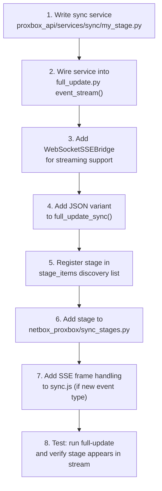

# Extending the Plugin

This page is the contributor's guide for adding new capabilities to the Proxbox ecosystem — new sync stages, new plugin models, or new API endpoints.

---

## Pre-commit Checklist

Before committing **any** change to `netbox-proxbox`, run all four checks:

```bash
# 1. Syntax check
python -m compileall netbox_proxbox tests

# 2. Linter
rtk ruff check .

# 3. Tests
rtk pytest tests/

# 4. Type checker (CLI only)
rtk ty check proxbox_cli
```

---

## Adding a New Sync Stage

Use this checklist when adding a new Proxmox data type to the sync pipeline.
Steps that reference `proxbox_api/...` are backend-service changes in the
separate `proxbox-api` repository; they are not Python imports from the
`netbox-proxbox` plugin.



### Step-by-Step

**Step 1 — Write the service** (`proxbox_api/services/sync/my_stage.py`)

```python
from proxbox_api.utils.streaming import WebSocketSSEBridge

async def sync_my_stage(
    netbox_session,
    pxs,
    *,
    websocket: WebSocketSSEBridge | None = None,
    use_websocket: bool = False,
) -> list:
    results = []
    # Fetch from Proxmox:
    data = await pxs.some.proxmox.endpoint.get()
    for item in data:
        # Transform and upsert in NetBox
        ...
        if use_websocket and websocket:
            await websocket.send("item_progress", {"name": item.name, "status": "created"})
    return results
```

**Step 2 — Wire into `full_update.py`** (SSE stream variant, `proxbox_api/app/full_update.py`)

```python
from proxbox_api.services.sync.my_stage import sync_my_stage

# Inside event_stream():
my_bridge = WebSocketSSEBridge()

yield sse_event("step", {"step": "my-stage", "status": "started", "message": "Starting my stage."})

async def _run_my_stage():
    try:
        return await sync_my_stage(netbox_session=netbox_session, pxs=pxs,
                                   websocket=my_bridge, use_websocket=True)
    finally:
        await my_bridge.close()

my_task = asyncio.create_task(_run_my_stage())
async for frame in my_bridge.iter_sse():
    yield frame
sync_my_results = await my_task

yield sse_event("step", {"step": "my-stage", "status": "completed",
                          "message": "My stage finished.", "result": {"count": len(sync_my_results)}})
```

**Step 3 — Add to the discovery list** (same file)

```python
stage_items = [
    ...
    {"name": "my-stage", "type": "stage"},    # add here
]
```

**Step 4 — Register stage in plugin** (`netbox_proxbox/sync_stages.py`)

```python
SYNC_STAGE_PATHS = {
    ...
    "my-stage": "my-stage/stream",   # path on proxbox-api
}
```

**Step 5 — JSON variant** (`full_update_sync()` in `full_update.py`)

```python
try:
    sync_my_results = await sync_my_stage(netbox_session=netbox_session, pxs=pxs)
except ProxboxException:
    raise
...
return {
    ...
    "my_stage": sync_my_results,
    "my_stage_count": len(sync_my_results),
}
```

---

## Adding a New Plugin Model

Follow this end-to-end checklist for a new Django model in the plugin:

| Step | File to create/modify | Notes |
|---|---|---|
| 1. Model | `netbox_proxbox/models/my_model.py` | Inherit from `NetBoxModel`; add to `models/__init__.py` |
| 2. Migration | Run `manage.py makemigrations netbox_proxbox` | Commit the generated migration file |
| 3. Form | `netbox_proxbox/forms/my_model.py` | Add to `forms/__init__.py` |
| 4. Table | `netbox_proxbox/tables/my_model.py` | Add to `tables/__init__.py` |
| 5. Filterset | `netbox_proxbox/filtersets.py` | Add `MyModelFilterSet` |
| 6. Serializer | `netbox_proxbox/api/serializers.py` | Add `MyModelSerializer` |
| 7. ViewSet | `netbox_proxbox/api/views.py` | Add `MyModelViewSet` |
| 8. API URLs | `netbox_proxbox/api/urls.py` | Register router entry |
| 9. Views | `netbox_proxbox/views/` | Add list/detail/create/edit/delete views |
| 10. Templates | `netbox_proxbox/templates/netbox_proxbox/` | Add list and detail templates |
| 11. URLs | `netbox_proxbox/urls.py` | Register UI URL patterns |
| 12. Navigation | `netbox_proxbox/navigation.py` | Add menu item (optional) |

!!! tip "Follow existing patterns"
    Look at `netbox_proxbox/models/vm_backup.py` + `forms/`, `tables/`, `api/` for a minimal example. The `ProxmoxCluster` model is a good example of a model with foreign keys to both plugin models and NetBox core models.

---

## Framework Stack Preference

When choosing how to implement a feature, follow this priority order (from CLAUDE.md):

1. **NetBox plugin layer** — reuse established plugin patterns, `NetBoxModel`, `NetBoxModelViewSet`, plugin-consistent tables and filtersets
2. **NetBox core** — prefer `utilities.forms.fields`, `utilities.forms.widgets`, `utilities.views`, and other `utilities.*` / `netbox.*` primitives
3. **Django** — use `django.forms`, `django.http`, ORM when NetBox has no specific helper
4. **Third-party packages** — only for integration needs that have no NetBox/Django path; never as UI shortcuts

---

## Environment Variables Reference

All Proxbox-specific environment variables for `proxbox-api`:

| Variable | Default | Description |
|---|---|---|
| `PROXBOX_NETBOX_TIMEOUT` | `120` s | Per-request timeout for all NetBox API calls |
| `PROXBOX_NETBOX_MAX_CONCURRENT` | `1` | Max concurrent NetBox API requests (keep low) |
| `PROXBOX_NETBOX_MAX_RETRIES` | `5` | Retry attempts for transient failures |
| `PROXBOX_NETBOX_RETRY_DELAY` | `2.0` s | Base retry delay (exponential backoff) |
| `PROXBOX_VM_SYNC_MAX_CONCURRENCY` | `8` | Max concurrent VM sync workers (Stage 3) |
| `PROXBOX_FETCH_MAX_CONCURRENCY` | `8` | Max concurrent Proxmox reads (Stages 2, 6, 7) |
| `PROXBOX_NETBOX_WRITE_CONCURRENCY` | `8` | Max concurrent NetBox write ops |
| `PROXBOX_PROXMOX_FETCH_CONCURRENCY` | `8` | Max concurrent Proxmox read ops |
| `PROXBOX_BACKUP_BATCH_SIZE` | `5` | Backup sync batch size (Stage 6) |
| `PROXBOX_BACKUP_BATCH_DELAY_MS` | `200` | Delay between backup batches (ms) |
| `PROXBOX_NETBOX_GET_CACHE_TTL` | `60` s | TTL for cached NetBox GET responses (0 = disable) |
| `PROXBOX_NETBOX_GET_CACHE_MAX_ENTRIES` | `4096` | Maximum cached entry count |
| `PROXBOX_NETBOX_GET_CACHE_MAX_BYTES` | `52428800` (50 MB) | Maximum cache size in bytes |
| `PROXBOX_DEBUG_CACHE` | `0` | Enable debug-level cache logging |
| `PROXBOX_CORS_EXTRA_ORIGINS` | (empty) | Extra CORS origins |
| `PROXBOX_EXPOSE_INTERNAL_ERRORS` | `false` | Return raw exception details in 500 responses |
| `PROXBOX_STRICT_STARTUP` | `false` | Fatal error on generated-route load failure |
| `PROXBOX_SKIP_NETBOX_BOOTSTRAP` | `false` | Skip default NetBox bootstrap at startup |
| `PROXBOX_RATE_LIMIT` | `60` req/min | Max API requests per minute per IP |

Plugin-side environment controls (in NetBox's `configuration.py`):

| Setting | Default | Description |
|---|---|---|
| `PROXBOX_SYNC_JOB_TIMEOUT` | `7200` s | RQ wall-clock limit for `ProxboxSyncJob` |

---

## Testing Conventions

```bash
# Run full suite
uv run pytest tests/

# Run with coverage
uv run pytest tests/ --cov=netbox_proxbox --cov-report=term-missing

# Run a specific test file
uv run pytest tests/test_jobs.py -v
```

Tests live in `tests/` and use pytest. The test stubs in `tests/` provide lightweight NetBox model mocks so you do not need a running NetBox instance.

The `tests/` directory contains a `CLAUDE.md` file with test conventions specific to this repository.
