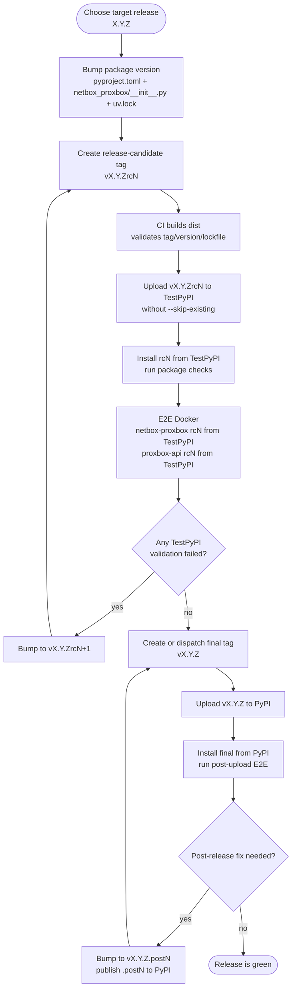
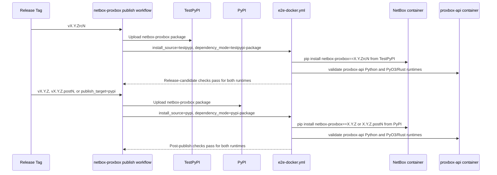

# Release Publishing

This page documents the staged package-release workflow for `netbox-proxbox` and
its companion `proxbox-api` backend. The workflow deliberately separates package
index validation from final publication so failed published artifacts are never
reused.

For the broader CI job map and Docker E2E matrix, see
[CI and E2E Workflows](ci-e2e-workflows.md).

## Release State Machine

## Cross-Package E2E Contract

The plugin does not import `proxbox-api` as a Python dependency. It consumes the
backend as a runtime HTTP service, so release coupling is validated in Docker
E2E rather than package metadata.

## Workflow Rules

- `pyproject.toml`, `netbox_proxbox/__init__.py`, `uv.lock`, and the Git tag
  must all describe the same version.
- `rcN` tag pushes (pattern `v*rc*`) publish to TestPyPI for release-candidate
  validation.
- Official releases (`vX.Y.Z`, `vX.Y.Z.postN`) are triggered **only** by GitHub
  release creation (`release: published`) cut from the `develop` branch. Plain
  non-rc tag pushes do **not** trigger the publish workflow. Manual workflow
  dispatch with `publish_target=pypi` also publishes to PyPI.
- Package uploads intentionally omit `twine --skip-existing`; a consumed version
  must move forward to the next `.postN` or `rcN`.
- Release E2E runs with `proxbox_api_runtime: both`. The Python backend and the
  PyO3/Rust backend must both pass before PyPI publication can proceed.
- In package-index E2E, Rust mode tries `proxbox-api[pyo3-rust]` first and
  falls back to the matching `<version>-pyo3-rust` Docker image when the backend
  package has not published that extra yet.
- `proxbox_api_version` can be supplied manually. If omitted, the workflow reads
  repository variables in this order:
  `PROXBOX_API_TESTPYPI_VERSION` / `PROXBOX_API_PYPI_VERSION`,
  `PROXBOX_API_RELEASE_VERSION`, then the checked-in default.

## Operator Checklist

1. Publish and validate `proxbox-api` on TestPyPI first.
2. Publish and validate `netbox-proxbox` on TestPyPI using that TestPyPI
   `proxbox-api` version.
3. Promote `proxbox-api` through PyPI release candidates and final PyPI release.
4. Promote `netbox-proxbox` through PyPI release candidates and final PyPI
   release using the matching PyPI `proxbox-api` version.
5. If any published validation fails, bump to the next `.postN` or `rcN`; never
   retry the same artifact version.
