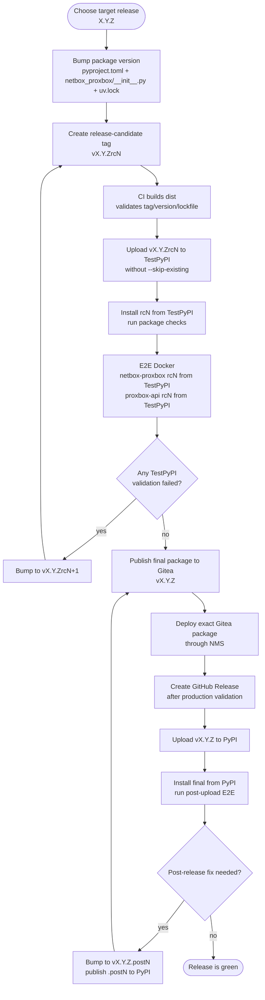
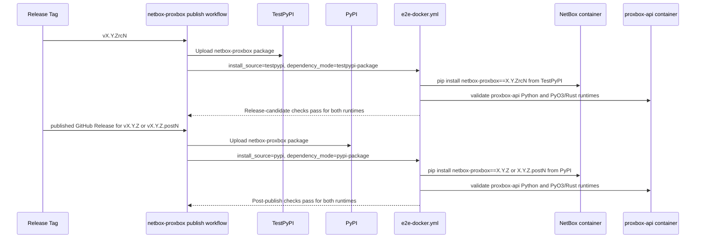

# Release Publishing

This page documents the staged package-release workflow for `netbox-proxbox` and
its companion `proxbox-api` backend. The workflow deliberately separates package
index validation from final publication so failed published artifacts are never
reused.

For the broader CI job map and Docker E2E matrix, see
[CI and E2E Workflows](ci-e2e-workflows.md).

## Release State Machine

```mermaid
flowchart TD
    Start([Choose target release\nX.Y.Z])
    Bump[Bump package version\npyproject.toml + netbox_proxbox/__init__.py + uv.lock]
    RCTag[Create release-candidate tag\nvX.Y.ZrcN]
    RCCI[CI builds dist\nvalidates tag/version/lockfile]
    RCUpload[Upload vX.Y.ZrcN to TestPyPI\nwithout --skip-existing]
    RCValidate[Install rcN from TestPyPI\nrun package checks]
    RCE2E[E2E Docker\nnetbox-proxbox rcN from TestPyPI\nproxbox-api rcN from TestPyPI]
    RCFailed{Any TestPyPI\nvalidation failed?}
    NextRC[Bump to vX.Y.ZrcN+1]
    FinalPrivate[Publish final package to Gitea\nvX.Y.Z]
    Deploy[Deploy exact Gitea package\nthrough NMS]
    PublicRelease[Create GitHub Release\nafter production validation]
    FinalUpload[Upload vX.Y.Z to PyPI]
    FinalValidate[Install final from PyPI\nrun post-upload E2E]
    FinalFailed{Post-release fix needed?}
    Post[Bump to vX.Y.Z.postN\npublish .postN to PyPI]
    Done([Release is green])

    Start --> Bump --> RCTag --> RCCI --> RCUpload --> RCValidate --> RCE2E --> RCFailed
    RCFailed -- yes --> NextRC --> RCTag
    RCFailed -- no --> FinalPrivate --> Deploy --> PublicRelease --> FinalUpload --> FinalValidate --> FinalFailed
    FinalFailed -- yes --> Post --> FinalPrivate
    FinalFailed -- no --> Done
```

## Cross-Package E2E Contract

The plugin does not import `proxbox-api` as a Python dependency. It consumes the
backend as a runtime HTTP service, so release coupling is validated in Docker
E2E rather than package metadata.

```mermaid
sequenceDiagram
    participant Tag as Release Tag
    participant WF as netbox-proxbox publish workflow
    participant TP as TestPyPI
    participant PY as PyPI
    participant E2E as e2e-docker.yml
    participant NB as NetBox container
    participant API as proxbox-api container

    Tag->>WF: vX.Y.ZrcN
    WF->>TP: Upload netbox-proxbox package
    WF->>E2E: install_source=testpypi, dependency_mode=testpypi-package
    E2E->>NB: pip install netbox-proxbox==X.Y.ZrcN from TestPyPI
    E2E->>API: validate proxbox-api Python and PyO3/Rust runtimes
    E2E-->>WF: Release-candidate checks pass for both runtimes

    Tag->>WF: published GitHub Release for vX.Y.Z or vX.Y.Z.postN
    WF->>PY: Upload netbox-proxbox package
    WF->>E2E: install_source=pypi, dependency_mode=pypi-package
    E2E->>NB: pip install netbox-proxbox==X.Y.Z or X.Y.Z.postN from PyPI
    E2E->>API: validate proxbox-api Python and PyO3/Rust runtimes
    E2E-->>WF: Post-publish checks pass for both runtimes
```

## Workflow Rules

- `pyproject.toml`, `netbox_proxbox/__init__.py`, `uv.lock`, and the Git tag
  must all describe the same version.
- `rcN` tag pushes (pattern `v*rc*`) publish to TestPyPI for release-candidate
  validation.
- Official releases (`vX.Y.Z`, `vX.Y.Z.postN`) are triggered **only** by GitHub
  release creation (`release: published`) cut from the `develop` branch after
  the final Gitea package and NMS production gates. Plain non-rc tag pushes do
  **not** trigger public publishing. Manual workflow dispatch is TestPyPI-only
  and requires an RC version.
- Package uploads intentionally omit `twine --skip-existing`; a consumed version
  must move forward to the next `.postN` or `rcN`.
- The Gitea package workflow listens for tag `push`, not the overlapping
  `create` event, so a tag can start only one immutable registry upload.
- A candidate tag must resolve to the current canonical Gitea `develop` SHA.
  Each latest required CI status must resolve through authenticated Gitea API
  records to a successful `ci.yml` push run for that exact SHA, trusted actor,
  job name, and untrusted runner class. A credential-free disposable job builds
  one wheel and one sdist after directly verifying the pinned uv archive,
  clearing inherited `UV_*` state, disabling discovered configuration, and
  selecting fresh per-run managed-Python/cache roots. A separate disposable
  publisher anonymously fetches the exact validated source, validates the
  manifest with a locked toolchain, exposes repository `PKG_TOKEN` only for
  package writes, keeps the built-in token package-read-only, links the package
  to this repository, and downloads the registry bytes again to prove their
  hashes. The unsupported Gitea Actions job token is never used as a package-
  registry credential.
- GitHub never rebuilds release artifacts. It downloads that exact linked
  Gitea wheel/sdist, installs both artifact forms on Python 3.12 and 3.13, and
  uploads the same bytes to TestPyPI or PyPI.
- A final package-first production workflow emits an immutable, repository-
  linked Gitea generic attestation only after the health check succeeds. The
  final GitHub release event must match that attestation's source SHA, version,
  artifact hashes, manifest digest, production environment, and Gitea run ID.
- TestPyPI and PyPI candidate validation run the mocked suite with
  `-p no:django`; the separate real-NetBox matrix keeps pytest-django enabled.
- Release E2E runs with `proxbox_api_runtime: both`. The Python backend and the
  PyO3/Rust backend must both pass before PyPI publication can proceed.
- In package-index E2E, Rust mode tries `proxbox-api[pyo3-rust]` first and
  falls back to the matching `<version>-pyo3-rust` Docker image when the backend
  package has not published that extra yet.
- `proxbox_api_version` can be supplied manually. If omitted, the workflow reads
  repository variables in this order:
  `PROXBOX_API_TESTPYPI_VERSION` / `PROXBOX_API_PYPI_VERSION`,
  `PROXBOX_API_RELEASE_VERSION`, then the checked-in default.

## Operator Checklist

1. Publish and validate `proxbox-api` on TestPyPI first.
2. Publish and validate `netbox-proxbox` on TestPyPI using that TestPyPI
   `proxbox-api` version.
3. Publish each final package in Gitea, link/verify it, and deploy the exact pair
   through NMS using `latest_package` by default.
4. After production integration and health checks pass, dispatch each
   repository's `promote-final-tag.yml` from canonical Gitea `main`. The
   workflow verifies the exact package and protected NMS attestation before
   pushing only that tag to the authorized GitHub repository. Then create the
   proxbox-api and netbox-proxbox GitHub Releases with `--verify-tag`; those
   final tags and protected Gitea deployment attestations authorize
   PyPI/Docker Hub publication.
5. If any published validation fails, bump to the next `.postN` or `rcN`; never
   retry the same artifact version.
