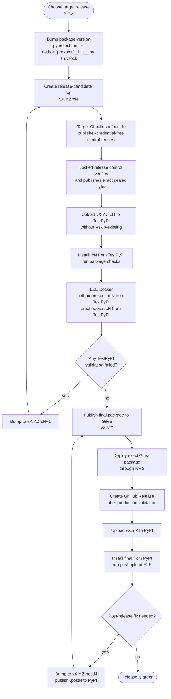
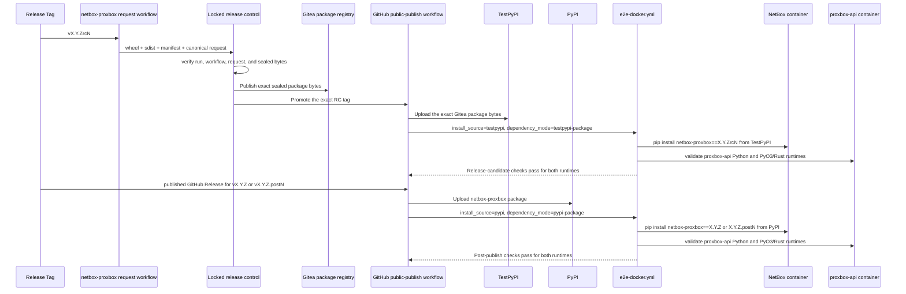

# Release Publishing

This page documents the staged package-release workflow for `netbox-proxbox` and
its companion `proxbox-api` backend. The workflow deliberately separates package
index validation from final publication so failed published artifacts are never
reused.

For the broader CI job map and Docker E2E matrix, see
[CI and E2E Workflows](ci-e2e-workflows.md).

## Release State Machine

```mermaid
flowchart TD
    Start([Choose target release\nX.Y.Z])
    Bump[Bump package version\npyproject.toml + netbox_proxbox/__init__.py + uv.lock]
    RCTag[Create release-candidate tag\nvX.Y.ZrcN]
    RCCI[Target CI builds a four-file\npublisher-credential-free control request]
    Control[Locked release control verifies\nand publishes exact sealed bytes]
    RCUpload[Upload vX.Y.ZrcN to TestPyPI\nwithout --skip-existing]
    RCValidate[Install rcN from TestPyPI\nrun package checks]
    RCE2E[E2E Docker\nnetbox-proxbox rcN from TestPyPI\nproxbox-api rcN from TestPyPI]
    RCFailed{Any TestPyPI\nvalidation failed?}
    NextRC[Bump to vX.Y.ZrcN+1]
    FinalPrivate[Publish final package to Gitea\nvX.Y.Z]
    Deploy[Deploy exact Gitea package\nthrough NMS]
    PublicRelease[Create GitHub Release\nafter production validation]
    FinalUpload[Upload vX.Y.Z to PyPI]
    FinalValidate[Install final from PyPI\nrun post-upload E2E]
    FinalFailed{Post-release fix needed?}
    Post[Bump to vX.Y.Z.postN\npublish .postN to PyPI]
    Done([Release is green])

    Start --> Bump --> RCTag --> RCCI --> Control --> RCUpload --> RCValidate --> RCE2E --> RCFailed
    RCFailed -- yes --> NextRC --> RCTag
    RCFailed -- no --> FinalPrivate --> Deploy --> PublicRelease --> FinalUpload --> FinalValidate --> FinalFailed
    FinalFailed -- yes --> Post --> FinalPrivate
    FinalFailed -- no --> Done
```

## Cross-Package E2E Contract

The plugin does not import `proxbox-api` as a Python dependency. It consumes the
backend as a runtime HTTP service, so release coupling is validated in Docker
E2E rather than package metadata.

```mermaid
sequenceDiagram
    participant Tag as Release Tag
    participant WF as netbox-proxbox request workflow
    participant Control as Locked release control
    participant GP as Gitea package registry
    participant PublicWF as GitHub public-publish workflow
    participant TP as TestPyPI
    participant PY as PyPI
    participant E2E as e2e-docker.yml
    participant NB as NetBox container
    participant API as proxbox-api container

    Tag->>WF: vX.Y.ZrcN
    WF->>Control: wheel + sdist + manifest + canonical request
    Control->>Control: verify run, workflow, request, and sealed bytes
    Control->>GP: Publish exact sealed package bytes
    Control->>PublicWF: Promote the exact RC tag
    PublicWF->>TP: Upload the exact Gitea package bytes
    PublicWF->>E2E: install_source=testpypi, dependency_mode=testpypi-package
    E2E->>NB: pip install netbox-proxbox==X.Y.ZrcN from TestPyPI
    E2E->>API: validate proxbox-api Python and PyO3/Rust runtimes
    E2E-->>PublicWF: Release-candidate checks pass for both runtimes

    Tag->>PublicWF: published GitHub Release for vX.Y.Z or vX.Y.Z.postN
    PublicWF->>PY: Upload netbox-proxbox package
    PublicWF->>E2E: install_source=pypi, dependency_mode=pypi-package
    E2E->>NB: pip install netbox-proxbox==X.Y.Z or X.Y.Z.postN from PyPI
    E2E->>API: validate proxbox-api Python and PyO3/Rust runtimes
    E2E-->>PublicWF: Post-publish checks pass for both runtimes
```

## Workflow Rules

- `pyproject.toml`, `netbox_proxbox/__init__.py`, `uv.lock`, and the Git tag
  must all describe the same version.
- `rcN` tag pushes (pattern `v*rc*`) publish to TestPyPI for release-candidate
  validation.
- Official releases (`vX.Y.Z`, `vX.Y.Z.postN`) are triggered **only** by GitHub
  release creation (`release: published`) cut from the `develop` branch after
  the final Gitea package and NMS production gates. Plain non-rc tag pushes do
  **not** trigger public publishing. Manual workflow dispatch is TestPyPI-only
  and requires an RC version.
- Package uploads intentionally omit `twine --skip-existing`; a consumed version
  must move forward to the next `.postN` or `rcN`.
- The target Gitea workflow listens for tag `push`, not the overlapping
  `create` event, so a tag can start only one immutable release request.
- A candidate tag must resolve to the current canonical Gitea `develop` SHA.
  Each latest required CI status must resolve through authenticated Gitea API
  records to a successful `ci.yml` push run and run attempt for that exact SHA,
  trusted actor, job name, and exact sole `ci-untrusted-python312` job label.
  Only that validation
  job's built-in token receives `actions: read` plus `contents: read`; Actions
  evidence is a separate Gitea permission scope. The separate untrusted build
  job declares only `contents: read`, fetches the validated public source
  without checkout credentials, and rejects job-token environment variables.
  Gitea's public-repository permission floor can still make public Actions data
  readable, so this is not an Actions-read confidentiality boundary. The
  outer job also receives Gitea's artifact runtime token. Candidate-controlled
  dependency installation, PEP 517 build, Twine check, and manifest generation
  therefore run as a separate numeric UID with an allowlisted token-free
  environment, no-new-privileges/resource limits, denial of the root parent's
  `/proc/.../environ`, and cleanup of every surviving process for that UID. A
  fail-closed x86-64 Landlock ABI 3+ rule permits writes only below the per-run
  build root, preventing candidate writes to runner workflow-command files and
  shared temporary storage; the runner must match that architecture and expose
  that ABI or the build fails. The
  activation canary must also prove the dedicated untrusted CI VM denies
  management and production network access; the runner's online label is not
  sufficient evidence.
  Candidate stdout/stderr is bounded and captured instead of reaching the runner
  workflow-command parser, with live `set-env`/`add-path` canaries checked in the
  next step. The job fails closed unless cgroup v2 proves hard one-CPU,
  2-GiB-memory, zero-swap, and 64-PID ceilings and `/nmc-build` is a hard
  one-GiB/50,000-inode tmpfs. The 900-second wall bound therefore also caps
  cumulative CPU, while parent accounting includes live and reaped descendants.
  Logical-size, filesystem-block, file-count, and output checks remain defense
  in depth; CPU parsing does not trust whitespace in Linux process names.
  Reviewed outer code uses exact no-follow file
  descriptors, bounded regular-file inventory, and copy re-hashing before it
  invokes artifact upload; candidate code receives no job, runtime, package,
  mirror, or write credential.
  A disposable target job
  builds one wheel and one sdist after verifying the pinned uv archive and
  selecting fresh per-run managed-Python/cache roots. It uploads exactly four
  data files: the wheel, sdist, canonical manifest, and canonical
  `release-request.json`. The request binds the repository ID, source/tag,
  initiating run and attempt, workflow digest, manifest digest, and artifact
  inventory. It has no package or GitHub-mirror credential. The separately
  administered release-control repository fetches that exact first-attempt run,
  verifies the policy-pinned target workflow and every byte on its isolated
  builder, then seals the handoff. Only its isolated publisher can read the
  package credentials and invoke the fixed, digest-locked publication tooling.
  Public no-authority downloads must match the manifest before the durable
  publication ledger advances.
- GitHub never rebuilds release artifacts. It downloads that exact linked
  Gitea wheel/sdist, installs both artifact forms on Python 3.12 and 3.13, and
  uploads the same bytes to TestPyPI or PyPI.
- A final package-first production workflow asks the root-owned fixed deploy
  helper to emit a schema-2 receipt only after the exact versioned wheel import
  and NetBox health checks succeed. Workflow code exports and publishes those
  host-issued bytes; it cannot create a successful-production receipt. The
  final GitHub release event must match the receipt's source SHA, version,
  artifact hashes, manifest digest, observed runtime path, production
  environment, and Gitea run ID.
- TestPyPI and PyPI candidate validation run the mocked suite with
  `-p no:django`; the separate real-NetBox matrix keeps pytest-django enabled.
- Release E2E runs with `proxbox_api_runtime: both`. The Python backend and the
  PyO3/Rust backend must both pass before PyPI publication can proceed.
- In package-index E2E, Rust mode tries `proxbox-api[pyo3-rust]` first and
  falls back to the matching `<version>-pyo3-rust` Docker image when the backend
  package has not published that extra yet.
- `proxbox_api_version` can be supplied manually. If omitted, the workflow reads
  repository variables in this order:
  `PROXBOX_API_TESTPYPI_VERSION` / `PROXBOX_API_PYPI_VERSION`,
  `PROXBOX_API_RELEASE_VERSION`, then the checked-in default.

## Operator Checklist

1. Before merging the target cutover, require the private control repository's
   positive policy-pinned ID plus ready protected workflows, host boundaries,
   sockets, and repository-scoped runners. If readiness is incomplete, leave
   the existing publisher active and stop.
2. Push the reviewed tag and wait for `publish-gitea.yml` to produce the
   `release-control-request` artifact. Record its run ID and the SHA-256 of its
   canonical `release-request.json`.
3. Dispatch `validate.yml` with exactly the repository name, target run ID, and
   request SHA-256. After it succeeds, dispatch the separate irreversible
   `publish.yml` with those same three inputs. For RCs, the control publishes
   the Gitea package and promotes only that exact RC tag to GitHub.
4. Publish and validate `proxbox-api` on TestPyPI first.
5. Publish and validate `netbox-proxbox` on TestPyPI using that TestPyPI
   `proxbox-api` version.
6. Publish each final package in Gitea, link/verify it, and deploy the exact pair
   through NMS using `latest_package` by default.
7. After production integration and health checks pass, dispatch each
   repository's `promote-final-tag.yml` from canonical Gitea `main`. The
   workflow verifies the exact package and protected host-issued deployment receipt before
   pushing only that tag to the authorized GitHub repository. Then create the
   proxbox-api and netbox-proxbox GitHub Releases with `--verify-tag`; those
   final tags and protected Gitea deployment receipts authorize
   PyPI/Docker Hub publication.
8. If any published validation fails, bump to the next `.postN` or `rcN`; never
   retry the same artifact version.
