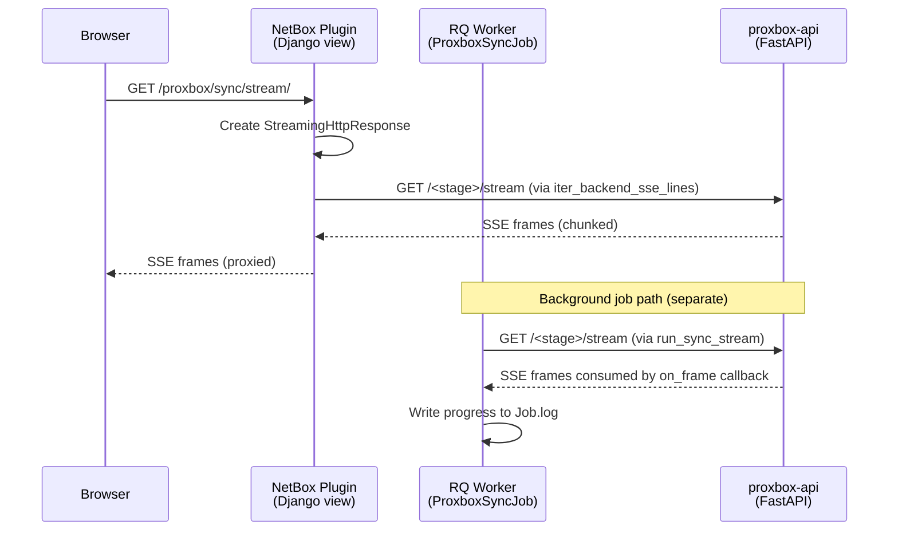
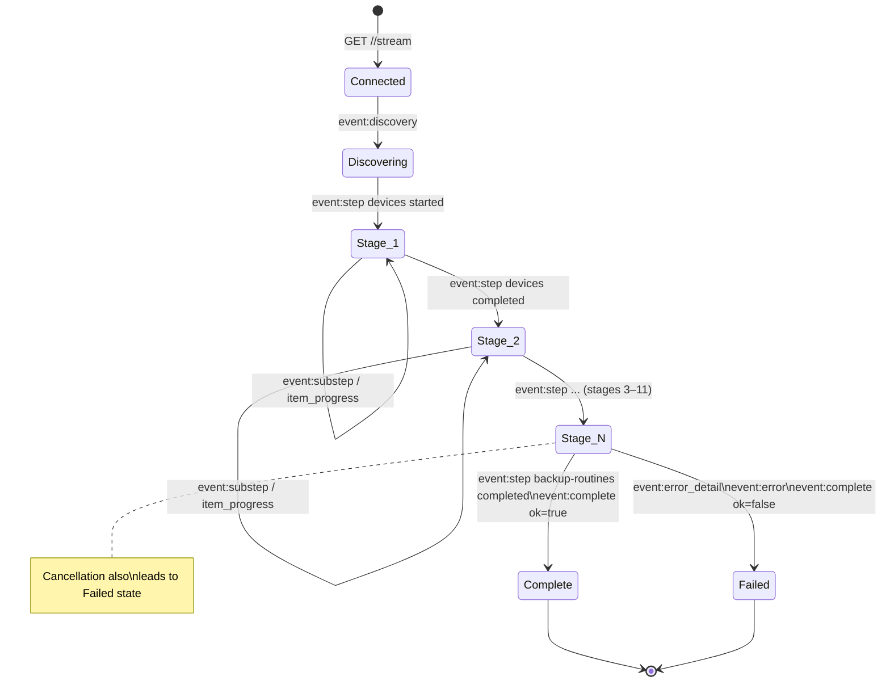

# Streaming Protocol

Proxbox uses **Server-Sent Events (SSE)** as the primary transport for real-time sync progress. A secondary **WebSocket** channel carries broadcast messages for dashboard updates. This page documents both protocols in detail.

---

## Two Sync Transport Modes

=== "SSE Streaming (primary)"
    The plugin opens long-lived HTTP GET calls to backend stage paths such as `proxbox-api/dcim/devices/create/stream` or `proxbox-api/proxmox/sdn/create/stream`. The response is `text/event-stream` and carries SSE frames for each stage and object processed. Scheduled jobs call one backend `/stream` path per selected stage; browser proxy views may still stream a single backend path directly.

    - **Used by**: `ProxboxSyncJob.run()` via `run_sync_stream()`, browser-facing `StreamingHttpResponse` proxy views
    - **Advantages**: real-time per-object progress, no polling needed, works through proxies with `X-Accel-Buffering: no`
    - **Timeout**: HTTP between-chunk read timeout is **3600 s** (`_SYNC_STREAM_READ_TIMEOUT`). RQ job wall-clock limit is **7200 s**.

=== "JSON Polling (legacy)"
    The plugin sends a GET to `proxbox-api/full-update` and waits for a single JSON response containing all sync results.

    - **Used by**: `sync_full_update_resource()`, some older dashboard views
    - **Advantages**: simple request/response, easy to debug
    - **Disadvantages**: no real-time progress, times out on large clusters

---

## SSE Event Types

Every SSE event has the form:

```
event: <event_type>
data: <json_payload>

```

(Note the blank line between events — this is the SSE message boundary.)

### `discovery`

Emitted once at the start of a scheduled full-update job or legacy full-update stream. Lists all stages that will be processed.

```json
{
  "event": "discovery",
  "phase": "full-update",
  "status": "discovered",
  "message": "Discovered 13 sync stage(s) for full update",
  "count": 13,
  "items": [
    {"name": "devices", "type": "stage"},
    {"name": "storage", "type": "stage"},
    ...
  ],
  "progress": {"current": 0, "total": 13, "percent": 0},
  "metadata": {"operation_id": "550e8400-e29b-41d4-a716-446655440000"}
}
```

### `step`

Emitted twice per stage: once when the stage starts, once when it finishes.

```json
// Stage started
{"step": "virtual-machines", "status": "started", "message": "Starting virtual machines synchronization."}

// Stage completed
{"step": "virtual-machines", "status": "completed", "message": "Virtual machines synchronization finished.", "result": {"count": 47}}
```

### `substep`

Emitted by individual sync services for sub-stage progress (e.g., per-VM progress within the VM stage).

```json
{"substep": "vm_create", "status": "processing", "message": "Creating VM web-server-01", "vmid": 100}
```

### `item_progress`

Carries per-object sync result for fine-grained frontend progress bars.

```json
{"event": "item_progress", "name": "web-server-01", "status": "created", "type": "virtual_machine", "id": 42}
```

### `phase_summary`

Emitted by some stages to summarize a batch of objects processed.

```json
{"event": "phase_summary", "phase": "backups", "created": 12, "updated": 3, "skipped": 0, "errors": 0}
```

### `error_detail`

Structured error event with category, suggestion, and detail text.

```json
{
  "event": "error_detail",
  "phase": "virtual-machines",
  "category": "internal",
  "message": "Virtual machine sync failed",
  "detail": "Connection refused to Proxmox VE",
  "suggestion": "Check Proxmox endpoint connectivity and retry"
}
```

### `error`

Short-form error event used alongside `error_detail`.

```json
{"step": "full-update", "status": "failed", "error": "Error while syncing virtual machines.", "detail": "..."}
```

### `complete`

Always the last event in a stream. `ok: true` on success, `ok: false` on failure.

```json
// Success
{"ok": true, "message": "Full update sync completed.", "result": {"devices_count": 3, "virtual_machines_count": 47, ...}}

// Failure
{"ok": false, "message": "Error while syncing virtual machines.", "errors": [{"detail": "..."}]}
```

---

## SSE Proxy Chain

The SSE stream passes through two hops before reaching the browser:



The `iter_backend_sse_lines()` function in `netbox_proxbox/services/backend_proxy.py` opens a streaming `requests.get()` with `stream=True` and yields each raw SSE line. The Django view wraps this in a `StreamingHttpResponse` with `Content-Type: text/event-stream`.

For background jobs, `run_sync_stream()` consumes the SSE stream to completion using an `on_frame` callback that writes progress data to the NetBox Job record.

---

## WebSocketSSEBridge

`proxbox-api` uses an internal bridge class to decouple async sync work from SSE frame emission:

```python title="proxbox_api/utils/streaming.py (simplified)"
class WebSocketSSEBridge:
    """Connects an async sync function to SSE frame output."""

    async def send(self, event: str, data: dict) -> None:
        """Called by sync service to emit a progress event."""
        await self._queue.put(sse_event(event, data))

    async def close(self) -> None:
        """Signal that no more events will be sent."""
        await self._queue.put(None)

    async def iter_sse(self) -> AsyncIterator[str]:
        """Yields SSE frames for the HTTP response generator."""
        while True:
            frame = await self._queue.get()
            if frame is None:
                break
            yield frame
```

Each stage gets its own bridge instance. The `full_update.py` event generator runs the sync function as a background `asyncio.Task`, iterates the bridge's SSE output, then awaits the task result:

```python
async def _run_vms_sync():
    try:
        return await create_virtual_machines(..., websocket=vm_bridge, use_websocket=True)
    finally:
        await vm_bridge.close()          # always signal completion

vms_task = asyncio.create_task(_run_vms_sync())
async for frame in vm_bridge.iter_sse():
    yield frame                          # proxy to HTTP response
sync_vms = await vms_task                # collect result
```

---

## Stream Lifecycle State Machine



---

## WebSocket Channel

In addition to SSE, the plugin supports a **WebSocket channel** for broadcast messages. This is used by the `home.js` dashboard to receive sync-end notifications without polling.

```
Browser ──── ws://netbox-host/plugins/proxbox/ws/ ──── websocket_client.py ──── proxbox-api WS
```

The `websocket.js` script exposes:

```js
onSyncEnd(listener)    // register a callback for sync completion events
notifySyncEnd(obj)     // trigger all registered listeners (called by sync.js)
```

---

## Timeout Architecture

Proxbox involves three distinct timeout layers that must all be longer than the expected sync duration:

| Timeout | Value | Location | Controls |
|---|---|---|---|
| RQ job wall-clock | **7200 s** | `PROXBOX_SYNC_JOB_TIMEOUT` in `jobs.py` | Max time for an RQ worker to hold the job before killing it |
| HTTP read (between chunks) | **3600 s** | `_SYNC_STREAM_READ_TIMEOUT` in `backend_proxy.py` | Max time to wait for the next SSE chunk from proxbox-api |
| NetBox API request | **120 s** | `PROXBOX_NETBOX_TIMEOUT` env var | Per-request timeout for netbox-sdk calls inside proxbox-api |

!!! warning "Stuck jobs"
    - **`pending` forever**: no RQ worker is running, or the worker does not listen to the `default` queue.
    - **`running` for a long time**: proxbox-api is still processing — check the Job log for SSE progress events.
    - **`errored` with `JobTimeoutException`**: the RQ wall-clock limit was hit — increase `PROXBOX_SYNC_JOB_TIMEOUT`.

    See [Backend Integration](backend-integration.md) for diagnosis steps.
