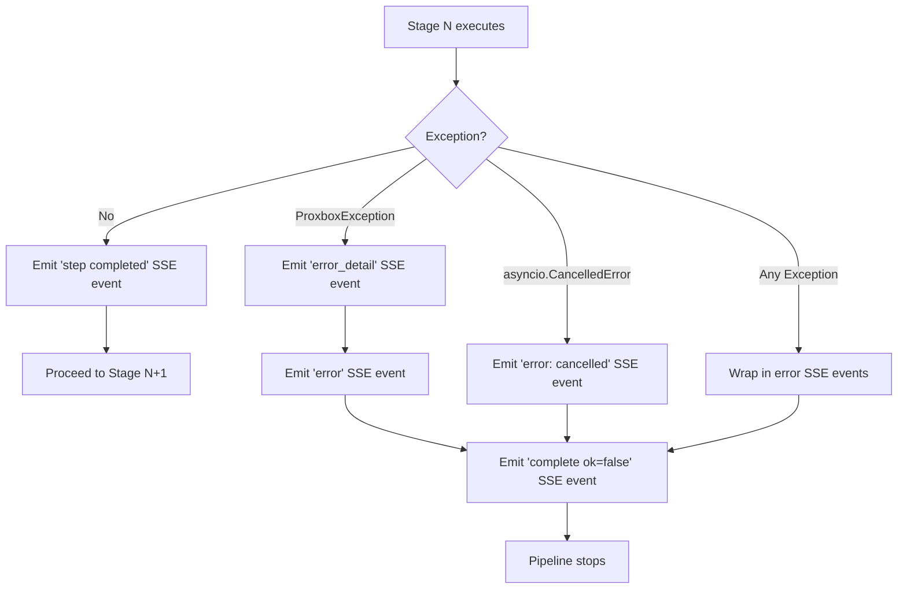

# Sync Pipeline

The scheduled Proxbox full-update sync is a **13-stage sequential pipeline**.
Each stage fetches data from Proxmox through `proxbox-api`, transforms it, and
creates or updates the corresponding NetBox objects. Stages run in a fixed
order because later stages depend on objects created by earlier ones.

---

## Stage Order

```mermaid
flowchart LR
    S1["1\nDevices\n(nodes)"] --> S2["2\nStorage"]
    S2 --> S3["3\nVirtual\nMachines"]
    S3 --> S4["4\nVirtual\nDisks"]
    S4 --> S5["5\nTask\nHistory"]
    S5 --> S6["6\nBackups"]
    S6 --> S7["7\nSnapshots"]
    S7 --> S8["8\nNode\nInterfaces"]
    S8 --> S9["9\nVM\nInterfaces"]
    S9 --> S10["10\nVM IP\nAddresses"]
    S10 --> S11["11\nSDN"]
    S11 --> S12["12\nReplications"]
    S12 --> S13["13\nBackup\nRoutines"]

    style S1 fill:#1565c0,color:#fff
    style S2 fill:#1565c0,color:#fff
    style S3 fill:#2e7d32,color:#fff
    style S4 fill:#2e7d32,color:#fff
    style S5 fill:#2e7d32,color:#fff
    style S6 fill:#2e7d32,color:#fff
    style S7 fill:#2e7d32,color:#fff
    style S8 fill:#6a1b9a,color:#fff
    style S9 fill:#6a1b9a,color:#fff
    style S10 fill:#6a1b9a,color:#fff
    style S11 fill:#6a1b9a,color:#fff
    style S12 fill:#e65100,color:#fff
    style S13 fill:#e65100,color:#fff
```



**Legend:** blue = infrastructure, green = VM data, purple = networking, orange = operational

---

## Stage Details

| # | Stage | `full_update.py` Function | NetBox Objects Created/Updated | Proxmox Data Source |
|---|---|---|---|---|
| 1 | **Devices** | `create_proxmox_devices()` | `Device`, `DeviceType`, `Platform`, `Cluster` | `/cluster/status`, `/nodes` |
| 2 | **Storage** | `create_storages()` | `ProxmoxStorage` (plugin model) | `/nodes/{node}/storage` |
| 3 | **Virtual Machines** | `create_virtual_machines()` | `VirtualMachine`, custom fields, tags | `/cluster/resources?type=vm` |
| 4 | **Virtual Disks** | `create_virtual_disks()` | `VirtualDisk`, `ProxmoxStorageVirtualDisk` | VM config API per VMID |
| 5 | **Task History** | `sync_all_virtual_machine_task_histories()` | `VMTaskHistory` (plugin model) | `/nodes/{node}/tasks` |
| 6 | **Backups** | `create_all_virtual_machine_backups()` | `VMBackup` (plugin model) | `/nodes/{node}/storage/{storage}/content` |
| 7 | **Snapshots** | `create_all_virtual_machine_snapshots()` | `VMSnapshot` (plugin model) | `/nodes/{node}/qemu/{vmid}/snapshot` |
| 8 | **Node Interfaces** | `create_all_device_interfaces()` | `Interface` (on Device) | `/nodes/{node}/network` |
| 9 | **VM Interfaces** | `create_only_vm_interfaces()` | `VMInterface` (on VirtualMachine) | VM config `net*` keys |
| 10 | **VM IP Addresses** | `create_only_vm_ip_addresses()` | `IPAddress`, assigned to `VMInterface` | QEMU guest agent or config |
| 11 | **SDN** | `sync_sdn_to_netbox()` | `L2VPN`, `RouteTarget`, `Prefix`, SDN plugin metadata | `/cluster/sdn/*`, `/nodes/{node}/sdn/*` |
| 12 | **Replications** | `sync_all_replications()` | `Replication` (plugin model) | `/cluster/replication` |
| 13 | **Backup Routines** | `sync_all_backup_routines()` | `BackupRoutine` (plugin model) | `/cluster/backup` |

---

## Stage Dependencies

The sequential order is not arbitrary — each stage depends on objects created by the previous ones:

- **Stage 1 → 2–3**: Devices (nodes) must exist before storage and VMs can reference them
- **Stage 3 → 4**: VMs must exist in NetBox before their virtual disks can be linked
- **Stage 3 → 5–7**: VMs must exist before task history, backups, and snapshots can be attached
- **Stage 1 → 8**: Devices must exist before their network interfaces can be created
- **Stage 3 → 9**: VMs must exist before their VM interfaces can be created
- **Stage 9 → 10**: VM interfaces must exist before IP addresses can be assigned to them
- **Stages 8–10 → 11**: SDN metadata runs after node/VM networking so generated
  L2VPN, RouteTarget, Prefix, and binding rows can reference already-discovered
  NetBox network objects when resolvable

For upgraded installs, Stage 10 also depends on the `proxmox_vm_id` custom
field that Stage 3 writes to each NetBox VM. VMs created by affected backend
versions before the VM config fix may need one Full Update on a fixed
`proxbox-api` build before the IP-address stage can match them reliably.

The SDN stage is optional and defaults to skipped because `sync_mode_sdn`
defaults to `disabled`. Choosing **All** includes the stage, but
`sync_stages.py` records a skipped stage until the effective SDN mode allows
it. Unsupported older Proxmox clusters are also counted as skipped warnings,
not failed syncs.

---

## SSE Stream Mode

The scheduled stage runner opens each backend stage's `/stream` endpoint and
emits **Server-Sent Events** during the pipeline. Each stage:

1. Emits a `step` event with `status: "started"`
2. Creates a `WebSocketSSEBridge` and runs the sync function as an `asyncio.Task`
3. Proxies all bridge SSE frames to the HTTP response as they arrive
4. Awaits the task completion
5. Emits a `step` event with `status: "completed"` and result counts

```python title="proxbox_api/app/full_update.py (pattern per stage)"
devices_bridge = WebSocketSSEBridge()

async def _run_devices_sync():
    try:
        return await create_proxmox_devices(..., websocket=devices_bridge, use_websocket=True)
    finally:
        await devices_bridge.close()

devices_task = asyncio.create_task(_run_devices_sync())
async for frame in devices_bridge.iter_sse():
    yield frame                         # proxy bridge events to the HTTP stream
sync_nodes = await devices_task         # collect final result
```

---

## Error Handling



!!! warning "A single stage failure aborts the pipeline"
    When a stage raises `ProxboxException`, the `event_stream()` generator catches it and terminates the SSE stream with an `ok=false` complete event. The plugin's `run_sync_stream()` reads this and marks the NetBox Job as **errored**.

---

## Non-Streaming (JSON) Mode

The backend `/full-update` route remains the synchronous JSON workflow for
legacy helper calls. Scheduled NetBox jobs use the explicit per-stage stream
paths in `netbox_proxbox/sync_types.py`, including
`proxmox/sdn/create/stream` for the optional SDN stage.

---

## Concurrency Controls

Long syncs can be tuned via environment variables on the `proxbox-api` host:

| Variable | Default | Controls |
|---|---|---|
| `PROXBOX_VM_SYNC_MAX_CONCURRENCY` | 8 | Max concurrent VM sync workers in Stage 3 |
| `PROXBOX_FETCH_MAX_CONCURRENCY` | 8 | Max concurrent Proxmox read ops in Stages 2, 6, 7 |
| `PROXBOX_NETBOX_WRITE_CONCURRENCY` | 8 | Max concurrent NetBox write ops in Stage 3; 4 in Stages 5, 7 |
| `PROXBOX_PROXMOX_FETCH_CONCURRENCY` | 8 | Max concurrent Proxmox reads; 4 in Stage 5 |
| `PROXBOX_BACKUP_BATCH_SIZE` | 5 | Batch size for Stage 6 backup sync |
| `PROXBOX_BACKUP_BATCH_DELAY_MS` | 200 | Delay between backup batches (ms) |
| `PROXBOX_NETBOX_MAX_CONCURRENT` | 1 | Max concurrent NetBox API requests (keep low to avoid PG pool exhaustion) |

!!! tip "Tuning for large clusters"
    Start with defaults. If sync is too slow, increase `PROXBOX_VM_SYNC_MAX_CONCURRENCY` and `PROXBOX_FETCH_MAX_CONCURRENCY` carefully. If you see PostgreSQL connection errors in NetBox, decrease `PROXBOX_NETBOX_MAX_CONCURRENT`.

---

## Individual Stage Sync

Besides the full 13-stage scheduled pipeline, individual objects can be synced on-demand through targeted endpoints. The plugin exposes "Sync Now" buttons on cluster, node, storage, and VM detail pages that call individual sync routes in `proxbox_api/routes/sync/individual/`. These are handled by `netbox_proxbox/services/individual_sync.py` on the plugin side.

---

## Code References

| Component | File |
|---|---|
| Full pipeline (SSE + JSON) | `proxbox_api/app/full_update.py` |
| Plugin stage runner | `netbox_proxbox/sync_stages.py` |
| Plugin job | `netbox_proxbox/jobs.py` |
| Sync services | `proxbox_api/services/sync/` |
| Individual sync | `proxbox_api/routes/sync/individual/` |
