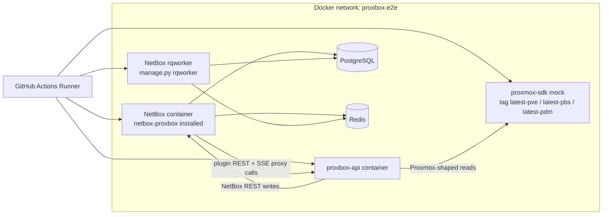
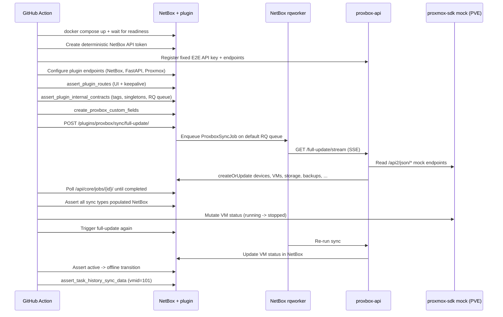

# E2E Docker Testing

The `E2E Docker` GitHub Action validates the real runtime integration path
between every moving piece in the Proxbox plugin: NetBox with
`netbox_proxbox` installed, the NetBox RQ worker that executes background
sync jobs, the separate `proxbox-api` backend container, and a dedicated
`proxmox-sdk` mock container that stands in for a real Proxmox service.

No real Proxmox cluster is contacted. The mock side is the only thing
faked; NetBox, the plugin, the backend, and the RQ worker are all real
production containers exercised over real HTTP, RQ, and SSE.

For the full CI workflow map (and the staged TestPyPI/PyPI release
pipeline that reuses this workflow), see
[CI and E2E Workflows](../developer/ci-e2e-workflows.md).

## Matrix Shape

`e2e-docker.yml` fans the test out across four axes. Each cell runs on its
own GitHub Actions runner with `fail-fast: false`, so failures in one cell
do not abort the others.

| Axis | Default values | Purpose |
|---|---|---|
| `install_source` | `local`, `pypi`, `container` | How `netbox-proxbox` is installed inside NetBox. |
| `netbox_image` | `v4.5.8`, `v4.5.9`, `v4.6.0` | The three NetBox releases the plugin is currently certified against. |
| `network_stack` | `ipv4` | Reserved for future dual-stack runs. |
| `proxmox_service` | `pve`, `pbs`, `pdm` | Selects which `proxmox-sdk` mock service image is used as the Proxmox side. |

The default cross-product is **3 × 3 × 1 × 3 = 27 cells**. Manual
dispatch (`workflow_dispatch`) and reusable callers can pin any axis to a
single value (for example `proxmox_service: pve`) to run a narrower slice.

### Proxmox Service Axis

The mock container image is split by service, with three matching tags
published by [`emersonfelipesp/proxmox-sdk`](https://github.com/emersonfelipesp/proxmox-sdk):

| Service | Image tag | Coverage |
|---|---|---|
| `pve` | `emersonfelipesp/proxmox-sdk:latest-pve` | Full Proxmox VE OpenAPI surface used today by the plugin sync pipeline. |
| `pbs` | `emersonfelipesp/proxmox-sdk:latest-pbs` | Proxmox Backup Server stub. Currently serves `/health` and the service identifier; PVE-shaped routes are intentionally absent. |
| `pdm` | `emersonfelipesp/proxmox-sdk:latest-pdm` | Proxmox Datacenter Manager stub. Same shape as PBS today. |

The `workflow_dispatch` input adds an `all` option that expands the full
three-service matrix (the default for scheduled runs). Pinning the input
to `pve`, `pbs`, or `pdm` keeps the matrix to a single service.

The image tag is rendered into the docker run command from the matrix:

```yaml
env:
  PROXMOX_SDK_IMAGE: emersonfelipesp/proxmox-sdk
  PROXMOX_SDK_TAG_PREFIX: latest
# ...
docker pull "${PROXMOX_SDK_IMAGE}:${PROXMOX_SDK_TAG_PREFIX}-${{ matrix.proxmox_service }}"
```

The same tag is reused both for the `docker pull` step and for the
container that backs the live `Proxmox Mock` service the stack talks to.

## Architecture

Each matrix cell stands up the same physical layout on its runner. The
only difference between cells is which Proxmox service mock is loaded
into the `proxmox-mock` container.



## Workflow Sequence (PVE Cells)

PVE cells exercise the full historical sync pipeline. The sequence below
is exactly what `tests/e2e/e2e_stack_check.py` drives end-to-end.



## Workflow Sequence (PBS / PDM Cells)

PBS and PDM cells exercise everything that does **not** depend on a
PVE-shaped OpenAPI surface. The same fixtures, the same NetBox, the same
backend, but the mock returns the service stub instead of full PVE data.

```mermaid
sequenceDiagram
  participant GA as GitHub Action
  participant NB as NetBox + plugin
  participant API as proxbox-api
  participant PM as proxmox-sdk mock (PBS or PDM)

  GA->>NB: docker compose up + wait for readiness
  GA->>NB: Create deterministic NetBox API token
  GA->>API: Register fixed E2E API key + endpoints
  GA->>NB: Configure plugin endpoints (NetBox, FastAPI, Proxmox)
  GA->>PM: GET /health  (verify the right service is loaded)
  GA->>PM: GET /api2/json/version (accept 4xx; mock has no PVE schema)
  GA->>NB: assert_plugin_routes (FastAPI + NetBox keepalive only)
  GA->>NB: assert_plugin_internal_contracts (tags, singletons, RQ queue)
  GA->>NB: create_proxbox_custom_fields
  GA-->>GA: log_service_skip("sync devices job", ...) for every PVE-shaped assertion
```

Every skipped assertion is logged with a `log_service_skip(<service>, <name>)`
line so the omission is visible in CI logs.

## What Each Cell Verifies

The matrix is designed to share as much as possible between services. The
exact distribution looks like this:

| Verification | `pve` | `pbs` | `pdm` |
|---|:---:|:---:|:---:|
| Stack readiness (NetBox API, proxbox-api API) | yes | yes | yes |
| Mock `/health` reports correct service | yes | yes | yes |
| Plugin UI + REST routes reachable | yes | yes | yes |
| Keepalive: FastAPI endpoint | yes | yes | yes |
| Keepalive: NetBox endpoint | yes | yes | yes |
| Keepalive: Proxmox endpoint | yes | skip | skip |
| Tag bootstrap (5 proxbox-* tags) | yes | yes | yes |
| Endpoint singletons (NetBox + FastAPI) | yes | yes | yes |
| Plugin discovery API root + 7 resource routes | yes | yes | yes |
| Settings runtime endpoint | yes | yes | yes |
| RQ default-queue contract | yes | yes | yes |
| Custom field creation via proxbox-api | yes | yes | yes |
| Backend `/full-update/stream` completes | yes | skip | skip |
| Devices / VMs / storage / backups / snapshots / IPs / replications sync | yes | skip | skip |
| VM status transition assertion | yes | skip | skip |
| Task history sync data assertion (vmid=101) | yes | skip | skip |

The matrix therefore guarantees no behavioral regression on PVE, while
PBS and PDM still validate that the plugin, the backend, NetBox, and the
mock can coexist and reach each other under those service tags.

## Skip Policy and Coverage Guarantees

PBS and PDM mocks today are deliberately minimal — they expose `/health`
and the service identifier and nothing else. The E2E suite encodes this
explicitly:

- `stack_setup.assert_proxmox_mock_contract` accepts a 4xx response on
  `/api2/json/version` for non-PVE services and treats only a 5xx or a
  non-JSON 2xx as a hard failure.
- `stack_setup.assert_plugin_routes` only includes the Proxmox endpoint
  keepalive URL when `service == "pve"`.
- `stack_sync.run_and_assert_all_sync_operations` and
  `stack_sync.assert_backend_stream` short-circuit with explicit
  `log_service_skip(...)` lines for every PVE-shaped assertion they own
  when `service != "pve"`.
- `e2e_stack_check.main` skips the NetBox VM lookup for `vmid=101` and
  the task-history assertion when `service != "pve"`.

When the PBS / PDM mocks gain full OpenAPI surfaces, removing each skip
gate is a one-line change in those helpers.

## Fixtures and Helpers

The runtime side is split across four Python files under `tests/e2e/`:

| File | Responsibility |
|---|---|
| `stack_common.py` | `StackContext` dataclass, env loading (`load_stack_context`), `get_proxmox_service`, `wait_http_ok(verify=...)`, JSON helpers, and `log_service_skip` for visible CI skip logs. |
| `stack_setup.py` | Backend / NetBox endpoint bootstrap, custom field creation, plugin route assertions, the new `assert_plugin_internal_contracts` block, and `assert_proxmox_mock_contract`. |
| `stack_sync.py` | All sync trigger + assertion helpers, including the service-aware skip logic in `run_and_assert_all_sync_operations`, `assert_backend_stream`, and `assert_task_history_sync_data`. |
| `e2e_stack_check.py` | Top-level entrypoint the workflow runs once per matrix cell. |

The workflow passes the active service down as an environment variable:

```yaml
env:
  PROXMOX_SERVICE: ${{ matrix.proxmox_service }}
```

`stack_common.get_proxmox_service()` reads it and validates it against
`VALID_PROXMOX_SERVICES = ("pve", "pbs", "pdm")`.

## Running a Single Cell Locally

```bash
# Pick the cell you want to reproduce
export PROXMOX_SERVICE=pbs
export NETBOX_IMAGE=netboxcommunity/netbox:v4.6.0

# Stand up the stack the way the workflow does
docker run -d --name proxmox-e2e-mock \
  "emersonfelipesp/proxmox-sdk:latest-${PROXMOX_SERVICE}"
# (Bring up NetBox + proxbox-api + PostgreSQL + Redis the same way the
#  workflow does — see e2e-docker.yml for the exact docker run flags.)

# Drive the same assertions the workflow drives
python tests/e2e/e2e_stack_check.py
```

Every assertion is structured around the `StackContext` returned by
`load_stack_context()`, so a single failing assertion gives you a
specific call site to dig into.

## Why the Matrix Is Fast

Before the per-service split, the workflow ran each Proxmox service stub
back-to-back on the same runner. Now each service is its own matrix
cell, runs on its own runner, and uses its own dedicated mock image.
Wall-clock time is therefore `max(cell_time)` instead of
`sum(cell_time)`, and the failure of one cell does not block the
remaining cells.
