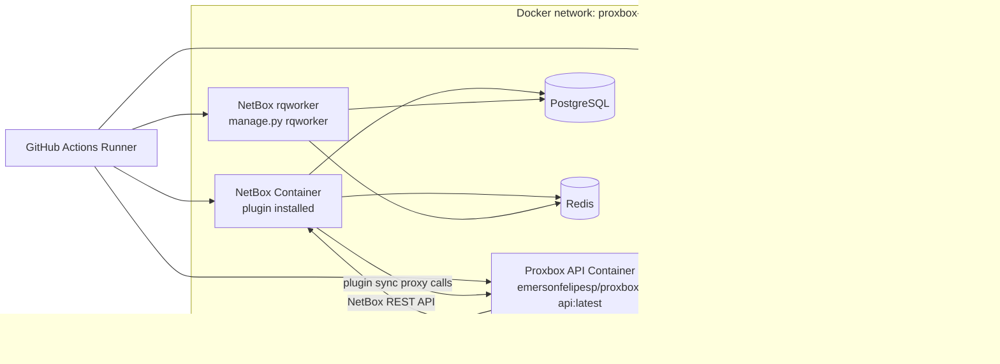
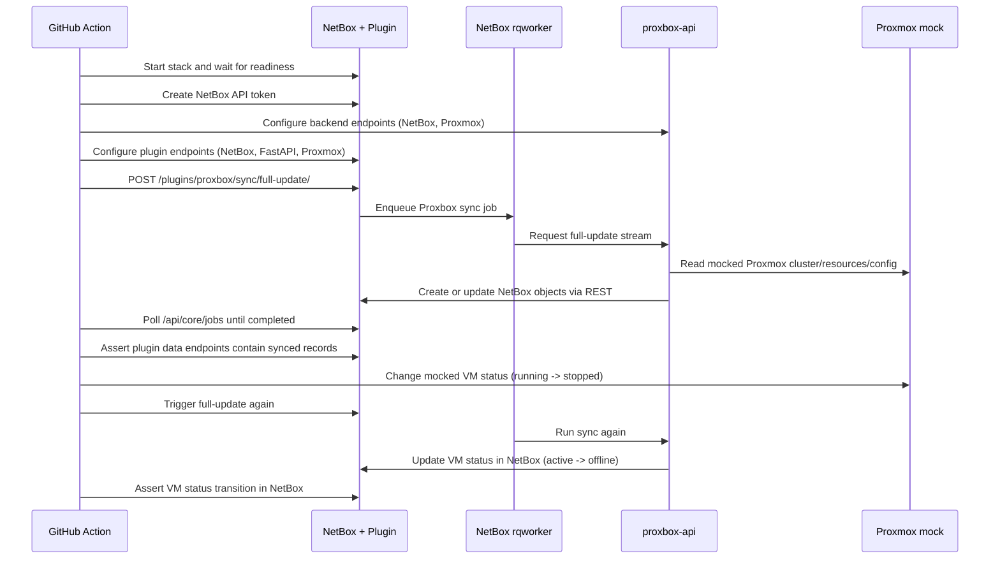

# E2E Docker Testing

The `E2E Docker` GitHub Action validates the real integration path between:

- NetBox (with `netbox_proxbox` plugin installed)
- NetBox RQ worker (job execution)
- Proxbox backend (`proxbox-api` container)
- A mocked Proxmox API service (no real Proxmox calls)

## Architecture

## Workflow Sequence

## What Is Verified

- NetBox plugin UI/API routes are reachable and functioning.
- Keepalive routes for FastAPI, NetBox, and Proxmox endpoint checks succeed.
- Full sync jobs run through real NetBox background jobs (`rqworker`).
- Proxbox backend stream endpoint (`/full-update/stream`) completes successfully.
- Synced storage/backup/snapshot plugin models are populated.
- VM status update behavior is validated by mutating mocked Proxmox VM state and confirming NetBox status changes after re-sync.

## Mocking Strategy

Only the Proxmox side is mocked. The test does not call any real Proxmox cluster.

- Mock API routes are served by `tests/e2e/mock_proxmox_api.py`.
- The mock supports runtime VM status mutation via `POST /__admin/vm/{vmid}/status`.
- NetBox and proxbox-api routes are real containers and are exercised end-to-end.
