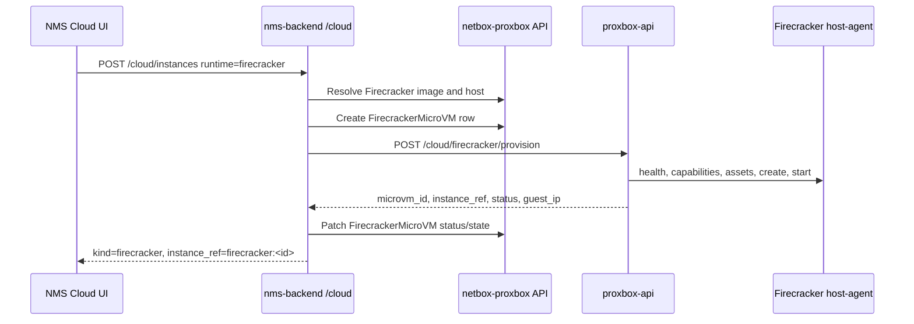

# Firecracker Cloud

Firecracker support lets the NMS Cloud area provision lightweight micro-VMs without modeling them as normal QEMU VMs or LXC containers. The Proxbox plugin owns the NetBox-side inventory that makes the runtime selectable and auditable.

## Model Split

Firecracker has its own inventory model:

- `FirecrackerHostPool` groups host-agent VMs and defines tenant visibility.
- `FirecrackerHost` points at the Proxmox VM running the host agent, tracks the agent URL, status, KVM availability, network support, and capacity.
- `FirecrackerImageTemplate` describes a kernel/rootfs bundle, checksums, default kernel args, default user, architecture, and tenant visibility.
- `FirecrackerMicroVM` tracks provisioned micro-VMs, lifecycle status, host, image, resources, guest IP, and the host-agent payload/state.

QEMU and LXC inventory remains unchanged. Firecracker instances are identified in Cloud responses with `kind="firecracker"` and `instance_ref="firecracker:<id>"`.

## NMS Cloud Flow

The streaming variant follows the same path through `POST /cloud/instances/stream`, with `proxbox-api` forwarding Firecracker host-agent progress as SSE frames.

## Tenant Visibility

Host pools and image templates can be restricted to selected NetBox tenants. Leave the tenant list empty to make a pool or image available to every Cloud tenant that has the required object permissions.

## Operational Notes

- The host-agent token is stored encrypted on `FirecrackerHost`.
- Firecracker capacity is tracked on the host row as total and allocated vCPU, memory, and disk fields.
- Image templates require 64-character SHA256 digests for both kernel and rootfs artifacts.
- The plugin does not install or run Firecracker itself; it records inventory and exposes APIs used by NMS and `proxbox-api`.
