# UI Screenshots

Screenshots are captured automatically from a live NetBox instance with the plugin
installed against a Proxmox mock backend. No real infrastructure data is shown.

The capture pipeline spins up a full Docker stack (NetBox + proxbox-api + proxmox-mock),
seeds it with mock data via the sync pipeline, and takes Playwright browser screenshots.
Screenshots are refreshed on every new release and can be triggered manually.

---

## Plugin Home

The plugin home page shows endpoint status cards, quick-sync actions, and navigation
to all Proxmox resources managed by the plugin.

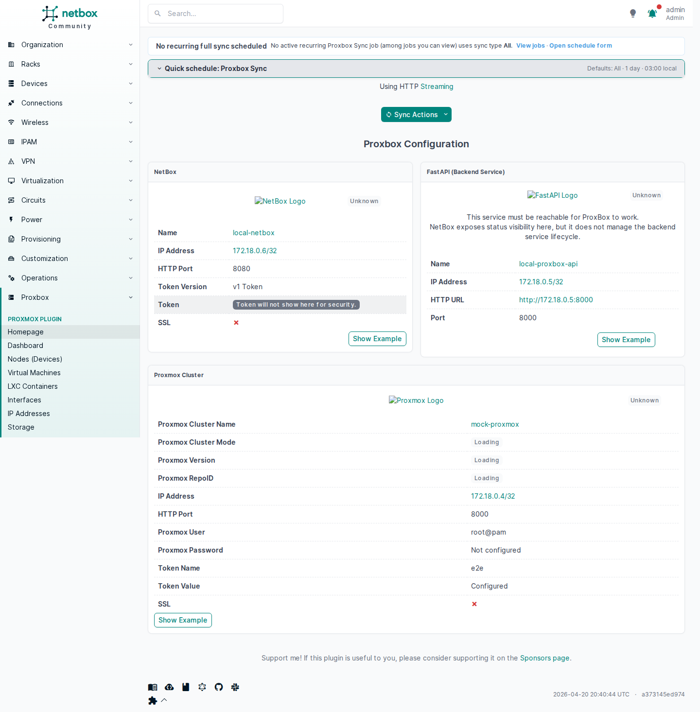

---

## Dashboard

The operational dashboard displays cluster and node summaries sourced live from
the proxbox-api backend.

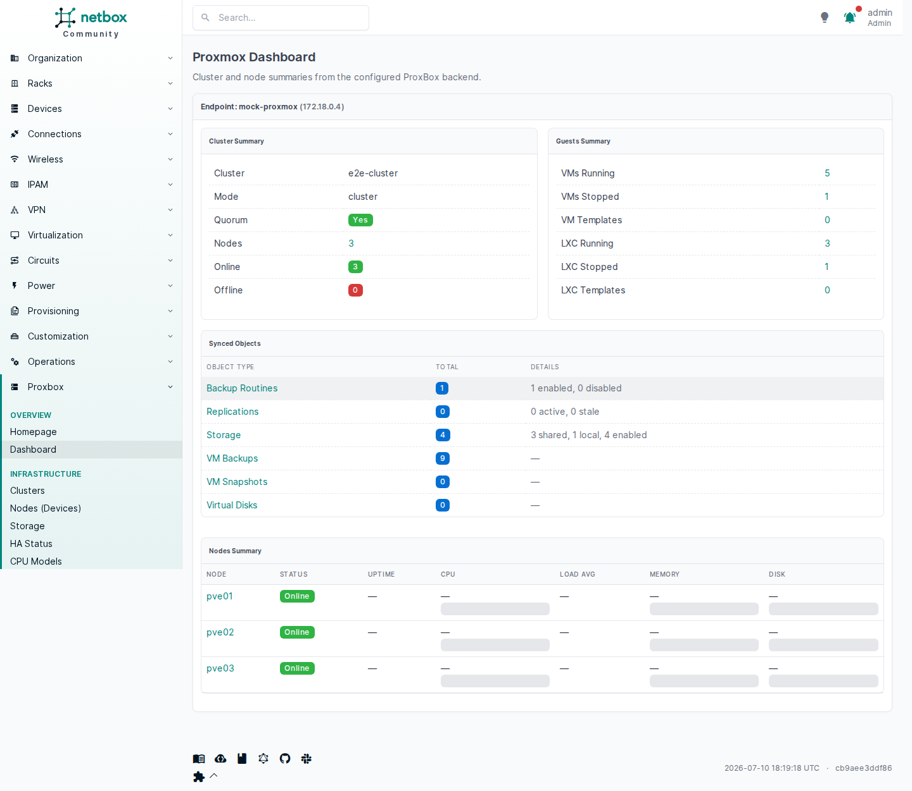

---

## Endpoints

=== "Proxmox Endpoints"
    List of configured Proxmox API endpoints the plugin connects to.

    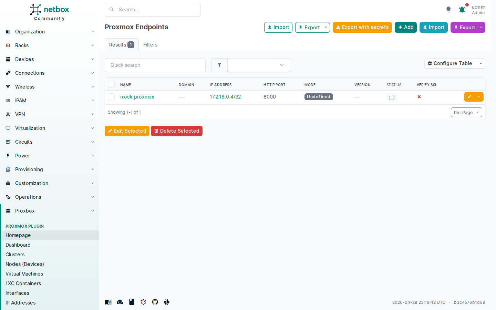

=== "FastAPI (Proxbox) Endpoints"
    The companion proxbox-api backend endpoint configuration.

    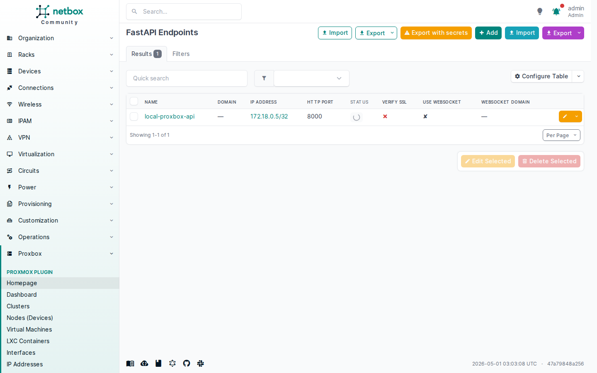

=== "NetBox Endpoints"
    The NetBox self-referential endpoint used by proxbox-api to write back.

    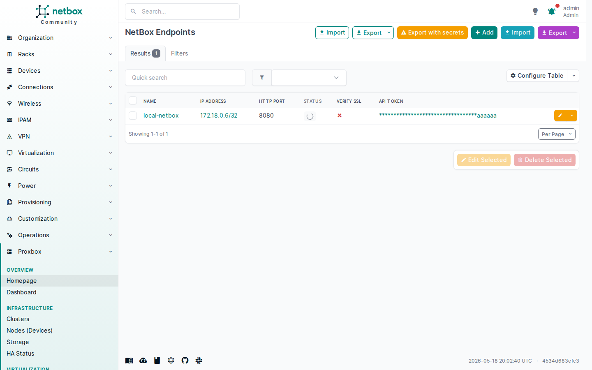

---

## Infrastructure

=== "Clusters"
    Proxmox clusters discovered and synchronized into NetBox.

    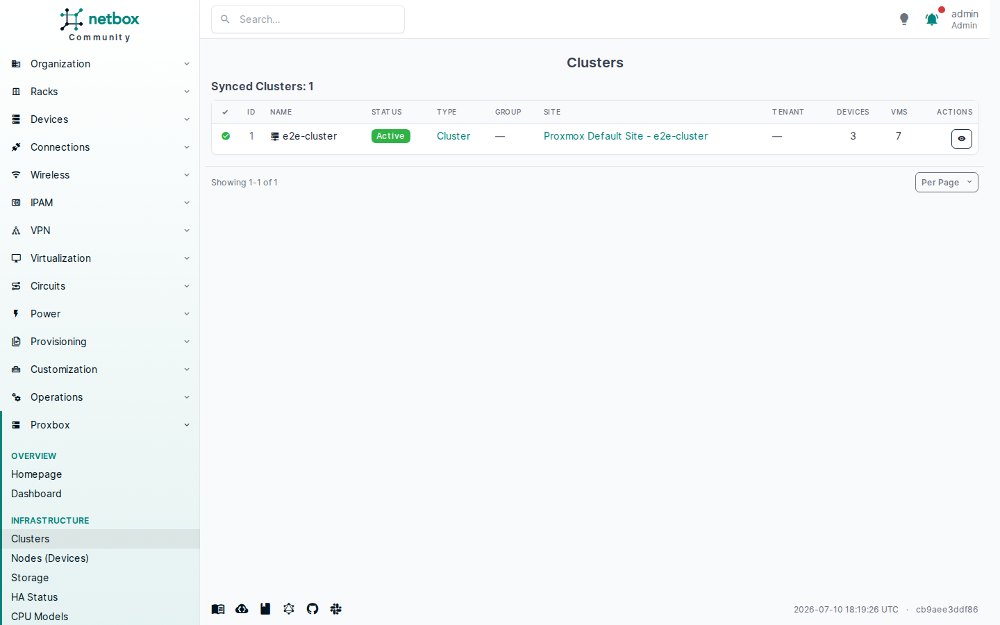

=== "Nodes"
    Proxmox nodes (devices) associated with each cluster.

    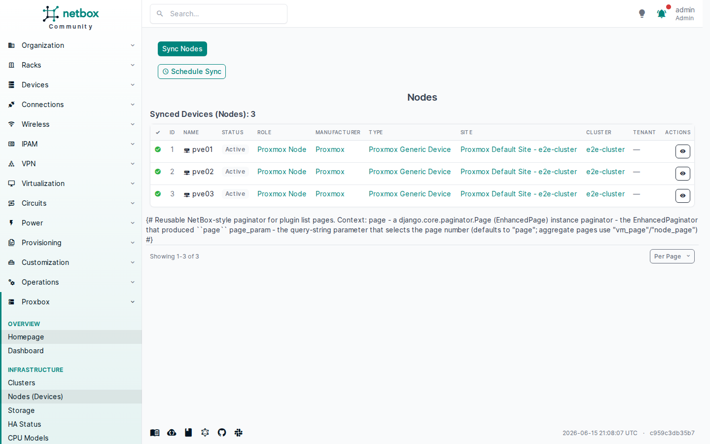

=== "Storage"
    Proxmox storage pools tracked per cluster.

    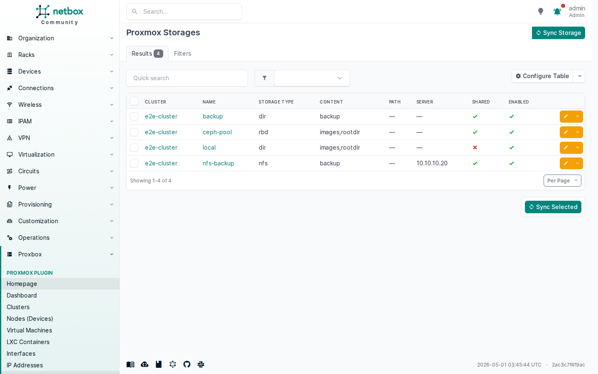

---

## Virtual Machines & Containers

=== "Virtual Machines"
    All Proxmox VMs synchronized into NetBox virtualization.

    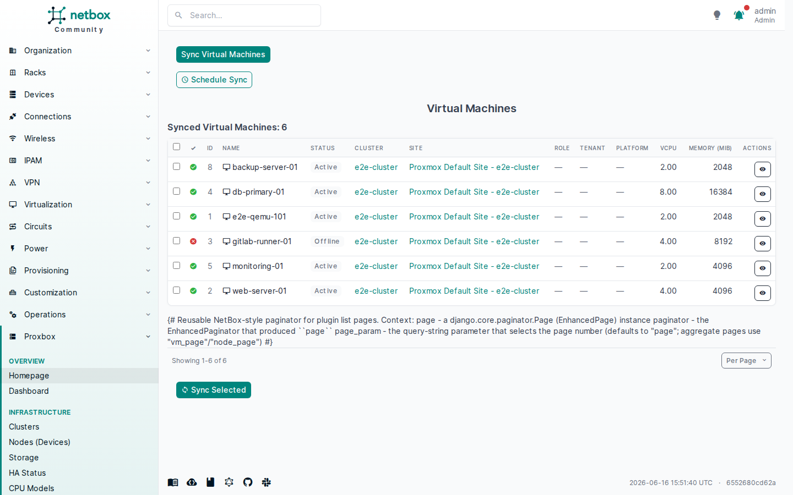

=== "LXC Containers"
    Linux containers managed by Proxmox and tracked in NetBox.

    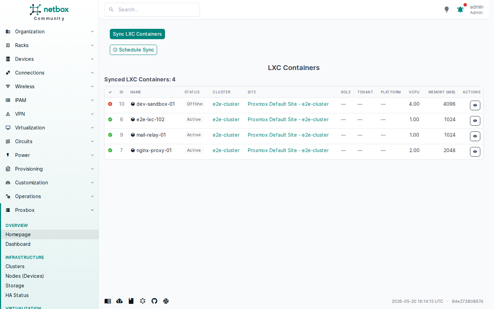

---

## Backup & Recovery

=== "Backups"
    VM backup jobs discovered from Proxmox storage.

    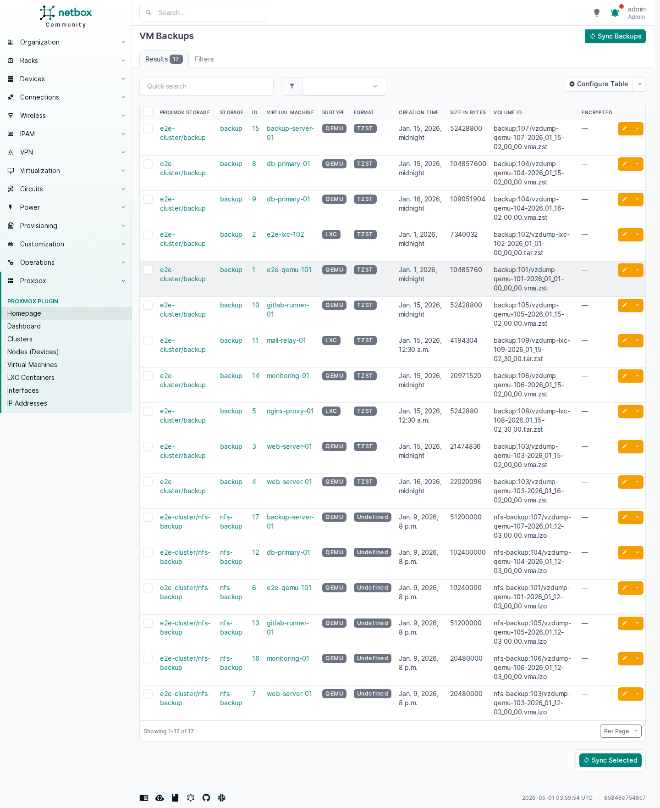

=== "Snapshots"
    VM and container snapshots tracked per virtual machine.

    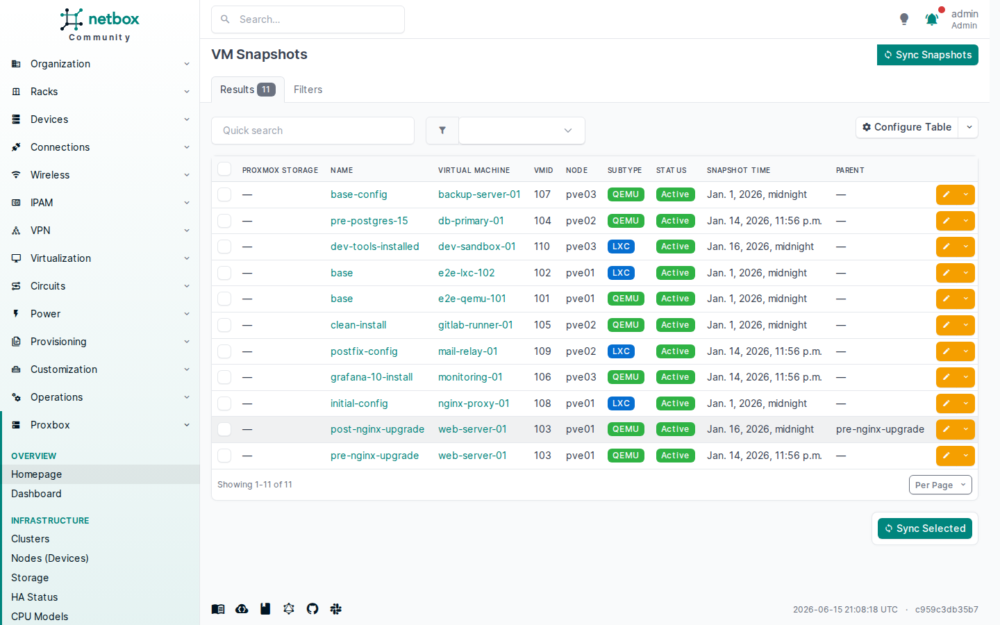
